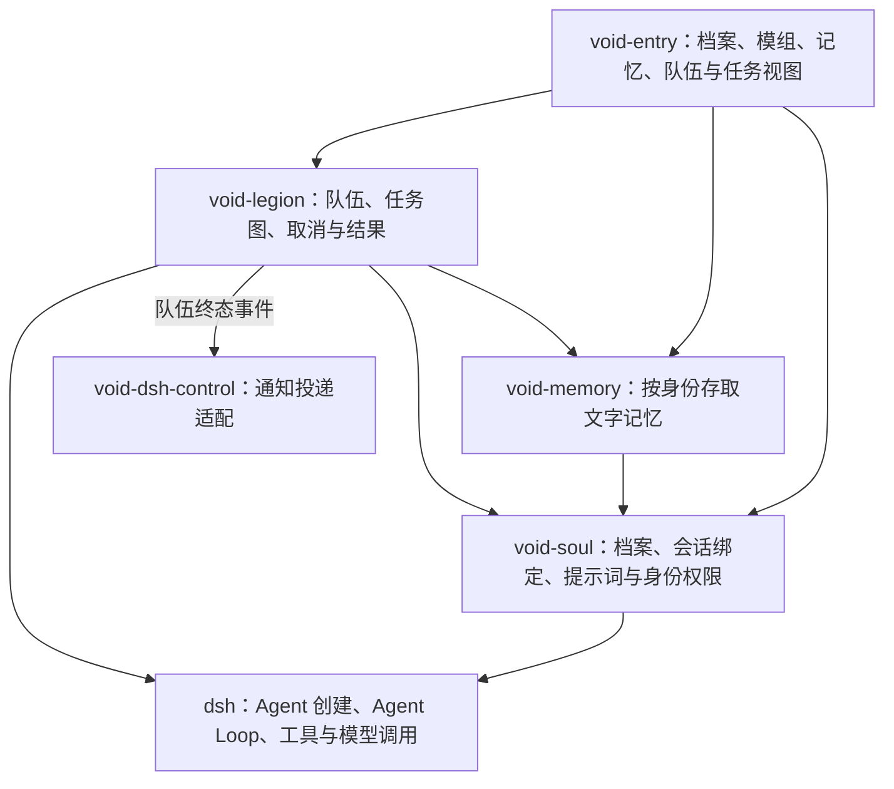

# 灵魂 · 记忆 · 军团 —— 第一期需求与实现开发计划

> **第一至十一节保留需求与审查依据；第十二节起补充实现方案和开发计划（2026-09-22）。**
> 已确认需求与技术建议分开：记忆体及 M5 等未确认口径仍须先定案，不能因写入方案就视为用户已确认。
> 开发状态只维护在文末「实施计划进度表」，技术方案不代表功能已经实现或实机验证通过。
> 起草：2026-09-22 ｜ 本次范围：源码核对与方案回写，不修改业务代码或运行环境。

---

## 一、这一期要解决什么

一句话：

> **让 dsh 能组织一支有灵魂、有记忆的 Agent 队伍干活，但不改动 dsh 自己的核心运转方式。**

拆成三条主线：

| 主线 | 要什么 |
|---|---|
| **灵魂** | 每个 Agent 有自己的性格与底线，且底线改不动 |
| **记忆** | 每个 Agent 有自己的记忆，互不串门 |
| **军团** | 能把 Agent 组成队伍，派活、看进度、收结果 |

---

## 二、边界：这一期明确不做什么

1. **不改 dsh 已有的 Agent Loop**——不替换、不架空它，只在它旁边加东西。
2. **不搬 Star 的旧代码**——旧项目只作参考，不作代码来源。
3. **不为了「用新东西」而拒绝旧设计**——旧项目里做得好的地方照样采用。

---

## 三、灵魂（SOUL）

### 3.1 用大白话说

Agent 每次开工前，会先读一份**开场说明书**。这份说明书决定它是谁、守什么规矩、怎么干活。进系统提示词。

说明书分两截：

- **上半截 = 底线**：身份（IDENTITY）、价值观、禁忌、权限边界。定名为SOUL。**永远不许变。** 
- **下半截 = 当前角色**：现在是「开发专家」还是「大统帅」。定名为FACET。**可以换。**

### 3.2 需求条目

| # | 需求 | 可行性 |
|---|---|---|
| S1 | 每个 Agent 开工前会读到一份开场说明书，决定它的性格、准则与行为方式 | 🔨 要做 |
| S2 | 说明书分两层：**底线层**（价值观/禁忌/权限边界）与**角色层**（当前职能） | 🔨 要做 |
| S3 | 底线层**从结构上无法被角色层覆盖**——不是「说好不改」，是「改不动」 | 🔨 要做 |
| S4 | **每个 Agent 可以有自己独立的说明书**，互不干扰 | 🔨 要做 |
| S5 | 改说明书**不用重启**，改完下次说话就生效 | 🔨 要做。旧项目不是这样：不重启，下一句仍是旧说明书 |
| S6 | 说明书里能自动填入变量（比如当前模型名、当前工作目录） | ✅ 已在装机的 rc 上核对落地：宿主 `dsh-system-prompt` 组装时做一次性严格插值，`dsh-agent-loop` 注册 `provider`/`model`/`cwd` 三个变量；本插件只做白名单与「取不到值」预检。见 12.1 与 13.3 第 4 条 |
| S7 | 说明书能显示「当前生效的是哪一版」（便于排查） | 🔨 要显示模组名与模组简介（摘要） |

> **S7 的补充说明**：模组文件须自带简介；来源已在 8.2 定为 front matter 的 `summary`，不再取前几行或另设清单。

### 3.3 与旧项目的差别（供你判断）

旧项目是**把上下两截写在同一张纸上**，靠纸中间一句手写的警告「这行以上不许动」来约束。
新做法是把两截**放在不同位置**，角色层**够不着**底线层。

> 结果差别：旧做法万一程序出错，底线可能被整个抹掉；新做法底线**物理上改不动**。
>
> **这是本期要达到的结果，不是旧项目已经做到的（2026-09-22 对照后补）**：
> 旧项目的普通改文件入口**写着**「禁止修改 SOUL.md」，保护名单却是空的，拦不住；
> 跑命令时只要命令文本里出现这个文件名就会被拦，换个写法就绕过；
> 切换模组的入口则专门能改这张纸。锚点丢了、或分界行被改掉，底线可以被整段换掉。
> 所以「改不动」是新需求，不是现成事实。

### 3.4 Agent 档案：一份 SOUL.md 就够了（2026-09-22 定案）

**档案不另设文件，SOUL.md 本身就是 Agent 档案。**

旧项目把「我是谁」拆成两个文件（`IDENTITY.md` 放名字性格、`SOUL.md` 放准则），
结果是**两个文件会打架**——实测旧项目的 `SOUL.md` 写「你是艾拉」、`IDENTITY.md` 写
「名字：小码」，旧项目不得不在 `SOUL.md` 里补一条规则裁定「`IDENTITY.md` 是权威来源」。
**这条裁定规则本身就是分家的成本。** 合并成一份，一份文件一个身份，规则也不需要了。

> **分层不受影响**：分界线不在 SOUL 内部，而在**「SOUL 文件 ↔ FACET 文件」之间**。
> SOUL.md 全部内容＝固定段落；FACET 文件内容＝可换段落。
>
> **并进这一份之后，今天已经在用的事不能丢（2026-09-22 对照后补）**：
> 名字、头像、换头像、谁是主人、谁是上级谁是下级、队伍里谁能指挥谁、
> 社区用量要核对的主人、第一次见面还要不要做自我介绍。
> 这些今天是按身份文件里的**固定说法**读的（「名字」「头像」「主人UUID」「上级/下级身份标签」），
> 不是按档案开头那三项机器信息读的。
>
> 另有三条边界：
>
> - **一份档案只能有一套主人。** 现在有的角色卡自己又写了一套主人编号，换角色不应把主人换掉。
> - **社区连接不靠说明书生效。** 社区名称、密钥、服务器地址今天写在身份文件里也不会被拿去连接，实际在单独的社区配置里。
> - **字数不够要删减时，底线、身份、主人和权限都不能被删掉。** 现在身份段比底线段更容易被丢掉。
> - **某个 Agent 没有自己的说明书时，不得悄悄用总说明书。** 现在会回退，用户会以为已经分开了。

#### 档案文件格式

文件开头留一段**给机器读的信息**，正文给人（和 Agent）读：

```markdown
---
id: xiaobei                       # 稳定标识，永不改变（军团引用、记忆索引都用它）
name: 小贝                         # 显示名，可以改
summary: 我的主助手，负责统筹协调     # 界面上显示（承接 S7）
---

# SOUL.md — 小贝

## 【身份 IDENTITY】
名字、性格、职责、专长…

## 【TABOO | 禁忌】
…

## 【ETHOS | 价值观】
…

## 【SYSTEM | 权限边界与核心机能】
…
```

**为什么 `id` 与 `name` 必须分开**：记忆跟着「Agent 身份」走（M6）。若记忆挂在**名字**上，
把「小贝」改名叫「贝贝」时**记忆就断了**。分开之后**改名不影响记忆**。
（旧项目拿目录名当身份，稳定但对人不友好，且改名＝换了个 Agent。）

#### 一个 Agent 的完整形态

```text
agents/
  facets/                    ← 共用模组库：所有 Agent 各取所需（见第四节）
    开发专家.md
    大统帅.md
    审计员.md
    …
  小贝/                       ← 一个 Agent 的全部状态都在自己的目录里
    SOUL.md                  ← 档案：身份 + 价值观 + 禁忌 + 权限边界
    （记忆）                   ← 这个 Agent 的记忆
    （当前选中的模组）           ← 承接 F8，形式待技术定型
  小码/
    SOUL.md
    （记忆）
```

**两个要点**：

1. **记忆放在 Agent 自己的目录下**——一个 Agent 的东西集中在一处，好管理；
   删除 Agent＝删除目录，备份迁移也直观。
2. **`facets/` 放在 `agents/` 共用层**——模组是「职能」（开发专家、审计员），
   **职能不属于某个特定 Agent**。共用一个库才叫「模组库」；每个 Agent 一套就成了重复维护。
   这与 F9「每个 Agent 都可以从模组库中选择模组」天然吻合。

> **代价**：一份完整档案约 5–15 KB（旧项目 SOUL.md 模板 12.2 KB），每次开工都进 Agent 视野。
> 这个量级合理（内容基本不变，属稳定前缀，缓存友好），但也意味着**档案该是「宪法」而非
> 「操作手册」**——具体流程、项目细节放记忆里，用到再查（正好是 M7 定的「主动去查」）。

---

## 四、模组（FACET）

### 4.1 用大白话说

角色层做成一张**可以换的卡片**。换角色 = 拔掉旧卡、插上新卡，**立即生效**。

### 4.2 需求条目

| # | 需求 | 可行性 |
|---|---|---|
| F1 | 角色做成**可切换的模组**，一批模组放在一个库里 | 🔨 要做 |
| F2 | 能列出库里有哪些模组可选 | 🔨 要做 |
| F3 | 能查看当前装的是哪个模组 | 🔨 要做 |
| F4 | 切换模组**立即生效，不用重启**，下一句就按新角色说话 | 🔨 要做。旧项目切换后仍要求重启，不重启下一句还是旧角色 |
| F5 | 切换后 Agent 的说话风格与工作方式跟着变 | 🔨 要做 |
| F6 | 模组不能覆盖底线（承接 S3） | 🔨 要做 |

> **原 F7「带参数地切换」已删除**（2026-09-22 决策）：
> 模组**不带参数**。模组本身就是一份写好的提示词；需要「开发专家-前端」，
> 就直接写一份「开发专家-前端」的模组文件。**带参数反而容易乱。**
> 由此推出：**模组库就是一个文件夹里的若干 markdown 文件**——加模组＝加文件，
> 改模组＝改文件，复制一份改改＝新变体。不需要任何额外机制。

### 4.3 已确认

| # | 确认结果 |
|---|---|
| **F8** | 切换模组后**重启 dsh**，要求**记住**上次切换的模组（每个 Agent 记住自己的选择） |
| **F9** | **每个 Agent 都可以从模组库中选择模组**；切换后**只影响该 Agent，不影响其他 Agent** |
| **F10** | 模组库＝**`agents/facets/` 共用层**下的 `.md` 文件。用户可以自己写 markdown，**界面上可以打开与编辑** |
| **F11** | **不限制**大小，由用户自己把握 |

> **F10 的路径已定案（2026-09-22）**：`facets/` 放在 **`agents/` 共用层**，**不是每个 Agent 一套**。
> 理由：模组是「职能」（开发专家、审计员），**职能不属于某个特定 Agent**；
> 共用一个库才叫「模组库」。这与 F9「每个 Agent 都可以从模组库中选择模组」天然吻合。
> 详见 3.4 的目录结构。
>
> **这是新定案，旧项目不是这样**：旧项目默认一份，每个专属 Agent **又各备一套**。
> 本期按共用库做。每个 Agent 只记住自己选了哪一张，**不能靠把角色正文写进底线文件来记**，
> 否则底线和角色又回到同一张纸上。重启后仍是各自上次的选择。
> 同一次聊天里已经说过的话，不会因为换角色自动忘掉。
>
> **由此产生的一个小问题（不阻塞，先记下）**：共用库意味着**没有「某个 Agent 专属的模组」**。
> 若将来确有需要（比如「小贝专用的晨间汇报模组」），可以再加一层「共用库 + Agent 私有库」
> 的两级查找——**那是加法，不会推翻现在的结构**。**本期先不做。**

### 4.4 可复用的现成资产

旧项目已有 **8 份现成模组**，内容是现成的，**可以直接拿来用**（复用内容，不复用代码）：

> 大统帅 / 开发专家 / 灵魂爱豆 / 全能开发者 / 十年一剑 / 铁血领袖 / 吟游诗人 / 织梦者

**模组文件同样要带 front matter**（与档案一致，承接 S7 要显示「模组简介」）。
现有 8 份只有标题，没有这段，系统也不记录「当前装的是哪个」，界面暂时无处可读：

```markdown
---
id: dev-expert
name: 开发专家
summary: 严谨务实的技术实现者，擅长架构设计与调试
---
```

---

## 五、记忆（MEMORY）

### 5.1 用大白话说

每个 Agent 有一本**自己的记忆本**，能记、能查，且**互不串门**。

### 5.2 需求条目

| # | 需求 | 可行性 |
|---|---|---|
| M1 | 每个 Agent 有自己的记忆，能写入、能检索 | 🔨 要做 |
| M2 | Agent 干活时能用到自己的记忆 | 🔨 要做 |
| M3 | 记忆**互不串门**：A 的记忆 B 看不到（除非明确允许） | 🔨 要做 |
| M4 | 记忆能持久保存，重启不丢 | 🔨 要做 |
| M5 | 记忆能删、能改、能查「记了些什么」 | ✅ 范围已确认（2026-09-23，按 14.1 矩阵；实现见 P3 行） |

### 5.3 已确认

| # | 确认结果 |
|---|---|
| **M6** | 记忆跟着 **Agent 身份**走——同一个 Agent 换会话也**带着记忆** |
| **M7** | **先实现 (a) Agent 主动去查**（像翻笔记本，用到才翻）。（b）每轮自动带上**本期不做** |
| **M8** | **只记文字** |
| **M9** | **两者都要**：Agent 自己判断要记 ＋ 你明确要求记 |
| **M10** | 跨 Agent 共享**以后再说，先不用** |

> **项目 git 记忆是另一套，本期不并入（2026-09-22）**：
> [Hindsight coding-agents](https://github.com/vectorize-io/hindsight/tree/main/hindsight-integrations/coding-agents)
> 记的是**仓库**的非人格开发记忆：提交历史、过去对话里的技术决定、组件地图、惯例和进行中事项。
> 隔离单位是仓库，同一个仓库的多个 Agent **故意共用**一套。
> 第五节要的是**跟着 Agent 档案走的人格记忆**，别人默认读不到。
> 两套可以以后并存，但不是同一件需求，本期不把 git 记忆库并进 Agent 记忆。

> **M7 选 (a) 带来的一个重要简化**：
> 因为记忆由 Agent **主动去查**，所以本期**不需要**「每轮自动把记忆送进 Agent 视野」这套机制。
> 第七节里列的「记忆注入的底层机制」**本期用不上**，留到以后做 (b) 时再用。
> 本期记忆只需要两件事：**能存** ＋ **能查**（做成 Agent 可调用的工具）。
>
> **M6 的「Agent 身份」已定案（2026-09-22）**：
> 「Agent 身份」＝**Agent 档案**，即 `agents/{目录}/SOUL.md` 里 front matter 的 **`id`** 字段。
> 记忆**存放在该 Agent 自己的目录下**（`agents/小贝/`），一个 Agent 的东西集中在一处。
> 详见 3.4「Agent 档案」。**记忆的存取键＝档案 `id`，不是名字**——所以改名不丢记忆。
>
> **对照现有实现后补上的默认（2026-09-22，尚未改需求结论）**：
>
> - **别人默认读不到、写不进。** 未单独允许时，也不读取队伍共用记忆。
>   旧项目不是这样：默认会读到「没有主人的全局记忆」和队伍共用层，所以 A 能看见不属于自己的内容。
> - **本期不自动带上。** 迁移或并行时，不得把最近记忆、语义召回、续做工作集自动送进开工提示词。
>   旧项目里「最近记忆自动送进开工」是**默认开着的**；「按问题自动召回」才是默认关。照搬默认值会违背 M7。
> - **记错了能撤。** 密钥、口令、令牌不得写入任何记忆，包括私人记忆。谁记的、记到谁的本子上，必须分得清。
> - **正文只记文字。** 用来帮忙查找的向量索引不算另一种记忆，也不单独保存图片或文件本体。
>
> 旧项目现有的记忆动作是：按问题查、读一份记忆文件、往文件里追加或整份覆盖、重建索引、把一份记忆升成大家都能看。
> **没有「改一条」「删一条」「列出记了些什么」。** 这三件事 2026-09-23 已按 14.1 矩阵定案并落地：`memory_update`（改一条，修订号加一）、`memory_retract`（撤回一条，原文移进 `retracted/` 恢复区而不是抹掉）、`memory_list`（列出记了些什么，长期文字与日记条目分列），旧项目那几个动作不再等同于 M5（见 P3 行）。
---

## 六、军团（LEGION）

### 6.1 用大白话说

把多个 Agent 组成一支**队伍**，派一个总任务，它们分工干完，你还能看进度、收结果。

### 6.2 需求条目

| # | 需求 | 可行性 |
|---|---|---|
| L1 | 能把多个 Agent 组成队伍，给队伍起名、写用途说明 | 🔨 要做 |
| L2 | 队伍成员各自有不同的**灵魂**与**记忆**（承接第三、五节） | 🔨 要做 |
| L3 | 派一个总任务，能自动/手动拆给成员 | 🔨 要做 |
| L4 | 派活方式可选：**同时干** / **按顺序干**（有依赖） / **分阶段干** | dsh 有子代理执行机制；三种队伍调度语义仍需 Void 实现，见 15.3 |
| L5 | 能给不同成员指定**不同的模型**（难的活用好模型） | dsh 子代理支持 `agentOptions`；现有 Void worker 尚未传入，见 12.1 |
| L6 | 能看**进度**：谁在干、干到哪、完没完 | dsh 有子代理生命周期与会话入口；队伍级进度聚合和视图仍需开发 |
| L7 | 能看**结果**：每个成员交了什么、汇总是什么 | dsh 返回 `output` / `structured`；现有 Void 队伍工具丢弃了产出，须修正 |
| L8 | 能中途**叫停**某个人或整支队 | dsh 有 `signal` / `dispose`；单任务取消和全队排队取消仍需接入 |
| L9 | 派活给队伍后，**干完能通知我** | 🔨 要做 |

### 6.3 已确认

| # | 确认结果 |
|---|---|
| **L10** | 队伍配置**要能存下来复用，但可修改** |
| **L11** | **要**定义「汇报关系」（谁指挥谁、谁能给谁派活） |
| **L12** | **要**能看队伍的「组织结构图」 |
| **L13** | 人数上限**做成可设置的变量**，但**界面上要有修改接口** |
| **L14** | 队伍配置可存可改——**临时叫一个「审计员」进来干完就走**也行；不改就是固定成员 |

> **L11 + L12 要分开看（2026-09-22 对照现有实现后修正）**：
> 旧项目**已经有**「谁向谁汇报、谁可以指挥谁」这组关系，派活时会写进每个成员看到的说明里。
> 所以「组织关系从零发明」不成立。**给人看的组织结构图仍然没有**，这一半仍是本期要做的。
> 另外：这组关系现在**只是写给成员看，并不会拦住一次不该发生的派活**。
> 本期要的是真的约束，不是再写一遍提示词。
>
> **两套权威不要混（补进 L11）**：
> 主人 UUID、身份权力（主人/上级可下令、下级只接受指导、外人拒绝）是一套；
> 队伍里「谁能给谁派活」是另一套。组队指挥权**不得压过身份底线**：
> 下级不能因为进了队伍就指挥上级。身份规则没生效时，也不得用身份标签去改已经写好的队伍关系。
> 两套不一致时以哪边为准，技术定型时给默认，但需求上必须两条都保留。
>
> **L9 不能写成「直接复用、不重写」**：
> 灵榜控制面（`packages/void-dsh-control/src/callback.ts`）的签名、去重、重试、超时、主机白名单可以沿用。
> 它通知的是「外部下的控制面任务结束了」，**不是**「这支队伍这次派的活干完了」，
> 也不会因为某个成员干完就发。本期要通知的是队伍这次任务结束，并分得清完成、失败、取消。
>
> **对照后再补四条用户能感知的缺口**：
>
> - **派活**：现在每人收到的是同一句总任务，没有自动拆，也没有按人指定。
>   执行只按依赖一个一个干；「同时干」「分阶段干」只是名字，不会改变跑法。整次派活只有一个模型来源，不能按人换模型。
> - **叫停**：现在只能取消整次派活。要能停一个人，也要能停整队，排队还没开始的人也算在整队里。
> - **结果**：汇总要带上每个人交的东西。失败要写明原因，并标出谁该重做、谁被堵住、谁还没交。
>   **失败不自动重做**，除非用户明确要求自动返工。现在队伍工具把每人的产出丢掉了，只留下状态和一句错误。
> - **L10 / L13 / L14 仍是空的**：队伍现在只活在当次运行的内存里，重启即丢；没有人数上限这个设置；没有「临时进来干完就走、不改固定名单」。

---

## 七、已有的能力与资产（历史核对与复用边界）

本节保留前几轮的核对依据。2026-09-22 本次已补读指定 dsh 源码，新增结论与具体接入成本见第十二节；已有机制不必重造，但适配、隔离与验证仍计入工作量。

### 7.1 首轮核对记录（当时未读 dsh 本体，现由 12.1 补充）

以下四项是首轮只读 Star 时的记录。右侧仍只说明旧项目，不作为本次 dsh 能力判断；本次判断以 12.1 指向的源码为准。

| 文档原说法 | 本仓库实际能确认的 |
|---|---|
| 配置单个 Agent | 旧项目能给每个成员单独定身份、角色、可用工具和风险上限 |
| 派活、通信、打断 | 旧项目能停一个子会话、停一条并行活，也能停整个流程里还在跑和还在排队的会话 |
| 并发、按顺序、分阶段、逐人换模型、结果汇总 | 旧项目的并行是分批同时干，不是按依赖顺序，也不是分阶段。按人换模型在规格里有，派活入口没露出来。汇总能标出谁通过、谁要重做、谁堵住，但是提示约束，**不会自动返工** |
| 灵魂按 Agent 隔离注入 | 旧项目开工会读各自的 SOUL.md。现有军团派活的开场白**不含灵魂**，只有角色、总任务和上游结果 |

### 7.2 本仓库已有的（可直接复用）

| 能力 | 出处 | 本期用途 |
|---|---|---|
| 对外通知的投递管道 | `packages/void-dsh-control/src/callback.ts`（签名/去重/重试/超时/白名单，20 例测试） | **只复用投递，不复用事件**。它通知的是灵榜控制面任务结束，不是队伍干完。见 L9 修正 |
| 配置草稿与保存 | `packages/void-entry`（按设置项渲染、先暂存再保存） | **不能**据此编辑模组正文，也**没有**人数上限这一项。长文本只是纯文本框，不是说明书编辑器 |
| 一次性子代理执行 | `packages/void-legion/src/subagent-worker.ts` | **只接上了「跑一次」**。不拆任务、不按人换模型、不能单停一个人、不带灵魂。L3 仍要做 |

### 7.3 本期用不上的（留到以后）

| 能力 | 为什么本期不用 |
|---|---|
| 记忆注入的底层机制（每轮把最新内容送进 Agent 视野） | **M7 选了「主动去查」**，本期不启用。注意：旧项目「最近记忆自动送进开工」默认是开的，迁移时要关掉，不能顺手继承 |

> 工作量按第十七节计算：包含新功能，也包含已有机制的接线、跨版本适配、失败处理与验收，不能只统计标 🔨 的条目。

---

## 八、需求确认结论

### 8.1 已确认结论一览

2026-09-22 审查，原列 11 组问题**全部有答案**：

| 原问题 | 编号 | 结论 |
|---|---|---|
| 记忆跟着谁走 | M6 | **Agent 身份**（换会话也带着） |
| 记忆怎么用 | M7 | **先做「主动去查」** |
| 队伍配置可否复用 | L10 | **可存可改** |
| 要不要汇报关系与组织图 | L11 / L12 | **都要** |
| 模组切换记不记住、全局还是单 Agent | F8 / F9 | **要记住**；**每个 Agent 各自选，只影响自己** |
| 记什么内容 | M8 | **只记文字** |
| 谁决定要记 | M9 | **两者都要** |
| 能否跨 Agent 共享 | M10 | **以后再说** |
| 模组库放哪、谁维护、有无大小限制 | F10 / F11 | **路径下的 .md 文件，界面可编辑**；**不限大小** |
| 队伍人数上限、成员固定还是临时 | L13 / L14 | **上限可配置且界面可改**；**成员可临时增减** |
| 干完要不要通知、带参数切换、看版本 | L9 / F7 / S7 | **要通知**；**不做参数化（F7 删除）**；**要显示模组名与简介** |

---

### 8.2 本轮新增定案（2026-09-22 第二轮）

| 原待定问题 | 定案 |
|---|---|
| ★★★ **「Agent 身份」具体指什么？** | **＝ Agent 档案**。不另立概念：**一份 `SOUL.md` 就是一个 Agent 档案**（含身份/价值观/禁忌/权限边界），front matter 里的 `id` 就是身份标识。记忆存在该 Agent 自己的目录下 |
| ★★☆ **底线层是每个 Agent 各一份，还是全队共用？** | **每个 Agent 各有一份**——因为每个 Agent 有自己的 `SOUL.md`。**共用的是模组库（`agents/facets/`），不是底线** |
| ★☆☆ **模组简介从哪来？** | **文件开头的 front matter**（`id` / `name` / `summary`）。档案与模组**用同一套格式** |
| — | **新增**：`IDENTITY.md` 不单独设文件，**并入 `SOUL.md`**（旧项目两个文件会打架，详见 3.4） |
| — | **新增**：`facets/` 放 `agents/` **共用层**，不按 Agent 分家（详见 4.3） |

### 8.3 剩余待定

| 优先级 | 待定问题 | 为什么要紧 |
|---|---|---|
| ✅ 已定（2026-09-22） | **记忆体清单已确认**：`MEMORY.md`（长期记忆）、`memory/`（日记条目）、`memory.sqlite`（检索索引）三种都做；聊天记录由 DSH 本体管，不并入人格记忆；梦境与队伍共用记忆本期不做 | 见下方「M5 口径」与第十节第四轮定案 |
| ★☆☆ | **目录名与 `id` 不一致时怎么办？** 建议：目录名用 Agent 的名字（好认），`id` 在 front matter 里保证唯一与稳定，**以 `id` 为准** | 改名时要不要连带改目录名、军团配置引用的是哪个——**技术定型时给默认值即可** |

#### M5 口径（2026-09-22 定案：记忆体清单已确认）

删改做到哪一步，取决于**先有哪些记忆体**。定案口径：

> 记忆体就是 `MEMORY.md`（长期记忆）、`memory/`（日记文件夹）、`memory.sqlite`（检索索引）三种，
> 加上 DSH 本体的 `sessions/`（每轮对话原文）。Agent **可以查、可以记、可以改** `MEMORY.md` 和 `memory/`，
> **不能动** `sessions/` 和 `memory.sqlite`——索引由插件自己维护，不是正文。

**聊天记录（`sessions/`）归 DSH 本体管**：一份会话一份日志，落在 `<DSH_HOME>/sessions/<工作目录编码>/<会话 id>/session.v3.jsonl.zstd`；
「哪个会话属于哪个档案」由数据根里的 `runtime/session-bindings.json` 决定，**不并入人格记忆**，本期也不复制、不清除。
**删一个档案不删记忆、不删聊天记录**（2026-09-22 定案）：删档案只删档案本身，记忆与聊天记录留着，由用户自己处理。
**2026-09-23 这条已落成面板入口**：`void-soul:profiles` 的档案详情末尾多了一个危险动作「删除这份档案」，要再敲一遍档案 id 才动手——档案目录里的 `SOUL.md`、`state.json` 与 `history/` 逐样搬进数据根的 `trash/<时间戳>-<目录名>/`（搬，不是抹；目录空了才顺手删掉空目录，目录名与档案 id 相同时绝不整目录搬走），记忆目录 `agents/<档案 id>/` 与 DSH 的 `sessions/`（聊天记录）一个字节不动，`runtime/session-bindings.json` 里的绑定也留着——重新建一份同 id 的档案就把那些会话接回来。每删一笔往 `trash/deletions.jsonl` 追加一行 JSON 留痕（档案 id、显示名、目录名、搬走的路径、留在原地的清单、绑定过的会话、备注），回执分「删了什么 / 什么没动 / 怎么捞回来」三节说清。**这条只针对一份档案，不是 Agent 整体删除**：下面那句「停用 + 引用检查 + 预览回收范围」的口径不变，回执里报出还绑着几个会话就是现成的引用检查。真机在隔离 profile 上删过一份探针档案（记忆三份 sha256 与聊天记录 110 个文件逐字节不变、绑定文件与删前逐字节相同、回收站恰好一份、留痕字段齐全），证据见 P1 行。

对照现有实现时还看到几类，**本期不做**（定案）：

- **梦境**：`DREAM.md`、`dreams/*.md`——旧项目的东西，收进来要单独定谁能改。
- **队伍共用记忆**：`team-memory/`——和「记忆互不串门」直接冲突，不收。
- **会话正文和索引不是一回事**：对话记录在 `sessions/`；`memory.sqlite` 是拿这些正文做的检索索引。Agent 不改库文件，不等于查得到会话内容——那条路由由入口策略一律拒绝（`session_*` 归 Host 私人数据）。

> 上述为需求审查时的待定项。技术核对又发现版本、隔离和既有 Star 快照问题，统一列于第十九节。
> **M5 的记忆体清单已确认（2026-09-22，见第十节第四轮）**；14.1 的矩阵据此收口，不再挂「待确认」。**删改范围这一半 2026-09-23 也定案**：按 14.1 矩阵的推荐默认——Agent 可改 `MEMORY.md` 与 `memory/`（改一条走 `memory_update`、撤回走 `memory_retract`，原文移进恢复区而不是抹掉），`sessions/` 与 `memory.sqlite` 一律不动；Agent 整体删除仍只做停用 + 引用检查 + 预览回收范围，不做一键递归。**2026-09-23「停用」这半条已落成面板入口**：`void-soul:profiles` 的档案详情里多了「停用这份档案 / 启用这份档案」两个动作（同一位置按当前状态二选一，可逆，**不是**危险动作），停用只把 `agents/<目录名>/state.json` 里的 `suspended` 改成 `true`——底线正文、正文留痕、`agents/<档案 id>/` 的记忆、DSH 的 `sessions/`、`runtime/session-bindings.json` 的绑定一个字节都不动；效果是**绑定的会话下一轮装配就把灵魂段摘掉**（不是沿用上一份），拒绝理由进通知栏「灵魂未生效」，军团也不再拿这份档案派活（取派活身份时同样拒绝）。详情里同时给出**引用检查**（绑定的会话、军团里引用它的队伍与 lane、组织图里别人写进来的上下级；读不了的队伍文件单独报出来，不算「没有引用」）与**回收范围预览**（哪些会搬进回收站、哪些一个字节不动），回执分「改了什么 / 什么没动 / 引用 / 回收范围」四节；每按一次往 `runtime/suspensions.jsonl` 追加一行 JSON 留痕（停还是启、什么时候、备注），面板上还能看到最近几次。落点在 `Void/packages/void-soul/src/` 的 `facet.ts`（`suspended` 位与拒绝文案）、`facet-store.ts`（`saveProfileSuspension`）、`plugin.ts`（首次冻结拒绝 + 刷新回空数组）、`persona.ts`（派活拒绝）、`soul-library.ts`（`setProfileSuspended` / `loadSuspensionHistory` / `inspectProfile` / `reclaimScopeOf`）与 `detail-view.ts`（面板三节与两个动作），真机证据见 P1 行与人工清单第 9 条。

---

## 九、这份清单是怎么来的

- **需求来源**：你在本轮对话中提出的第一期核心需求——「通过插件让 dsh 具备配置与调用 Agent 军团的能力，各 Agent 都能拥有记忆，但不改 dsh 已有的 Agent Loop」，以及后续补充的「系统提示注入 SOUL.md 与 facets（模组）」。
- **原清单判断来源**：前几轮记录的 dsh 运行时清点及 Star 中 `SOUL.md` / `switch_facet` 实读；本次补充源码与版本证据见第十二节，不以历史包数量推断当前契约。
- **一条重要结论**：旧项目的模组切换是「改文件 + 重启」的变通做法（因为它的宿主换不了页）；dsh 本来就能换页，所以**照搬旧做法是退步**。旧项目的**分层思路**保留，**实现方式**换掉。
- **文档分工**：第一至十一节是需求及已确认的插件划分；第十二节起给出技术选型、开发顺序、工作量估算及验证边界。

---

## 十、审查记录与后续补充

> 本节记录你的审查意见；有新想法随时往下加。

### 补充需求

- **第一轮（2026-09-22）**：暂无补充，需确认的、调整的内容都在前文中修改了，先做当前内容吧，一步步来。
- **第二轮（2026-09-22）**：
  1. 「Agent 身份」选 **C 方案**——另立 Agent 档案；并明确**档案就是 SOUL**（含身份），
     不单独设 `IDENTITY.md`，**一份 `SOUL.md` 就是一个 Agent 档案**。
  2. **记忆放在各 Agent 自己的目录下**，好管理。
  3. **`facets/` 放到 `agents/` 共用层**——模组是通用的，小贝能用、小码也能用，
     不必每个 Agent 各备一套；`facets/` 里会有很多模组，**大家各取所需，这才叫模组库**。
  4. 档案文件开头的「给机器读的信息」**按 3.4 的格式定**（`id` / `name` / `summary`）。
- **第三轮（2026-09-22，对照 star-sanctuary 现有实现，只补需求、不改定案）**：
  1. 「底线改不动」「换角色不用重启」「全队共用一个模组库」都是**本期要达到的**，旧项目目前都不是这样。
  2. 取消单独的身份文件时，名字、头像、主人、上下级、指挥关系和首次见面引导不能丢；一份档案只能有一套主人。
  3. 记忆默认必须互不可见；本期不得自动把记忆送进开工。记错了能撤，密钥不得入库。现在还不能改一条、删一条。
  4. 队伍的汇报关系旧项目已经能写进成员说明，但不会拦住不该发生的派活；给人看的组织图仍然没有。
  5. 「干完通知我」只能沿用通知的投递方式，不能沿用现在那条「控制面任务结束」的事件。
  6. 删掉一个 Agent 时，聊天记录和长期记忆是否一起删，仍要单独定。现在记忆主要按编号记在总库里，不是都在这个 Agent 的文件夹里。
- **第四轮（2026-09-22，定案四条 + 两条提问的答复）**：
  1. **记忆体清单确认**：长期记忆 `MEMORY.md`、日记条目 `memory/`、检索索引 `memory.sqlite` 三种**都有**（索引不是正文，是给检索加速的库文件）。**聊天记录由 DSH 本体管**：一份会话一份日志，落在 `<DSH_HOME>/sessions/<工作目录编码>/<会话 id>/session.v3.jsonl.zstd`，按工作目录分组、按会话 id 分目录；「哪个会话属于哪个档案」不看宿主，看数据根里的 `runtime/session-bindings.json`（Void 自己维护的绑定表）。聊天记录**不并入人格记忆**，本期不复制、不清除。旧项目的「梦境」与「队伍共用记忆」**本期不做**——后者与「记忆互不串门」直接冲突。
  2. **删档案不删记忆、不删聊天记录**（第三轮第 6 条就此定案）：删一个档案只删档案本身，记忆与聊天记录留着，由用户自己处理。**2026-09-23 已落成面板入口**（「删除这份档案」危险动作 + `trash/` 回收站 + `trash/deletions.jsonl` 留痕；机制见第八节的落地注与第十三节的数据根说明，证据见 P1 行与人工清单第 8 条）。
  3. **底线正文开人类编辑入口**（19.2 那一格定案）：玩家在界面上改，不用再去开 IDE；**要留痕**——写之前把旧版整份存进 `agents/<目录>/history/SOUL-<旧修订>.md`，再往 `history/soul-log.jsonl` 追加一行（时间、改写还是回滚、换掉哪一版、字节数、人填的改动原因），面板里能看这一串留痕、能按修订回滚，**回滚本身也留痕**。模型仍然没有写底线的工具：改底线只有这一条人类入口。
  4. **要允许模型访问本机地址**：宿主内置的取网页工具（`@deepseek-ai/dsh-web-fetch-http`）对非公网地址是**硬拒绝**——IP 字面量非公网即拒、域名解析后只按已校验的公网地址建连并用 `lookup` 钉住、跨源重定向也拒，`Config` 里**没有**放开私网/回环的开关（这是宿主行为，Void 改不了）。模型现有的本机通路是 **shell 执行面**（要不要给执行面由入口策略决定，`write`/`execute` 一类现在按「无读隔离」一律拒绝）。**2026-09-23 用户点头，已落地**：在 Void 侧新开一条本机取用工具 `local_fetch`（`@void/void-tools/local-fetch`）——只 GET、只去白名单里逐条写明的本机地址（`127.x.x.x` / `::1` / `localhost` + 端口，默认空名单＝谁都不放行）、只走 `http://`、每次重定向重新过白名单、有字节/超时/跳数上限；文本正文进模型上下文，图片这类非文本只回一句说明；每次调用与每次拒绝都进日志。它按 `network-read` 家族登记为只读、风险 low，并在 `void-soul` 的入口策略里按**名字**归入「读」——入口守卫那条通道拿不到契约，只能看名字（`Void/packages/void-soul/src/tool-entry-guard.ts:79-85`），所以**改工具名等于改权限**。设计细节见 13.4，验收证据见 18.3 的 A4 行。

### 删除/修改

- （待补充）

### 其他想法

- （待补充）

---

## 十一、插件划分（2026-09-22 确认）

本期做成 **3 个插件**：灵魂、记忆、军团。虚空入口和灵榜控制面不新开插件，只借它们的界面和通知管道。

### 11.1 灵魂 `void-soul`（新建）

管一个人是谁，以及开工时读到的说明书。

- 一份 `SOUL.md` 就是一份档案：稳定 `id`、显示名、简介、底线、主人、上下级。
- 模组库全队共用。每个 Agent 只记住自己选了哪一张，选择单独存放，不写进底线文件。
- 底线在改文件、打补丁、跑命令、切换模组时都改不动。切换只换角色层，下一句生效，不用重启。
- 名字、头像、主人、上下级、第一次见面引导都从这份档案读。一份档案只有一套主人。
- 没有自己的说明书时，不回退成总说明书。字数不够时，底线、身份、主人和权限不能被截掉。

模组不单独做插件。角色层和底线拆开后，切换入口若在另一个插件里，就又能碰到底线。

### 11.2 记忆 `void-memory`（在现有插件上改）

管这个人记得什么。键用灵魂档案的 `id`，不跟名字、不跟某一次会话。

- 只记文字。Agent 可以主动查，也可以自己判断要记，用户也可以明确要求记。
- 别人默认读不到、写不进，也不读队伍共用层。本期不自动送进开工提示词。
- 密钥、口令、令牌不入库。记错了要能撤。
- 能删改哪些记忆体，等记忆体清单定了再写进这个插件，不另开一个。

不把仓库 git 记忆并进来。那是仓库共用的开发记忆（见 M10），和「跟着人走、互不串门」不是一套。

### 11.3 军团 `void-legion`（在现有插件上扩展）

管一支队伍怎么派活、看进度、收结果。成员指向灵魂档案的 `id`，不自己保存性格和记忆。

- 队伍能保存、能改。临时成员干完就走，不改固定名单。人数上限是一个能改的设置。
- 汇报关系要真的拦住不该发生的派活，不能只写进提示词。给人看的组织图也在这里。
- 组队指挥权压不过灵魂里的身份底线：下级不能因为进了队伍就指挥上级。
- 总任务能自动拆，也能按人指定。同时干、按顺序干、分阶段干要真的改变跑法。不同成员能用不同模型。
- 能停一个人，也能停整队，包括还在排队的人。
- 汇总带上每个人交的东西。失败写明原因，并标出谁该重做、谁被堵住、谁还没交。不自动返工。
- 派活时注入该成员的灵魂，并绑定该成员可主动调用的记忆工具；**不预读、不自动注入记忆正文**（M7）。干完发出「这支队伍这次结束了」，并分得清完成、失败、取消。

### 11.4 不新开插件的两块

- **虚空入口**只提供暂存再保存的设置面板。模组编辑、组织图、人数上限都登记到这里，不因此再做一个界面插件。
- **灵榜控制面**只出借通知的投递方式：签名、去重、重试、超时、白名单。事件本身由军团发出。它现在那条「控制面任务结束」的通知不挪用。

### 11.5 依赖

灵魂不依赖另两个。记忆只认灵魂的 `id`。军团同时认灵魂和记忆，但只读自己的成员，不能借派活去看别人的记忆。

所以可以只装灵魂，或灵魂加记忆。军团要装齐前两个，否则成员没有独立的灵魂和记忆。

---

## 十二、技术核对、总体方案与闭环边界

### 12.1 本次源码依据（2026-09-22）

本文以下路径使用三个根：`Star/` 表示 `E:/project/star-sanctuary/`，`Void/` 表示其下的 `Void/`，`DSH/` 表示 `Void/参考项目/deepseek-harness-dsh-v0.1.6-alpha.2/`。这些是阅读约定，不是准备新增的目录。

本次读取的是当前工作树：Star 的 HEAD 为 `470bb609`，Void 独立 Git 仓库的 HEAD 为 `b3164d1`；两个工作树均有既有改动。目标文档在 Void 中原为未跟踪文件，修改前已读取全文；本次不提交、不覆盖其他文件。

| 主题 | 实际依据 | 对方案的约束 |
|---|---|---|
| 参考版本 | `DSH/package.json` 声明 `0.1.6-alpha.2` | 用作新方案的源码契约基线，不等于本机已安装此版本 |
| 本机安装版本 | 读取 `%APPDATA%/npm/node_modules/@deepseek-ai/dsh/` 下包元数据：CLI `0.1.5-rc.1`；system-prompt、subagent、settings、web-frontend 均为 `0.1.5-rc.2`；Cordis `4.0.2` | P0 必须验证目标版本，不能直接在日常 profile 上安装新包试错 |
| Void 构建版本 | `Void/packages/void-{memory,legion,entry}/package.json` 仍使用 dsh `0.1.0-rc.6`；control 使用 `0.1.5-rc.2`，被根 workspace 排除 | 现有单测替身和旧类型通过，不代表 alpha.2 能运行；需要隔离的目标契约测试 |
| 动态提示词 | `DSH/packages/core/system-prompt/src/index.ts`：`section()`、`variable()`、`assemble()`；`DSH/packages/core/agent-loop/src/agent.ts`：`preStep()` | 每步重新组装，支持作用域和严格插值；不必修改 Agent Loop（智能体循环）实现热更新 |
| 实际变量 | `DSH/packages/core/agent-loop/src/index.ts` 注册 `provider`、`model`、`cwd` | S6 先只开放这三个已核对变量，不开放环境变量、任意表达式或模板执行 |
| 提示词覆盖风险 | `system-prompt/src/index.ts` 的 `complete` 会在 assemble waterfall（组装处理链）之后恢复为唯一系统段；同名 scoped section（作用域提示段）可遮蔽上层 | 段落排序不是不可覆盖保护；不能用 `complete: true` 偷换整个宿主提示，也必须检测其他插件的 complete 冲突 |
| 子代理能力 | `DSH/packages/subagent/subagent/src/types.ts`、`subagent-spawn-in-process/src/index.ts` | `agentOptions`、`persona`、`toolFilter`、`outputSchema`、`signal` 可用；provider 必须声明对应能力。`prompt` 是用户消息，不能代替系统 SOUL |
| 子代理创建窗口 | `DSH/packages/core/agent/src/index.ts` 的 `CreateAgentOptions.setup`；`DSH/packages/subagent/subagent-in-process-driver/src/index.ts` | setup 在公开 Agent 和首次调用模型之前执行；但标准 `SubagentStartRequest` **没有自定义 setup 字段**，不能凭空往请求里加字段期待生效 |
| 子代理继承 | `DSH/packages/subagent/subagent/src/child-agent.ts` 的 `applyChildComposition()`；`DSH/packages/preset/agent-presets/src/index.ts` 的 `composeFrom()` | 默认 spawn 不带父聊天，但继承父 preset（预设）的能力组合。必须显式绑定子成员身份，不能误把父身份当子身份 |
| 取消与结果 | `DSH/packages/subagent/subagent/src/types.ts` 的 `SubagentRun`；`subagent-in-process-driver/src/index.ts` | 已有结果、取消和释放生命周期；队伍运行状态、取消传播和汇总由 Void 补齐 |
| 文件与进程隔离 | `DSH/packages/fs/fs-sandbox/README.zh.md`；`DSH/packages/sandbox/sandbox-windows-acl/README.zh.md` | 前者保留不受约束的读取；后者明确“写入受限；读取、网络与进程可见性不受限”，且有 Everyone / 硬链接写入边界。不能据此宣称满足 M3/S3 |
| 现有军团 | `Void/packages/void-legion/src/{service,team,subagent-worker,tool}.ts` | 已有拓扑顺序、可注入 worker 和一次性子代理；当前队伍只存在内存、按 teamId 存进度、未知依赖被忽略、循环可能漏跑、默认 worker 空跑成功、工具结果丢失 output |
| 现有记忆 | `Void/packages/void-memory/src/{service,sqlite,tool}.ts`、`SOURCE.md`、`src/star/` | 只有未绑定身份的单实例 store/search/ingest；模型工具仅有 search，sqlite 直接 import Star 快照。本期须新写最小实现并切断新路径对快照的依赖 |
| Star 可参考设计 | `Star/packages/belldandy-agent/src/{agent-profile,workspace,system-prompt}.ts`；`Star/packages/belldandy-core/src/team-identity-governance.ts`；`Star/packages/belldandy-skills/src/{delegation-protocol,builtin/switch-facet,builtin/memory}.ts` | 参考身份、关系、记忆来源与结果语义；不复制实现。固定格式身份解析、混合记忆默认值、改 SOUL 切模组均不沿用 |
| Star 保护缺口 | `Star/packages/belldandy-skills/src/builtin/file.ts` 的空 `PROTECTED_FILES`；`builtin/system/exec.ts` 的文件名文本匹配 | 本期对真实目标与能力授权做检查，不继续依赖文件名字符串黑名单 |
| 界面与通知 | `Void/packages/void-entry/src/client/draft.ts`、`src/index.ts`；`Void/packages/void-dsh-control/src/callback.ts` | 草稿机制可参考/复用，正文编辑和组织图仍须新增；通知 dispatcher 依赖 ControlLedger，不能直接传入一个军团对象了事 |

阅读了 `Void/packages/void-legion/tests/{subagent-worker,legion-tool,team-composition}.spec.ts` 中相关入口及 `void-memory/tests/memory-composition.spec.ts` 的现有测试模式，并检查了 DSH 的提示词 admission 测试；本轮为文档工作，**未执行这些测试、未编译、未启动 alpha.2 宿主**。现有测试数量不作为本期验收结果。

### 12.2 推荐架构

采用 **三个业务插件 + 原有入口/通知适配**。文件正文、身份授权、记忆读写、任务调度分别由所属插件管理；共享能力只放入既有 `void-core` 的少量纯类型/工具，不再新开第四个业务插件。



关键边界：

1. `void-soul` 提供身份绑定和不可变视图；不依赖 memory/legion，不复制其数据。记忆与军团使用 `agentId` 和受控服务接口，不读别人的数据库。
2. dsh 继续拥有消息队列、模型调用、工具执行循环与原生会话；Void 只增加组合、治理和队伍调度。禁止复制 `agent-loop` 或 monkey patch（运行时替换）其内部方法。
3. 参考基线采用 alpha.2 的公开扩展契约；P0 先验证 npm 实包/实际宿主。最终锁定的所有运行时依赖必须是一套相容版本。旧 rc.6/rc.2 兼容不默认纳入第一期。
4. **新记忆路径独立重写**。保留现有插件名称，新增最小 provider（实现提供方）；旧快照暂不删除、不导入新数据。新 profile 的注册、构建入口和最终包内容均不得依赖/携带旧快照。旧快照历史清理单独处理。
5. 界面不成为权威来源：按钮隐藏不能替代服务端校验；RPC、模型工具和内部派活共用同一授权判断。

### 12.3 两个实质性方案取舍

| 选择点 | 推荐方案 | 备选与代价 | 决策边界 |
|---|---|---|---|
| 私人数据与任意命令隔离 | 数据留在 Host（可信宿主）；模型文件访问经授权服务，shell/code 在只挂载任务工作区的隔离执行环境运行 | 仅加路径 guard 成本低，但阻止不了任意命令读取宿主文件，**不满足 M3/S3**；每 Agent 整套独立 dsh 进程成本更高，且单独分进程仍须限制文件权限 | P0/P2 先做 Windows 实测；需要容器或独立受限账户时作为部署依赖，不临时修改日常权限。隔离不可用就拒绝相关原始工具能力 |
| 记忆正文存储 | Markdown 正文是唯一原文，SQLite/FTS5 仅为可重建索引 | 正文全放 SQLite 的事务更简单，但 M5 的文件管理、人工编辑、备份不直观；全文件扫描无需本地库，但数据增长后检索成本升高 | 推荐 Markdown + 每 Agent 索引；先确定 14.1 的记忆体，再实现 CRUD（增删改查）。向量检索本期延期 |

部署隔离优先接 dsh 的能力提供方边界；参考源码注明 `ctx.sandbox` 是共享宿主内核/文件系统的约束接口，容器属于外围能力实现，不能把容器强塞进该接口冒充现成 backend。拟在 `void-soul` 内提供受控执行适配子模块，使用既有 fs/shell 工具接口；若所需公开接口不能满足契约，P0 要列明差距及额外工作量，不能绕过 dsh Loop。

### 12.4 本期完成与排除范围

**包含**：独立 Agent 档案与会话绑定、共用 FACET 库及可视编辑、热切换与重启保持、主动文字记忆及确认后的 M5、可保存的队伍与真实授权、三种调度、逐成员模型、组织图、进度/产出、单任务及整队取消、队伍终态通知、异常与重启回收。

**排除**：改 dsh 核心循环、搬 Star 实现、仓库 git 记忆、自动记忆注入、梦境、共享记忆、图片/附件记忆、FACET 参数与私有库、自动返工、跨机器调度、透明恢复正在执行的外部副作用、自动删除 Agent 全部历史、正式环境升级/发布。社区连接与真实渠道接入不在本期；保留主人归属和身份字段的服务契约，供后续渠道接入使用。

**完成条件**：两个 Agent 能跨会话保有各自文字记忆，改名不串库，独立切换模组；一支至少三成员的队伍能保存/修改/派活、按规则并发与阻塞、逐成员选模型、看产出并取消；重启后档案、选择、记忆、队伍、终态结果仍可见；未经授权不能读写别人记忆或突破 SOUL；通知区分完成/失败/取消。高风险隔离用例和第十八节验收全部闭环，才可标记第一期完成。

---

## 十三、灵魂与模组实现方案（void-soul）

### 13.1 档案、目录与权威数据

部署配置 `VOID_DATA_DIR` 的默认路径已定（2026-09-22）：

```text
<DSH_HOME>/void-data/<profile>/
```

`DSH_HOME` 未单独设置时就是 dsh 的默认 home（Windows 上为 `C:\Users\<用户>\.dsh`）。日常 web profile 即 `C:\Users\<用户>\.dsh\void-data\web\`。测试若把 `DSH_HOME` 指到临时 home，数据跟着那个 home 走，不写进日常这份。

它与 `<DSH_HOME>/profiles/`、`sessions/`、`storages/` 分开，插件重装不把它当安装目录清理。必须是独立绝对路径，位于模型任务工作区和 shell 挂载范围之外。可用环境变量改到别的绝对路径（例如另一块盘），改动后仍必须在工作区外面。多个 profile 要共用一份数据时必须显式配成同一个路径，不能变成默认。不得默认指向 Star 运行目录或旧 `VOID_MEMORY_PATH`。

**档案名必须显式给，而「没配」与「配错」要分开处理（2026-09-22 P7 真机定案）**：宿主 rc 线在运行期拿不到 profile 名（见 19.1），`dsh --profile web` 也不会替你设 `DSH_PROFILE`——这条已在真机上验到底：对已装宿主全量检索 `DSH_PROFILE` **零命中**（含 `lib/bin.js` 与 `lib/profile-boot-*.js`），`runProfile` 只 provide `DSH_LAUNCH_ENVIRONMENT_KEY` 与 `ctx.cmdlineArgs`（`dsh-cmdline/lib/index.js:27-29`，只有 app 参数），profile 名根本不进插件树。**但宿主给了等价的东西**：根树插件的 `ctx.baseUrl` 就是 profile 目录（真机实测 `file:///…/profiles/headless/`、`…/profiles/web/`），所以数据根的档案名按优先顺序认：**显式 `dataDir` > 入口的 `profileContext` > `DSH_HOME`+`DSH_PROFILE` > `ctx.baseUrl` 反推**（`<DSH_HOME>/profiles/<档案名>/`；要求父目录正好叫 `profiles`、档案名符合 `PROFILE_NAME_PATTERN`，认不出就不认，绝不猜默认档案）。解析函数在 `packages/void-entry/src/index.ts`（`PROFILE_DIRECTORY_NAME` / `isProfileName` / `profileLocationFromBaseUrl`）与 `packages/void-soul/src/profile.ts` 各有一份——`void-soul` 没有任何 dependencies，不能反向依赖入口，两份同口径由 `packages/void/tests/profile-anchor-closure.spec.ts` 18 例钉住；`void-soul` 另导出 `readProfileDirectory(ctx)` 与 `dataRootOptions(ctx, config)`，灵魂、记忆、军团三处的服务构造器统一改走这两个函数，`apply` 里 `const profileDirectory = readProfileDirectory(ctx)` 后一路传下去。**真机结果（2026-09-22，隔离 web profile）**：只设 `DSH_HOME`、完全不设 `DSH_PROFILE` 时灵魂段与模面段照常装进系统提示（1896 字），拒绝复验里通知的 `meta.档案=ghost` 也证明拒绝路径同样认得出档案。所以数据根要么由宿主启动器/`ctx.baseUrl` 给，要么由装包的人显式给（`DSH_HOME` + `DSH_PROFILE`）。规则是：**既没给 `dataDir`、也没有档案名时，服务照常加载、数据根为 `undefined`，真正用到数据的时候才报一句看得懂的错**（`tryResolveVoidDataRoot`，`packages/void-soul/src/profile.ts`；报错文案见三个服务的 `requireDataDir` / `requireLibrary`）；**给了 `dataDir` 或 profile 却解析不出来（相对路径、非法档案名）一律照实抛**，绝不静默换一个目录。这条规则来自 P7 在隔离 profile 上实测到的真缺陷：`voidAuthority`、`voidSoul`、`voidMemoryLibrary` 在构造器里解析数据根，`dsh web` 只因为少一个 `DSH_PROFILE` 就让整棵插件树加载失败（`dsh: plugin tree failed to load … loader entries failed to apply`），整个 GUI 起不来——一个漏配的环境变量不该有这么大杀伤力，但也不能降级成错数据。入口侧同一口径：拿不到档案位置时业务视图回 `404 无法确定档案位置：需要 profileContext、宿主给的档案目录（ctx.baseUrl），或 DSH_HOME + DSH_PROFILE`（`packages/void-entry/src/index.ts:685`），面板导航与 `/void/api/panels` 照常渲染。

目录方案为：

```text
<VOID_DATA_DIR>/
  agents/
    facets/
      开发专家.md
      审计员.md
    小贝/
      SOUL.md                    # 唯一身份档案
      state.json                 # schemaVersion、activeFacetId、选择修订、引导状态、停用位
      MEMORY.md                  # 推荐：长期文字记忆；待记忆体确认
      memory/                    # 推荐：日记/条目原文；待记忆体确认
      memory.sqlite              # 本 Agent 可重建检索索引
      history/                   # Host 管理的可恢复修订；不参与检索
  runtime/
    session-bindings.json         # dsh sessionId -> Agent 档案 id，不存第二份身份
    suspensions.jsonl             # 停用/启用留痕（2026-09-23 落地）：每按一次追加一行 JSON
  trash/                          # 删档案的回收站（2026-09-23 落地）：<时间戳>-<目录名>/ 与 deletions.jsonl 留痕
  legion/
    teams/<teamId>.json           # 固定队伍配置
    runs/<runId>/                 # 本次计划快照、事件、逐成员产出与终态
```

以上除 `SOUL.md` 与共用 `agents/facets/` 外均为**技术建议路径**。原生 dsh `sessions` 仍由宿主管理，不复制到本目录，也不通过 Junction（目录联接）伪装成 Agent 私人记忆目录。

- 注册时扫描 `agents/*/SOUL.md`，跳过 `facets/`；`id` 全局唯一、稳定，目录名只是位置。默认创建为可读名字，重名补短后缀；改显示名不自动搬目录。离线搬目录后以 `id` 重建映射，重复 id、保留名、越界或链接目标一律报错。**2026-09-22 落地提醒**：Windows 上 `readdir(..., { withFileTypes: true })` 把 junction 报成「不是目录、是链接」（`isDirectory() === false`、`isSymbolicLink() === true`），所以「非目录就跳过」的写法会把链接**悄悄跳过**——表现是那份档案凭空消失、只报「没有这份档案」，与这里要求的「链接目标一律报错」正好相反。`Void/packages/void-soul/src/registry.ts` 现在先判 `entry.isSymbolicLink()` 再判 `isDirectory()`：链接一律抛 `档案目录是链接，拒绝读入: <目录名>（指向数据根外/库内 <真实路径>）`，普通文件（如 `agents/README.md`）仍跳过。同一类检查也接进了共用模组库：`facet-store.ts` 的 `loadFacetFiles` 对 `agents/facets` 整层与每个 `*.md` 都先走 `assertRealPathInsideRoots`，整层被换成 junction、或某个条目是指向库外的链接，都抛 `路径经链接后越界: <路径> → <真实路径>`；模组库还不存在时仍按空库处理（首次运行不报错，也不建目录）。**2026-09-22 保留名口径**：`agents/facets` 这个名字由 `Void/packages/void-soul/src/profile.ts` 的 `FACET_DIRECTORY_NAME` 与 `isFacetDirectoryName()` 单点定义，`resolveAgentDirectory`、`registry.ts` 的扫描跳过、`facet-store.ts` 的目录拼接都改用这一处；判定**大小写不敏感**，因为 Windows 上 `agents/Facets` 就是 `agents/facets`，只挡小写会让一份叫 `Facets` 的档案住进模组库、两边的文件混在一层。人格记忆侧同样把它当保留名：`void-memory/src/agent-store.ts` 的 `assertAgentId` 拒绝 `facets`/`Facets`，所以记忆面板不会再把这个共用层列成一份「档案」，绑定到它的会话也写不出 `MEMORY.md`（详见 P3 行的验收记录）。
- 保留既定 `id/name/summary`。建议在同一 front matter 中新增 `schemaVersion`、`avatar`、`owner`、`authority`，正文保留身份描述/禁忌/价值观/权限规则。**不另设 IDENTITY，也不从任意正文反向推断权限**。同一事实在正文与机器字段冲突时要求修正，不能悄悄选一方。
- `owner` 只有一套主体信息（标准 UUID，写别的值一律拒绝），凭据和社区地址继续由独立配置管理。`authority` 采用结构化上级/下级身份关系及启用开关；关系引用稳定 id，显示标签只作展示。**具体字段 Schema 在 P6a 固化**（P0 当时只说「在 P0 固化」，没写下字段名，此处补齐）：`owner: <8-4-4-4-12 十六进制 UUID>`；缩进的 `authority:` 块内只认 `enabled`（缺省 `true`）、`superiors`、`subordinates`，列表可写行内 `[a, b]` 或块列表 `- a`。档案里 `authority` 没写或 `enabled: false` 就是**没有上下级**（不是「默认是上级」）；`enabled: false` 只能让许可更窄，且关掉后不许再留着关系；引用了不存在的档案会让整份档案读不进来——写错一个字母在派活时表现为「没有许可」，比直接报错难查得多。未知字段、重复字段、缩进错位、空列表、自引用一律报错而不猜。
- `state.json` 只保存角色选择与非身份运行状态，不存 SOUL/FACET 正文或第二套主人。首次见面状态由“是否已完成引导”字段决定；档案创建完成后才启用会话，不能让引导工具随意改底线。
- **删档案落进 `trash/`，记忆与聊天记录留在原地**（2026-09-23 落地 2026-09-22 定案，见第十节第四轮）：面板的「删除这份档案」把档案目录里的 `SOUL.md`、`state.json`、`history/` 逐样 `rename` 进 `trash/<时间戳>-<目录名>/`（同一卷上才搬，跨卷直接拒绝、不退化成复制再删；目录搬空之后才删目录，**目录名与档案 id 相同时绝不整目录搬走**——记忆目录可能就叫这个名字），`agents/<档案 id>/` 的记忆与 DSH 的 `sessions/` 一个字节不动、`runtime/session-bindings.json` 的绑定留着；每删一笔往 `trash/deletions.jsonl` 追加一行 JSON。回收站本身**不是档案来源**：注册扫描只看 `agents/*`，`trash/` 里的副本不会被列成一份档案。落点 `Void/packages/void-soul/src/soul-library.ts` 的 `deleteProfile`，证据见 P1 行。
- **停用一份档案只改 `state.json` 里的一个布尔值，一个字节都不删**（2026-09-23 落地 14.1 末尾那条「停用 + 引用检查 + 预览回收范围」的停用半条，见第八节的落地注）：`state.json` 的 `AgentFacetState` 多一个 `suspended`（**老状态文件缺这个字段就是「启用」**，值写坏了照旧报 `停用状态损坏`），面板上「停用这份档案 / 启用这份档案」按当前状态二选一、可逆、不是危险动作，写盘只碰 `agents/<目录名>/state.json`；停用后**绑定的会话在下一轮装配里被摘掉灵魂段**（`createFrozenRefresh` 走的是「这一轮什么也不装」那条路，不是沿用上一份，所以提示词里当场干净），拒绝理由经现成的 `reportRefusal` 进日志与通知栏「灵魂未生效」，同一条原因只报一次；军团取派活身份（`buildMemberPersona`）同样拒绝，队伍不会拿到一份停用档案的身份。每按一次往 `runtime/suspensions.jsonl` 追加一行 JSON（`profileId`、显示名、目录名、**停还是启**、时间、备注），面板上能看到最近几次。落点 `Void/packages/void-soul/src/` 的 `facet.ts`（停用位、`setSuspended` 与拒绝文案 `suspendedReason`）、`facet-store.ts`（`saveProfileSuspension`）、`plugin.ts`（首次冻结拒绝 + 刷新回空数组）、`persona.ts`（派活拒绝）、`soul-library.ts`（`setProfileSuspended` / `loadSuspensionHistory` / `inspectProfile` / `reclaimScopeOf`），证据见 P1 行。

现有八份内容资产来源为 `Star/examples/facets/`。P1 逐份补 `id/name/summary`，保留职能、风格与工作方式；移除会与 SOUL 冲突的独立主人编号、身份权威或权限声明，不能整份原样复制后再让模型决定相信哪套主人。复用的是已确认可用的角色文字，不搬 `switch_facet` 实现。新模组保存时也执行相同的结构校验；自然语言里隐含的越权要求仍由运行时权限边界拒绝。

**需要定案的边界**：S3 的“永远不变”与 S5“改说明书下次生效”、改名/换头像存在字面冲突。推荐定义为：**Agent/FACET 无权修改 SOUL 的任何字段；已确认的底线、主人、权限由可信人类管理入口维护，不通过 Agent 工具开放；显示名/头像允许该入口更新**。如果“永远”还包括人类不能修订底线，则底线修订应改为新建档案，S5 只适用于 FACET 和允许更新的显示字段。**2026-09-23 定案（按上面的推荐口径，用户确认）**：Agent/FACET 无权修改 SOUL 的任何字段——模型手里根本没有写底线的工具；已确认的底线、主人、权限由可信人类管理入口维护；人类**可以**在面板上改底线正文，但必须留痕、可回滚（2026-09-22 用户裁定，见第十节与 19.2 表），所以「永远不变」不解释成「连人类也不能改」；显示名/头像走原来的保存面。落地见 P1 行与 13.3 第 1 条。

### 13.2 会话绑定与模型首次调用

`dsh Agent.id` 是会话身份，**不是 SOUL.id**。新增 `voidSoul` 服务，提供如下拟议契约，方法名在实现前由 P0 的真实类型编译固定：

| 接口职责 | 输入与返回 | 约束 |
|---|---|---|
| `list/getProfile` | 档案 id -> 只读元数据与修订 | 用户管理视图可列目录；模型仅获得本身份及已授权队伍成员摘要 |
| `bindSession/resolveBinding` | 可信调用者、sessionId、agentId -> 绑定 | 绑定必须在第一条模型消息前提交，恢复时核对档案；模型参数不能自称任意 agentId |
| `snapshotFor` | 实际执行 Agent -> SOUL/FACET/权限快照 | 无绑定、缺文件、重复 id 或修订无效时拒绝进入模型，不回退默认灵魂 |
| `selectFacet` | 本身份、facetId、expectedRevision -> 新选择 | 只修改该身份的 state；同一身份多会话同步，不影响其他身份 |
| `canAct` | 可信主体、目标身份、行为 -> allow/deny + 原因码 | 调度、文件和记忆服务共用；不得接收 FACET 定义的新权限 |

顶层聊天由入口选择 Agent，并在空会话上绑定；已有非空会话换身份时新开会话，避免把 A 的历史交给 B。原生“选择 preset”不是“切换 FACET”，不能拿 preset 替换抹掉聊天历史。绑定恢复使用 Host 保存的 sessionId 映射，Agent 卸载时释放作用域对象，重启时仍能恢复到同一个档案。

军团优先实现一个薄 `void-spawn` provider，登记在 `ctx.subagents`：以经过权限校验的任务绑定创建 child，在 `ctx.agents.create({ setup })` 里装配本成员 SOUL、工具边界和记忆句柄，再交给 dsh 现有 Agent 执行。provider 只适配创建、结果与释放，不实现自己的推理循环。

由于标准 start 请求没有 setup 扩展位，成员绑定用 Host 内部一次性调用上下文关联到精确的父 Agent 和本次 launch；不得用 `label`、提示词文本或一个共享“当前 Agent”变量识别成员。P0 必须做两个并发创建的串身份测试，验证失败、取消、恢复和子孙派活都不继承错误身份。需要直接调用的 helper 必须从包公开 exports 核对；未公开的 `src/` 内部函数只读参考，不作为依赖。

### 13.3 SOUL/FACET 组装、变量与热更新

1. 以独立命名的 `void:soul` 与 `void:facet` 段接入 scoped systemPrompt，保留宿主自身的工具/安全说明。SOUL 在 FACET 之前；顺序仅用于表达优先关系，实际权限由 `canAct` 和工具/文件边界执行。

    **2026-09-22 P1 真机复核定案（宿主不等 `agent/created` 的监听器，装配要能补段）**：宿主每次请求前 `await this.loopCtx.systemPrompt.assemble(assembleContextFor(this, signal))`（`dsh-agent-loop/lib/index.js:890`），而 `dsh-system-prompt/lib/index.js:308-358` 的 `assemble()` 先在 `:331-343` 把当轮所有段算成 `assembly.sections`（元素是 `{name, text}`，`text` 允许是函数），到 `:351` 才 `await this.ctx.waterfall(scopeTarget(this, scope), "system-prompt/assemble", assembly, context, …)`。注册本身是异步的：宿主 `announce()` 不 await 监听者，所以「按会话读档案 → 算快照 → 注册段」这一串在第一条消息到达时可能还没跑完——真机上最坏时机（`Void/.tmp/live-signal/live-min.mjs` 延迟 0）连跑三次都丢了灵魂段，系统提示只有 1827 字、模型答「我的系统提示里没有底线这一节」。修法两条一起上：**① 认档案**（13.1，从 `ctx.baseUrl` 反推 profile，不再等 `DSH_PROFILE`）；**② 装配补段**（`Void/packages/void-soul/src/prompt-recovery.ts`：`registerFrozenFacetListener` 的 `attach` 在冻结开始时把这一轮要装的段记进 `FrozenAttachRegistry`，`installFrozenSectionRecovery` 挂在 `system-prompt/assemble` 瀑布上，先 `await next()` 拿到宿主算好的快照，再 `await attach.pending` 等挂载落定，用 `syncFrozenSections` 把快照对齐到这一轮该装的那一份：缺的段插到 `deployment:persona-prefix`（宿主的人设段，order 0）之后——找不到就退到 `harness:identity` 之后，再找不到才插头部；**同名段换成本轮正文**；本插件自己的段（`void:soul` / `void:facet` / `void:first-meeting`）这一轮不该装就摘掉；名单外别人的同名段一律不动。挂载失败或 `pending` 抛错都不连累装配，别人拿同名事件 `emit`（没有 `next`）时本插件什么也不做）。宿主 `:352-357` 对 `complete: true` 的段会用 `[completeSection]` 覆盖整个 `sections`，那种组合下补段会被覆盖（罕见，接受）。测试：`Void/packages/void-soul/tests/prompt-recovery.spec.ts` 21 例（锚点三态、同名换正文、自己的段不该装就摘、别人的段不动、空快照也照插、等 `pending` 落定、每轮重算、重算失败沿用上一份、会话结束收尾、撤销监听）与 `plugin.spec.ts` 3 例（只给 `baseUrl` 也认数据根并留下段记录、认不出档案目录一律 `false` 且不登记、`dataRootOptions` 优先顺序）。**真机结果**：延迟 0（最坏时机）与延迟 300ms 两种跑法、只设 `DSH_HOME` 不设 `DSH_PROFILE`，灵魂段与模面段都是 true（1896 字）；首次见面引导段也跟着装（1924 字），标成已完成后再跑就只剩 1896 字。

    **2026-09-23 P1 真机复核定案（正文热更新：段注册在 Agent 身上，装配瀑布每轮换正文）**：第 2 条要求「每次装配读同一份内容快照」，但 `systemPrompt.section()` 只在 `agent/created` 那一刻注册一次，宿主此后每轮都拿那一份旧文本装配——真机实测：会话 A 第一问后 `prompt-watch.jsonl` 记 1862 字，在面板上把模组正文改掉（`POST /void/api/detail` 的 `save`，修订 `c1eaaaf66488a96b` → `c37add38fd431049`）后，**同一个会话再问一次仍是 1862 字**（模型没看到新正文），只有新会话才变成 1896 字。修法：`FrozenAttach` 加 `owned`（本插件拥有的段名）与 `refresh`（每轮重算），`installFrozenSectionRecovery` 的钩子先 `await next()`，再 `await attach.pending`，然后 `current = await attach.refresh()`（失败就沿用上一份），最后用 `syncFrozenSections` 把宿主算好的快照对齐过去——**没有 `refresh` 的老路径仍然用掉即从表里删**；记录由新增的 `registerFrozenAttachDisposal` 在 `agent/disposed` 时删掉（会话结束就收尾，长跑进程不攒记录）。`refresh` 由 `plugin.ts` 的 `createFrozenRefresh` 造：重读 `runtime/session-bindings.json`（会话被解绑就回空数组＝这一轮什么也不装）、重读 SOUL 注册表与模组库、`planFrozenSections` 重算三段（冻结与热更新共用同一份计算）、顺手把「本次生效」记进 `AppliedPromptRegistry`。**修后真机（`session-void-facet-c` + `-b`，端口 3798，日志 `Void/.tmp/facet-applied-live-c.log`）**：面板改完正文后同一个会话第二问（轮次 26）`prompt-watch.jsonl` 记 **1896 字（+34 正好是那行标记）**，面板那行也从「本次生效：开发专家（写代码）（还是改前那份）」翻成「本次生效：开发专家（写代码）」。顺带把灵魂侧三处写盘点（`soul-library.ts` 的 `writeAtomic`、`registry.ts` 的 `saveSessionBindings`、`facet-store.ts` 的 `writeFacetState`）统一到新模块 `Void/packages/void-soul/src/atomic-file.ts`（每次调用自己的临时名 + `rename` 失败重试 5 次，`EPERM`/`EBUSY`/`EACCES` 算瞬时；与军团那份的差别只有「不做按目标串行」——灵魂侧写入都由人的动作驱动）——起因是 `soul-library.spec.ts` 实测红过一次 `EPERM: operation not permitted, rename '…\agents\小贝\state.json.tmp' -> '…\agents\小贝\state.json'`，单跑该文件却是绿的。
2. 在每次 assembly（组装）开始时读取并验证**同一份内容快照**，同一次请求不能出现新模组名配旧正文。小文件可直接读；缓存必须以内容修订为准。文件 watcher（监视器）只用于加速 UI 刷新，不能是热更新正确性的唯一来源。

    **2026-09-23 P1 落地**：这一条的「每次 assembly」现在是**真的每次**——段文本不再在 `agent/created` 那一刻定死，`installFrozenSectionRecovery` 在每轮装配的瀑布里调 `attach.refresh()` 重读磁盘再换掉段正文（机制与真机证据见上一条）。同一次请求内不会出现新模组名配旧正文：卡片显示信息与段正文出自**同一次读盘**（`planFrozenSections` 一次算出三段，`recordAppliedPrompt` 抄的就是这一次的卡片）。
3. `.md` 保存不设产品大小上限。装入模型前检查目标上下文预算：若完整 SOUL、身份、主人、权限和所选 FACET 放不下，明确拒绝并提示缩短模组或换模型，**不悄悄截 SOUL，也不悄悄把 FACET 截成半张卡**。磁盘/内存不足同样报实际错误。

    **2026-09-22 P1 落地**：预算检查走 `Void/packages/void-soul/src/plugin.ts:45` 的 `resolvePromptBudget({ maxCharacters, contextWindow })` —— 显式配置是硬上限，模型窗口只收紧不放大（窗口未知就不猜）。窗口取 `Agent.session.requestContext()?.contextWindow`（`plugin.ts:63` `readContextWindow`；宿主 `dsh-agent-loop` 里 `this.session = session`，但没写进 `Agent` 接口，所以按可选结构化类型取），首次请求之前拿不到就退回配置值或默认值 `DEFAULT_PROMPT_MAX_CHARACTERS = 100_000`（`plugin.ts:28`）。换算保守写死：`PROMPT_CHARACTERS_PER_TOKEN = 1`（字符数当 token 数的上界）、`PROMPT_WINDOW_SHARE = 0.5`（说明书最多占窗口一半，其余留给对话与工具）。配置入口是 `VoidSoulConfig.prompt.maxCharacters`（`plugin.ts:149`），由 `apply` 传给 `freezeCreatedAgent`（旧写法没往下传，配置到不了检查点——这次一并修掉）。度量与拒绝在 `Void/packages/void-soul/src/facet.ts:177` `measurePromptText` 与 `:188` `assertPromptRenderable`：拒绝信息带 SOUL/模组/合计字数、预算、超出字数、预算出处（`configured` / `context-window` / `default`）与补救方向，并明说「不会截断内容」；变量白名单收敛成 `facet.ts:167` 的 `PROMPT_VARIABLES`（原先 `plugin.ts` 与 `soul-library.ts:29` 各写一份）。保存与 UI 预览仍走 `maxCharacters: Number.MAX_SAFE_INTEGER`，不受预算影响。装不进去时由 `registerFrozenFacetListener`（`plugin.ts:115`）把拒绝交给 `ctx.logger("void-soul")` 报错，而不是只丢一个未处理的 rejection。
    **2026-09-22 P1 落地（拒绝的通知面）**：拒绝不再只进宿主日志。`Void/packages/void-soul/src/refusals.ts` 的 `SoulRefusalLog`（`:78`）在进程内留最近 `REFUSAL_RING_SIZE = 50`（`:24`）条，id 形如 `<会话>#<序号>`、新记录在前，被挤掉的老记录不能再标已读（`markRead` 只算真标到的）；`createRefusalNotifications`（`:125`）把它包成通知来源 `REFUSAL_NOTIFICATION_SOURCE_ID = "void-soul:refusals"`（`:21`，标题「灵魂未生效」、level `danger`、meta 只有会话与档案 id，**不放 SOUL 正文**——通知来源只报事实），空列表时给一句「还没有拒绝过。说明书装不进模型时（超出上下文预算、会话没有绑定档案、变量取不到值）这里会留一条，写明为什么。」，有记录时说明只留本次进程里的最近 50 条、历史去宿主日志按 `void-soul` 查。**决策：只在进程内保留、不落盘**——拒绝是当场发生的事，重启后那次会话已经不在了；军团终态通知要留档是因为事后还要查。登记点**没有新增 cordis 入口**：`Void/packages/void-soul/src/plugin.ts` 的 `apply` 里本来就有 `ctx.inject(["voidSuite"], …)`（原先只登记模组版本），现在顺手判 `typeof suite.registerNotificationSource === "function"`（`:243`）再把来源登记进 effect，所以组合 bundle 的并集与 `bundle-parity.spec.ts` 都不用动；单装灵魂（没有 `voidSuite`）时安静跳过。档案名是**尽力补**的：`plugin.ts:145` 的 `describeRefusal(sessionId, env)` 按 `DSH_HOME`/`DSH_PROFILE` 读 `runtime/session-bindings.json` 反查，查不到就只报会话、不猜，补档案失败也不会把原始拒绝盖掉。测试：新增 `refusals.spec.ts` 8 例（条目形状、同会话不重号且新在前、`markRead` 只算真标到的、环上限 50 与「被挤掉的标不了」、两种 note、档案名补得到/补不到、describe 抛错照旧出通知）与 `plugin.spec.ts` 3 例（登记与撤销、真拒绝端到端——200 字 SOUL + 预算 10 字 → 通知里带「超出本次上下文预算……预算来自 configured」、未绑定会话**不报**通知），soul 124 → **135**；跨包闭包用例加在 `Void/packages/void/tests/notification-closure.spec.ts`（真 Loader 同时装入口、军团与灵魂，`context.emit("agent/created", …)` 后从 `/void/api/notifications` 读回同一条，POST `{ op: "read" }` 也能标已读），组合包 19 → **20**。
    **2026-09-22 已完成（拒绝复验的真机证据，P1 项）**：不再等 GUI，直接用宿主会话 API 驱动——`Void/.tmp/live-signal/live-min.mjs` 与 `ghost-refusal-probe.mjs` 在进程内 `runProfile({ profile: "web", patchFiles, args: ["--no-open", "--port", …] })` 起隔离 profile，再 `agents.create({ sessionId })` 建一个**预先绑好档案**的会话（绑定写进 `runtime/session-bindings.json`；会话 id 会持久化，每跑一次换一个新 id）。绑到不存在的档案 `ghost` 时：系统提示 1827 字、**没有**灵魂段与模面段（模型那边确实什么也没装，它照常答「接通了」，只是手里没有说明书），而 `GET /void/api/notifications`（带同源 `origin`/`referer`）读回一条 `{"id":"session-void-ghost-c#1","title":"档案 ghost 的说明书没装进模型","summary":"没有这份档案，拒绝进入模型: ghost","level":"danger","meta":{"会话":"session-void-ghost-c","档案":"ghost"},"read":false,"source":"void-soul:refusals","sourceTitle":"灵魂未生效"}`，`unread=1`、`sources` 里 `void-soul:refusals` 与 `void-legion:runs` 都在。两点附带结论：① `meta.档案=ghost` 说明**拒绝路径也走通了新的 `ctx.baseUrl` 档案认领**（13.1）；② `dsh web` 的 console logger 不往 stderr 打，宿主日志里看不到那句 `拒绝把说明书装进模型…`——要拿证据就看通知面，这正是拒绝通知存在的意义。
    **操作提醒**：`dsh --patch <文件>` 的补丁项若给同一个 `id` 写 `config:`，是**整体替换**该条目的配置而不是深合并——2026-09-22 核对时用 `--patch` 加 `prompt`，该条目原有的 `entryPolicy` 在 `--dump-config` 里就没了。
4. 开放 `{{provider}}`、`{{model}}`、`{{cwd}}` 的一次性严格插值。禁止递归插值、任意代码、环境变量读取；未知或未定义变量报可定位错误。front matter 的 id/主人/权限不插值。模板字面括号的转义规则纳入测试。

    **2026-09-22 P1 落地（S6 收口）**：插值由宿主做，本插件**不自己替换文本**——装机的 rc 里 `dsh-system-prompt/lib/index.js:151` 的 `interpolate()` 在每次组装提示词时扫描 `{{name}}`：名字必须匹配 `/^[a-z][a-z0-9_]*$/`（否则 `malformed prompt variable reference …`），未注册抛 `unknown prompt variable "{{x}}" in section "…"; registered variables: …`，注册了但这次组装取不到值抛 `prompt variable "{{x}}" has no value for this assembly (section "…")`；替换进去的值**不再扫描**（天然不递归），孤立的 `{{` 后面没有 `}}` 时按普通文字处理。变量注册点全宿主只有一处：`dsh-agent-loop/lib/index.js:1534-1536` 的 `ctx.systemPrompt.variable("provider" | "model" | "cwd", …)`，取值分别是 `context.agent?.options.provider`、`context.agent?.options.model`、`context.agent?.session.header.cwd`。所以本插件的活是两件：① `Void/packages/void-soul/src/facet.ts:167` 的 `PROMPT_VARIABLES` 白名单——别的名字在保存、预览、装载时都报 `未知说明书变量`；② 装载前按同一口径取值（`plugin.ts` 的 `readPromptValues(agent)`，读 `agent.options` 与会话头 `header.cwd`，取不到不编默认值），`facet.ts` 的 `assertPromptRenderable` 见到「有名字但没值」就拒绝，并写明宿主会在组装时报什么错、怎么修（给这个 Agent 设上它，或把变量从 SOUL 与模组里去掉）。**这条预检有实际意义**：宿主允许通过 `agent/request` 瀑布提供 provider/model（`dsh-agent-loop/lib/index.js:1149` 只在请求时校验 `proposedConfig`），那种情况下 `AgentOptions.provider` 仍是 undefined，而提示词变量只认 `AgentOptions`——说明书里写 `{{provider}}` 会让整个 Agent 起不来。front matter 不插值：只有 SOUL 正文与模组正文会变成段文本（`plugin.ts:91-92`），front matter 只进卡片。取值读得到是因为宿主把 loop 实例本身登记成 Agent（`dsh-agent-loop/lib/index.js:1707-1718`：`const agent = machine;` … `loopCtx.agents.announce(agent)`），`agent/created` 那一刻 `options` 与 `session` 都已在身上（`:757-758`）。测试：`facet.spec.ts` 与 `plugin.spec.ts` 各补用例（值齐全时原样交给宿主、缺值时拒绝且不登记任何段、`readPromptValues` 三口径），soul 115 → **119**；保存与 UI 预览不传取值，只查名字，保存依旧不设限。
5. 切换成功后返回选中修订，**下一次模型请求**使用新角色；已发出的模型请求继续完成，不篡改中途上下文。当前聊天历史保留。须分别验证普通模型适配器和支持 `systemPromptUpdate` 的适配器，不能把存在旧历史系统消息误判为仍使用旧角色。

    **2026-09-23 落地**：「下一次模型请求」对**同一个会话的下一轮**也成立（13.3 第 1 条的热更新），不必等新会话——真机 `session-void-facet-c` 改完正文后同会话第二问就是新正文（1896 字）。已发出的请求不受影响：段文本只在装配瀑布里换，中途上下文一个字不动。
6. `facetId`、文件名、显示名分开；id 重复、已选模组丢失/损坏/变量无效时不回退别的模组，显示错误并要求修正或显式清除选择。允许“无模组”作为显式选择，仍完整注入 SOUL。
7. UI 显示 SOUL 修订、选中 FACET 的 id/name/summary/内容 hash（摘要值），并区分“已保存/已选择”与“该会话最近一次请求实际采用的版本”。共享库正文修改会影响所有选用它的 Agent 的下一次请求；保存前展示影响成员清单。

    **2026-09-23 P1 落地（面板那两行的口径）**：设置页「虚空（Void）」顶部那两行来自 `GET /void/api/facet-versions`，第一行是**磁盘上已保存的**（`已保存：<模组名>（<摘要>）`，无模组就说「无模组」），第二行是**该会话最近一次装配真正装进模型的**（`本次生效：…`；本进程还没请求过就照实说「还没有请求」）。两者不一致时第一行会点明原因与去处：选择修订不同 → 「，等下一次请求生效」；正文改过 → 「，模组正文已改，待下一次请求生效」；SOUL 改过 → 「，底线正文已改，待下一次请求生效」，第二行后缀「（还是改前那份）」。**这些显示信息是请求那一刻抄下来的**（`AppliedPromptRecord` 存 `facetName`/`facetSummary`，只存卡片不存正文），所以模组后来被改名或删掉也不会让这一行变成「无法显示已丢失的模组」。登记表 `AppliedPromptRegistry` **只活在内存**：宿主重启后进程里没有请求记录，面板照实说「还没有请求」，不假装。

对 `complete`、同名遮蔽及组装处理链的检查必须落在实际发给模型的内容上：兼容的官方组合应包含且仅包含本 Agent 的 SOUL/FACET；会排除 SOUL 的组合直接阻止该请求。P0 若找不到可靠的请求前检验扩展点，就把该组合标为不兼容，不声称靠段落名已经实现结构保护。

### 13.4 文件、工具与权限保护

保护对象包括 SOUL、选择状态、session 绑定、其他 Agent 的记忆、索引和修订备份；攻击入口包括 file read/write/edit、patch、shell、代码执行、MCP 文件工具、原生 session 查询、插件/preset 管理和权限提升。

- **服务边界**：普通 Agent 工具不能写 SOUL/state/bindings；模组切换工具只接受 facetId，并由服务推导当前身份。用户的管理保存接口另行鉴权、校验 revision（修订号），不能被模型通过本机 HTTP 绕过。
- **路径边界**：所有文件读写重新解析绝对路径、真实祖先和目标对象；拒绝 `..`、盘符/UNC 越界、Junction/symlink 指向保护区、硬链接别名及路径替换竞态。单纯 canonicalize（规范化路径）仍不构成任意代码隔离，必须结合下一条。**2026-09-22 状态**：`assertPathInsideRoots` / `assertRealPathInsideRoots`（`Void/packages/void-soul/src/path-guard.ts`）此前只有定义与单测、没有任何生产调用点——现在已接进共用模组库读取（`facet-store.ts` 的 `loadFacetFiles`）、档案注册表（`registry.ts`）与**人格记忆的全部读写点**。记忆侧新增 `Void/packages/void-memory/src/paths.ts`：`assertMemoryPathInside(dataRoot, target, label)` 先做字符串比，再对**最近的已存在祖先**做一次 realpath 比（目标还不存在时——首次写入——真正会被跟着走的是最近的已存在祖先，直接放行就等于给首次写入留后门），失败抛 `MemoryPathError` 并保留守卫原文；`AgentMemoryStore` 的 `dataRoot` 成为必填项，档案根、长期文字、条目、撤回区、日记目录与每个条目文件、`indexPath` 全过守卫，`provider.ts` / `memory-library.ts` 同步打开的 `memory.sqlite` 句柄路径也先过守卫（`MemoryIndexStore.open` 是同步的，所以给 `path-guard.ts` 补了语义逐条对齐的同步版 `assertRealPathInsideRootsSync`）。列目录时遇到链接（`assertMemoryEntryNotLink`）直接拒绝，不再让 Windows 上 `isDirectory()` 为 false 的 junction 被静默跳过。坏链接（指向不存在的目标，或 Windows 上指向文件的 junction）按 ENOENT 放行，结果是调用方读写失败，而不是读到根外内容——这一条有专门用例钉住。
- **执行边界**：模型原始命令只进入隔离执行环境，挂载任务工作区，不挂载 `VOID_DATA_DIR`、DSH_HOME、控制面凭据或宿主控制通道。工作区若包含这些目录/链接/硬链接应拒绝启用。模型不能自行升级成宿主全权限，也不能经 `run_code` / 插件装载拿到宿主文件系统。
- **派活面与入口门禁**：`launch_legion` / `legion_run` / `legion_cancel` 在入口策略里都按**管理入口**归类（名字不在 `READ_NAMES` 里，落兜底 manage），`entryPolicy.enabled: true` 时默认拒绝，要派活得在 `entryPolicy.allowed` 里显式认领。**这是有意的**：`legion_run` 按 `runId` 读整份运行记录（每条 lane 的完整产出与子会话 id），`Void/packages/void-legion/src/run-tool.ts` 里**没有调用者归属过滤**——它比 `job_output` 那类「只看自己的」更宽，放进只读名单等于给任何档案一个跨会话读取面。**2026-09-23 真机证据**：门禁开着且没认领时，真模型调 `launch_legion` 拿到 `Error: 工具 launch_legion 属于管理入口，未开放给 Agent，已拒绝`（`isError: true`）并如实汇报；把三个名字写进 `allowed` 之后派活才通。`allowed` 是**整份 profile 一份**的名单（`void-soul` 的插件配置，不按档案分开）：写进去，所有档案都能派活。
- **失败策略**：只能证明写入受限、不能证明读取受限的 runner，不允许带原始 shell/code 能力进入本期“严格隔离”profile。可先交付有隔离证据的受控文件/记忆工具路径，但不能据此宣称编码工具的完整隔离也已完成。
- **能力作用域**：并发同一 Agent 可共享同一本记忆，两个不同 id 永不共用句柄。主 Agent 的派活权只允许得到任务产出，不包含直接打开成员私人记忆；原生 fork 复制聊天、跨会话查询和任意子代理 spawn 都需限制或经同一绑定适配。
- **网络边界（本机读取面）**：宿主的取网页工具对非公网地址硬拒、无开关（见 十·第四轮第 4 条），模型读本机只走 Void 自己的 `local_fetch`（`Void/packages/void-tools/src/local-fetch.ts`）：白名单逐条写 `host`+`port`（只认 `127.x.x.x`/`::1`/`localhost`，`0.0.0.0`、`::`、内网地址、DNS 名一律不认），**默认空名单＝全拒且装载期不报错**（装得上、用不了，报错发生在真去抓的时候）；只发 GET、不带 body、只走 `http://`、地址里带用户名密码直接拒；每一跳重定向都重新过白名单，跳数超限也停手；字节上限超了截断并标 `truncated`；**超时与取消分得清**：上层（调度器/子代理）停手时按 `exec.signal` 当场断开并回 `本机抓取被取消（上层停手了）：<url>`，自己那条超时才回 `本机抓取超时（Nms）：<url>`；非文本响应只回「正文没有装进上下文」不带二进制；非 2xx 如实回话不抛异常。成功与拒绝都写日志（`本机抓取 <url> → <status>（N 字节[，已截断]） 会话=<id>` / `本机抓取被拒：<原因> 会话=<id>`）。工具按 `network-read` 家族登记为只读、风险 low；**入口策略那一层拿不到契约，只按名字把它归入「读」**（`Void/packages/void-soul/src/entry-policy.ts` 的 `READ_NAMES`），改名字必须同步改这里，否则只读工具会被当成「管理」入口挡掉。这一层的对抗边界是「模型不越权」，不是「本机服务本身可信」：任何写进白名单的服务，模型都能读它吐出来的东西（包括它自己的凭据），所以白名单要按「允许模型看这个页面」来写，而不是按「这台机器上有什么」来写。**2026-09-23 真机核对**（隔离 profile + 真凭据，探针 `Void/.tmp/live-signal/local-fetch-live.mjs`）：模型自己调了两次 `local_fetch`，白名单内的 `127.0.0.1:3777` 读回 200 且正文口令原样进了回答，白名单外的 `127.0.0.1:3778` 回 `Error: 本机抓取只允许白名单里的地址，127.0.0.1:3778 不在白名单里`、模型拿不到内容也照实转述了拒绝原文。**2026-09-23 取消信号真机复核**（同一慢面板 + 真模型派活，探针 `Void/.tmp/live-signal/legion-cancel-live.mjs`、慢面板 `slow-page-server.mjs`）：接 `exec.signal` **之前**在面板上点「停全队」，还没派发的 lane 当场记 `task_cancelled`，但**正在跑的那次抓取照样把 100 秒睡满**——点击 `16:57:46.838Z`，抓取到 `16:58:45.181Z` 才自然结束，比点击多跑 58.3 秒；把 `exec.signal` 接上之后同样点一次，点击那一毫秒（`17:03:17.647Z`）慢面板就收到断开、lane 当场落定 `cancelled`，比自然结束早 24 秒。这就是「取消要真能打断在跑的工具调用」的硬证据，也是 `ToolDefinition.execute` 那条契约（`Async work must observe or forward exec.signal`）在本项目里的落地。

保证范围是已列明、实际受控的模型能力和部署环境；宿主管理员、可信插件代码本身不在对抗边界内。自然语言价值观不能靠提示词顺序得到数学保证；可机器判断的身份、文件和派活权限必须硬执行，风格/价值观遵循通过行为用例检验，不能用后者代替前者。

---

## 十四、记忆实现方案（void-memory）

### 14.1 记忆体与 M5 操作矩阵（2026-09-23 定案：按下面的推荐默认）

按“先定记忆体，再定删改范围”的原决策，推荐下面的最小清单。**2026-09-23 用户确认：按这张推荐默认定案**（含 M5 的删除/编辑范围），表里写的删改语义就是本期口径——P3 的正文格式与删改接口就是照这张清单落地的（见 P3 行），8.3 里因此不再挂「待定」；唯一保留的限制仍是本节末尾那条：Agent 整体删除不做一键递归，只做停用 + 引用检查 + 用户预览回收范围。

| 记忆体 | 本期是否索引/检索 | Agent 可执行 | Host 职责与删除语义 |
|---|---|---|---|
| `MEMORY.md` 长期文字 | 是，仅本人 | 读、追加、按修订整文编辑；清空/撤回需显式调用 | 保存前一版可恢复修订；清空后不得仍命中旧正文 |
| `memory/<日期>/<entryId>.md` 日记/独立条目 | 是，仅本人 | 新建、分页列出、读、按 entryId 编辑/撤回 | 稳定 entryId，不拿行号当身份；撤回移入不可检索恢复区 |
| `memory.sqlite` | 只作索引，不是模型可读正文 | 不直接读写库文件 | Host 建库、同步、重建、关闭句柄；损坏时从上述正文恢复 |
| dsh 原生 `sessions` | **不纳入人格记忆检索** | 沿用本次会话可见历史，无跨 Agent 记录浏览权 | dsh 管理；本期不复制、不清除，不承诺删档案即删聊天 |
| `history/` 修订/撤回记录 | 不索引 | 不直接遍历；用户可通过受控入口恢复 | 仅用于误改恢复；审计元数据与正文分离，仍须保密 |
| `DREAM.md` / `dreams/` | 否 | 不开放 | 延期 |
| `team-memory/`、全局无主记忆、git 记忆 | 否 | 不开放 | 延期；禁止继承旧共享默认值 |

`MEMORY.md` 先做文档级编辑，日记按条目编辑；本期不做任意 Markdown 段落的自动稳定编号、语义合并或全历史擦除。Agent 整体删除单独设计为“停用 + 引用检查 + 用户预览回收范围”，本期不开放一键递归删除。**2026-09-23 其中「停用」已落地**：面板上的「停用这份档案 / 启用这份档案」、绑定会话进模型的拒绝、引用检查与回收范围预览、`runtime/suspensions.jsonl` 留痕都已在隔离 profile 上真机核过（机制见第八节的落地注，证据见 P1 行与人工清单第 9 条）；「整体删除」仍不开放一键递归。

### 14.2 存取服务与工具契约

重构现有 `VoidMemory` 为**必须绑定执行身份**的服务，拟议内部接口为 `forAgent(binding)` 返回只操作该身份的 handle（受控句柄）。模型工具不接受任意 `agentId` 或绝对路径；`exec.agent` 必须经 `voidSoul.resolveBinding` 核验，缺身份即拒绝。

| 模型工具（拟议） | 行为 | 核心校验 |
|---|---|---|
| `memory_search` | 本人文字关键词检索，返回 entryId/source/revision/片段 | query 非空，k 为有界正整数，索引代际正确，无全局回退 |
| `memory_read` / `memory_list` | 读取本人条目、分页查看记了什么 | ID 归属、分页上限、撤回不可见 |
| `memory_write` | 写长期记忆或新建文字条目 | 写入前敏感信息检查，记录实际 actor/owner/sourceSession/时间 |
| `memory_update` | 按 entryId 或长期文档 id 修改 | `expectedRevision` 防覆盖并发修改 |
| `memory_retract` | 撤回错误记忆，立即不再被检索 | 本人归属、显式目标、原文可恢复；不直接删库或历史 |

`memory_write/update/retract/list/read` 的精确范围服从 14.1 的最终确认；不先把所有接口挂出来再补权限。用户明确说“记住”与 Agent 自行判断都走同一写工具，存同样的来源信息；不新增自动抽取/后台总结/自动召回。写成功须返回 entryId 与 revision，不能只回一句“记住了”。

对现有无身份 `store/search/ingest/searchByVector` 调用逐一盘点，更新 `Void/packages/void/tests/vertical-closure.spec.ts` 等消费者。无身份调用不能通过兼容层继续进入默认库；需要过渡时旧 provider 仅保留在隔离的旧 profile。向量 API 不接入新首期 provider，新数据不回流旧快照。

### 14.3 一致性、检索与敏感信息

- **原文真源**：每 Agent 串行化写入，按 revision 比较后执行“同目录临时文件写入/刷盘 → 原子替换 → 索引事务更新”。临时文件不是有效记忆，watcher 不摄取它；恢复区、库文件和其他 Agent 目录也不摄取。
- **故障窗口**：正文已提交、索引失败时记录 dirty generation（待同步代际），明确返回“正文已保存、检索待同步”；查询只读已核验代际，必要时退回本人原文检索或拒绝，不能返回被撤回的旧记录。重启先修复代际再开放检索。
- **重建与释放**：每 Agent 一库，使用已校验路径，按需打开并在卸载/异常时关闭；连接数有界。重建新索引后切换，不直接覆盖唯一正文。持久 provider 缺路径时必须报错，禁止沿用 `:memory:` 默认导致重启丢失。
- **中文检索**：推荐本地 FTS5 + 确定性中文切分/短词回退；P0/P3 用中文姓名、两字词、中英混合、标点与字面特殊符号验证，不能只凭现有英文 `hello world` 测试就声称中文可用。查询参数化，不把用户文本直接拼成 FTS 表达式。无向量服务也能完成首期检索。
- **密钥禁止入记忆**：在正文、临时文件、修订、索引及写入日志产生之前检查；已知凭据匹配、常见 token/私钥模式及显式敏感标记命中则拒绝。错误只报告命中类别，不回显原值；不把正文发往外部 embedding（向量生成）服务。
- **能力边界**：任意自然语言中的未知口令不可能仅靠正则完美识别，这是残余风险，不宣称百分之百检测。优先不让记忆工具获得凭据值，增加诱导存储和编码绕过用例；不能识别的敏感标记内容直接拒绝。既有会话中已出现的敏感原文清理属于宿主记录治理，不通过人格记忆工具承诺删除。

---

## 十五、军团实现方案（void-legion）

### 15.1 队伍定义与单次运行分离

保留 `ctx.voidTeam` 服务入口，内部拆出 team repository（队伍配置）、plan validator（计划校验）、scheduler（调度器）、run store（运行记录）和 worker adapter（子代理适配）。已有 `service.ts` 只保留服务装配与转发，不再继续堆调度细节。

拟议核心数据：

```ts
type TeamDefinition = {
  schemaVersion: 1;
  id: string;
  name: string;
  summary: string;
  revision: number;
  managerAgentId: string;
  members: Array<{
    agentId: string;
    reportsTo: string[];
    mayDirect: string[];
    modelRef?: string;
  }>;
};

type PlannedTask = {
  taskId: string;
  agentId: string;
  instruction: string;
  expectedDeliverable: string;
  dependsOn: string[];
  stage?: number;
  modelRef?: string;
  workspaceRef?: string;
};

type RunStatus = "queued" | "running" | "cancelling"
  | "completed" | "failed" | "cancelled";
type TaskStatus = "pending" | "ready" | "running" | "cancelling"
  | "completed" | "failed" | "blocked" | "cancelled";
```

这是设计草图，不表示现有源码已有这些类型。`runId` 标识一次派活，`taskId` 标识一条任务，`agentId` 标识档案；现有 `laneId` 只在过渡适配中映射，不能继续把成员、任务、队伍三种身份混用。

每次 launch 冻结 team revision、实际成员、临时增减、任务图、模型路由、权限快照与工作区；队伍配置修改只影响下一次 launch。临时成员通过 `memberOverrides` 形成运行名单，不写回固定名单；权限不足的临时成员不能因“临时”绕过检查。任务运行记录和结果按 `runId` 存储，支持同队伍两次派活而不互相覆盖。

人数设置分清三个量：`maxMembers`（成员数，推荐默认 8）、`maxConcurrentTasks`（本服务总并发，推荐默认 4）和 dsh/provider 容量限制。均校验为正整数；计数包含指挥者与临时成员、按 agentId 去重。界面可改人数/并发，运行只采用启动时配置；降低限制不强杀正在运行的成员。**dsh 的 continuable 子代理上限不能当作 one-shot 全局并发限流。**

### 15.2 汇报与派活授权

`reportsTo` 是展示/汇报边，`mayDirect` 是派活许可边，不从前者自动推导后者。组织图与权限检查读同一份队伍快照，图中箭头不能成为第二份权威数据。

推荐判定顺序：

1. 验证调用者是已认证用户或绑定到 live Agent 的内部主体；消息中的“我是主人”、模型提供的 ownerUUID/managerId 均不作为凭证。
2. 验证 team/run/workspace 的访问权、成员存在、任务范围与模型路由；不能借传入陌生 teamId 获取产出。
3. 身份权力启用时，先执行 SOUL 中的身份禁止项；下级不得指挥上级，未知主体默认拒绝。身份权力关闭时，不用身份标签自动重写队伍显式关系。
4. Agent 派活必须同时满足队伍 `mayDirect`，**取身份许可和队伍许可的交集**；任意一方拒绝即拒绝。经认证的人类主人可在其管理范围发起队伍任务，但不能由军团赋予突破底线的权力。
5. 子任务继续委派、取消别人任务、看别人的详细结果也走相同校验，不能只校验第一次 launch。取消自己正在做的任务可开放；停别人/全队需要用户或相应指挥权限。

自动拆分器只能提出计划，不能自行增加管理员、放宽工具权限或偷换主人。人工编辑计划后也必须重新校验权限。主人 UUID、身份上下级与队伍指挥图冲突时返回明确原因，不能在后台“修正”为更宽许可。

### 15.3 三种调度与自动/手动拆分

统一用 DAG（有向无环任务图）执行，避免做三套生命周期：

| 模式 | 编译后的执行语义 | 可观察验收 |
|---|---|---|
| `parallel` 同时干 | 无依赖任务同时 ready，在全局容量内并发；有依赖仍须等待 | A/B 的执行区间重叠；依赖 A 的 C 不提前开始 |
| `sequential` 按顺序干 | 按拓扑顺序，每次只执行一条；按输入次序稳定打破并列 | 上一条结算后下一条才启动，不因数组顺序破坏依赖 |
| `staged` 分阶段干 | 本阶段内部按 DAG 并发；全阶段成功后才开放下一阶段 | 前阶段失败/取消会阻塞后续阶段；同阶段独立任务可继续收尾 |

**手动拆分**：用户指定每条 instruction、成员、依赖、阶段和交付物。**自动拆分**：指挥者通过一次独立 dsh 子任务生成结构化 `PlannedTask[]`；支持 `outputSchema` 的 provider 用该能力，否则不静默放宽为任意 JSON。Host 校验通过后按用户选定的自动派活方式执行，并保留可查看的计划快照；无有效计划时明确失败，不退回“把总任务复制给所有人”。

启动前一次性拒绝：重复 taskId/成员 id、缺成员、未知依赖、自依赖、循环、反向阶段依赖、越权派活、超人数、未知模型、空任务、不可用工具/隔离。修复现有 `topoSortRoster` 忽略未知依赖、循环只返回部分顺序的问题；缺真实 worker/provider 必须失败，不能再用 `{done:true}` 空跑成功。

工作区并发写入不能靠“不同任务”自动安全：读取任务可并发；默认同一工作区写任务串行，或显式分配已隔离的工作区/worktree 后并发。不同 run 也共享该锁/容量约束。自动合并代码、解决冲突与发布不纳入调度器首期职责。

### 15.4 成员执行、模型与失败

- worker 启动前解析成员 `agentId` 并绑定其 SOUL 与记忆工具。交付给模型的是该条任务、交付标准和被授权的上游产出；不读私人记忆、不复制父聊天。若只装了灵魂未装记忆，军团入口明确不可用。
- 路由优先级建议为本次 task modelRef > team member modelRef > 运行默认模型；在启动前解析为 dsh 的 provider/model/options。未知/无权/不支持路由时失败，不能悄悄换模型。配置只存引用，不存 API key。
- 每条任务持有独立 AbortController（取消控制器），组合调用方、run 与 task 的取消信号。取消 ready/pending 任务立即阻止派发；取消 running 任务须等待底层停止并 `dispose`，不能只把 UI 状态改为 cancelled。
- 整队取消先锁定 `cancelling`，停止队列派发，再取消并回收全部活跃 worker；进行中的自动拆分和最终总结也算在内。可提供“停止该成员本次运行全部未结算任务”，内部仍逐 task 取消。
- 一个任务失败/被停，其依赖任务变为 `blocked` 并记录 `blockedBy`；平行分支继续结算。失败不自动重试/返工；用户手动重做生成新 run，记录 `retryOf`，避免重写历史结果。
- 完成/取消竞态用单次状态提交处理：已提交完成的任务保留产出；取消之后才结束且不能证明已成功的任务按取消处理。失败归因区分模型/工具错误、启动失败、上游阻塞、用户取消、宿主中断。
- 正常/异常均 `finally` 释放子代理、信号监听器、工作区锁、队列槽位和文件句柄。底层停不下来时保持 `cancelling` 和诊断，不能假称已停止；隔离 runner 必须有有界进程树终止机制。

### 15.5 进度、产出与重启

launch 先返回 `runId`，后台执行由军团服务生命周期持有，不能随工具返回就被调用方临时对象释放。配套 `legion_status`、`legion_result`、`legion_cancel` 工具及等价管理 RPC；原 `launch_legion` 的同步返回结构属于契约变化，按新 schemaVersion 更新消费者和测试，不伪装兼容。

事件至少有 `run.created/task.started/task.completed/task.failed/task.blocked/task.cancelled/run.finished`，包含单调 seq、runId、taskId、agentId、时间及脱敏摘要。按 run 串行提交事件与状态，通过磁盘 journal（事件记录）恢复；产出先原子落盘，再发布引用它的完成事件，避免事件指向不存在的结果。

进度显示当前任务状态、已结算/总任务数、最近活动时间和原生 child session 链接，不编造完成百分比。记录每人实际 output/structured、错误码、模型路由和使用过的 SOUL/FACET 修订；界面摘要可以折叠，但完整交付物必须可读取。返回大结果时用有权限校验的引用/分页，不能重复现有 tool.ts 丢 output 的行为。

run 终态规则：全部任务成功才 `completed`；用户/指挥者取消整队为 `cancelled`；其他失败/阻塞或关键总结失败为 `failed`，同时保留全部成功产出。机器汇总先列已交、失败、被堵、未交和建议重做项；可再调用指挥者生成自然语言汇总。总结失败不能删除原始产出，也不自动返工。

宿主重启后保留队伍、任务计划和已交结果；默认把上次未终结 run 收敛为 `failed`，原因 `host_interrupted`，其未执行任务标注阻塞。先回收/核对残留 child 与隔离进程，再发布终态通知；**不自动重放可能已产生外部副作用的任务**。普通聊天可按 session 绑定恢复，队伍的执行中任务不承诺透明续跑。

---

## 十六、入口界面、通知与配置接入

### 16.1 复用 void-entry，按业务视图扩展

在现有“虚空”入口内增加以下内容，不新增顶层导航或第四个 UI 插件：

| 位置 | 用户操作 | 业务 owner |
|---|---|---|
| 灵魂卡片/详情 | 创建并校验档案、查看身份/主人/权限、改允许的显示字段、绑定空会话、查看实际生效修订 | void-soul |
| 模组库详情 | 列表、打开 Markdown、编辑草稿、保存、查看受影响成员；为当前 Agent 切换/清除模组 | void-soul |
| 记忆详情 | 本人检索、列出、打开、修改/撤回；操作范围服从 M5 定案 | void-memory |
| 队伍详情 | 名称/用途/成员/模型/汇报关系/指挥许可，临时名单、人数上限、组织图、**停用成员标记（派活之前就看得出来）** | void-legion |
| 任务详情 | 自动/手动计划、运行进度、成员产出、原生会话跳转、停单任务/成员/全队、通知结果 | void-legion |

> **2026-09-23 落地：队伍面板标出停用成员，派活之前整队拦住（A17）**。灵魂那边「停用一份档案」落地之后，军团这一侧原来只有派活时才失败：人得先点「派活」，看见「派活失败」，再回头猜是谁的档案被停用了。现在两处都提前说：
>
> - **列表与详情**：队伍列表摘要的尾巴加「 · N 个成员已停用」（登记表读不动时不标——详情里如实报，列表这一格不猜）；队伍详情在「成员名单」与「运行记录」之间多出一节「停用的成员」，逐条点名 `已停用：<laneId> 的 <agentId> —— 派活会被拒（在灵魂档案面板上「启用这份档案」就恢复，记忆与聊天记录一个字节都没动）`；读不出来的档案单列一行并注明「这一处不算「没停用」」；末尾一句说清名单一个字节都不动。**没有往可编辑的成员表里加列**：那张表整份回写，算出来的列会被当成字段写进队伍文件。
> - **派活之前整队拦住**：`authorize` 在任何 lane 启动之前跑 `loadMemberPersonas`，现在改成**一次报全**——有几个成员取不出身份就列几个（`整队不派：N 个成员取不出派活身份——lane … 的派活身份取不出来（<agentId>）：档案已停用，拒绝派活: …`），免得人改完一个再撞下一个；被停用的成员一个 run 都不会产生。
> - **只读**：军团自己再读一遍 `agents/*/state.json` 才知道谁被停用（平时只从 `personaFor` 取身份，取时才知道被拒，那时人已经在看「派活失败」）。落点 `Void/packages/void-legion/src/suspensions.ts`（`loadSuspensionIndex` / `memberSuspensions` / `hasSuspensionNews`）、`detail-view.ts` 的 `suspensionSection` / `suspensionLines` / 列表标记、`member-identity.ts` 的整队报全。
> - **真机核对（2026-09-23）**：隔离 profile 上把「阿甲（ajia）」停用后，队伍列表摘要变成 `parallel_subtasks · 并行 · 3/8 人 · 1 个成员已停用`，详情多出这一节且名单仍是 3 行；真模型调 `launch_legion` 一次，拿到的是 `Error: 整队不派：1 个成员取不出派活身份——lane lane_front 的派活身份取不出来（ajia）：档案已停用，拒绝派活: ajia（在面板上「启用这份档案」就恢复，记忆与聊天记录一个字节都没动）`（`isError: true`），`legion/runs/` 一个文件都没多（21 → 21）；面板点「启用这份档案」后标记消失、这一节收起，同一条两条 lane 的计划再派一次正常跑完（runId `alpha-20260922232739-01`，`lane_front`/`ajia` 与 `lane_check`/`ayi` 都 `completed`）；全程队伍文件、底线正文（sha256 `a1e2bd5115d5eb39`）、记忆与聊天记录逐字节不变，盘面上只多了一份 `agents/阿甲/state.json`（探针 `Void/.tmp/live-signal/legion-suspend-live.mjs`，日志 `Void/.tmp/legion-suspend-live.log`，25 条断言全绿）。

保持 `ctx.settings.installSection`、`ctx.voidSuite.registerPanel` 和上层草稿机制。简单参数留在 settings；Markdown 正文、组织关系和任务查询走所属插件专用 RPC，不把长文本塞成设置里的任意字符串。入口只认 view id/渲染组件/回调，不实现 memory 或权限业务。

所有编辑“暂存 → 校验 → 保存”，以开始编辑时 revision 设栅；冲突或失败保留草稿。图与表同步读取同一队伍数据，关系循环/悬空引用由服务端拒绝。Markdown 预览按安全文本处理，不执行 HTML/脚本；内存记录、SOUL 正文不进入浏览器控制台日志。

Host 管理接口采用目标版本的已认证会话/管理能力；若复用现有 `/void/api/*` 路由，须核对认证、Origin/CSRF、文件目标校验与模型进程能否调用，不能直接继承“本机地址所以可信”的假设。客户端经 `ctx.slots.inject/register` 接入，依赖只取目标版本平台模块表内的项并 externalize（外部化），继续保留严格 `.d.ts` 类型检查。

### 16.2 L9：新增军团事件，复用投递能力

拟定义 `LegionRunFinished`：`eventId/runId/teamId/status/finishedAt/counts/resultRef`，status 为 completed/failed/cancelled。`eventId` 由一次已提交终态的 runId + seq 确定，重复观察同一终态不能生成新事件。

1. `void-legion` 在终态持久化时记录待投递事件；通知重试不能改变 run 结果，不能重新执行成员任务。
2. `void-dsh-control` 在现有包内抽出 transport（投递）与 ledger adapter（记录适配）的边界，保留控制面原事件/API，新增可选的军团事件消费适配。**不伪造 Control TaskRecord，不让 legion import control 的私有源码，不新增通用通知平台。**
3. 保留签名、超时、白名单、重试和稳定 deliveryId；本地投递记录可去重，但网络只能按“至少一次”交付，接收端须按 eventId 幂等。成功送达但回写前崩溃仍可能重复，不能宣称外部恰好一次。
4. 默认只通知状态和受控结果链接，不发送私人记忆、SOUL 正文或完整会话。外部地址/凭据只能来自用户配置；未配置 webhook 时，入口保留持久未读通知并在重连后展示。
5. 未安装 control 时，军团仍可运行并提供入口通知；外部 webhook 能力显示未配置/不可用，不拖垮三插件主链。control 挂载/卸载响应式接入，待投递事件可在恢复后重试。

修改 control 后单独执行其 typecheck/test/build；根 `pnpm -r` 不覆盖它。通知实际发送到外部地址、密钥配置及正式 profile 安装属于后续部署动作，本轮只写方案。

---

## 十七、分阶段开发计划与工作量

### 17.1 估算前提与推进顺序

整体风险 **高**，主要来自宿主版本适配、原始执行能力隔离及取消/持久化竞态；档案和 UI 本身为中低风险。前提是目标 dsh 实包可取得、Windows 有可验证的隔离执行环境、测试模型路由可用，并先确认 P0 的少数业务口径。

按一名熟悉 TypeScript/Cordis 的开发者、包含定向测试及文档回写估算 **28–46 人日**；不是实测工时或交付承诺。若需额外部署容器/独立账户或适配缺失的宿主契约，另计 **3–8 人日**；依赖不可用时不能用该估算承诺完成。每阶段拆为 2–4 个可独立验证的小变更，避免整包重写一次提交。

顺序为 `P0 → P1 → P2 → P3 → P4 → P5 → P6 → P7`。前几阶段就提供最小纵向验证入口，P6 做完整界面收口；不等所有 UI 完成后才首次调用真实 dsh。

### 17.2 各阶段交付与退出条件

| 阶段 / 预计人日 | 改动位置与任务 | 为什么先做 / 预期效果 | 验证与退出条件 |
|---|---|---|---|
| **P0 技术定型与最小探针 / 2–3** | 在 `Void/.tmp/p0-compat/`（已建；`.tmp/` 被 Git 忽略，探针与跑出来的证据只留在本地）核验 alpha.2 实包、setup/提示词/模型/取消/导出/平台模块；形成固定依赖方案。确认记忆体矩阵、SOUL 人类修订边界；验证 Windows 读隔离路线 | 先消除“编译依据和部署对象不同”及“分文件等于隔离”的假设 | 隔离测试组合能创建两个不同身份，首次请求无串入；变量和下一请求换模组可观测；明确 Windows runner 能否实现读写隔离。缺条件登记阻塞，不能跳过宣称可交付 |
| **P1 灵魂档案与角色 / 4–6** | 新建 `packages/void-soul/src/{profile,service,binding,prompt,facet,state,tool}.ts` 等职责模块和包/组合注册；实现 front matter、独立绑定、角色选择、热读取、变量和版本显示；准备内容模板 | 先让单个 Agent 身份和提示词闭环，后续记忆/队伍有稳定依附点 | 单独装 soul 可用；A/B 同时请求互不串入；缺档案拒绝；改名不改 id；切角色不清历史、重启保持；超预算无静默截断 |
| **P2 权限与执行隔离 / 4–7** | 在 soul 内增设 `authority.ts`、`execution-policy.ts`、必要的 fs/shell provider 适配；为入口管理接口补授权；覆盖模型直接/间接工具入口 | 把 S3/M3/L11 的共同安全前提做实，防止后续记忆仅在 API 层看似分开 | 文件/patch/编码命令/路径别名/原生 session 查询/插件管理等绕过用例拒绝；无隔离时原始执行不可用；测试确认所有可用模型入口不能访问 Host 私人数据 |
| **P3 人格文字记忆 / 4–6** | 在现有 memory 包新建 `agent-store.ts`、`documents.ts`、`index-store.ts`、`sensitive-content.ts`，更新 `service.ts/tool.ts` 及组合；新 provider 不导入 Star 快照；按确认矩阵提供编辑/撤回界面基础 | 让两个 Agent 的记忆先跨会话、跨重启闭环，再接军团 | A 记 B 查不到，伪造 id/路径无效；中文可检索；撤回立刻不命中；冲突/写盘失败/索引损坏可诊断；无自动注入；known secret 未进入正文、备份或索引 |
| **P4 队伍配置与授权 / 3–5** | legion 新建 `team-repository.ts`、`contracts.ts`、`authority.ts`、`plan-validator.ts`；service/team 保留转发；接入队伍 CRUD、临时名单、人数配置及最小表单 | 先有可信且可复用的队伍/任务计划，调度器不用承担修正坏数据 | 重启名单仍在；临时成员不污染固定名单；身份禁止胜过队伍许可；关系/依赖循环、未知成员、上限与并发保存冲突被拒绝 |
| **P5 调度、取消与结果 / 5–8** | legion 新建 `scheduler.ts`、`run-store.ts`、`planner.ts`、`subagent-provider.ts`；扩展 worker/tool；实现三模式、逐任务模型、工作区写锁、runId、完整结果与重启结算 | 形成能真实派活/看结果/叫停的军团主链；消除现有空跑成功和产出丢失 | 手动/自动计划都由 Host 验证；三模式时序不同；不同模型路由实收；单人/全队取消不再派发；同队多 run 不覆盖；失败阻塞准确且不自动返工 |
| **P6 界面与通知收口 / 4–7** | 扩展 entry 现有 client 的业务详情组件、草稿/RPC/组织图/任务视图；业务 metadata 在所属插件声明；control 新增军团投递适配与相应独立测试 | 用户从现有入口完成配置到收结果，不必手改 JSON 才能使用；队伍终态可达用户 | 浏览器真实输入、立即保存、冲突保留草稿；组织图同源；人数能改；正文可编辑；断线补进度；通知三终态/重复/超时/恢复均正确，原控制面回归通过 |
| **P7 集成验收与交付准备 / 2–4** | 更新 `packages/void/cordis.patch.yml`、构建/打包入口及受影响 lockfile；编写隔离 profile 操作指南；检查 README/项目导航；运行完整相关回归 | 验证交付的是最新构建和明确兼容组合，留出失败回滚路径 | 第十八节高风险用例与端到端通过；tarball 不带 Star 快照/运行态/密钥；插件卸载后无资源残留；证据完整后才准备正式安装，安装/上线另按授权执行 |

各拟议文件名用于说明责任，可按实现中的相邻模式调整；不能为了凑齐文件表机械拆模块。阶段实现完成时，按仓库要求记录具体文件、效果、TypeScript 结果与实跑测试数，统一附于文末进度区，不在本节反复写“已完成”。

### 17.3 每阶段回滚与兼容策略

- P0 在独立 `DSH_HOME` 和测试依赖组合核验，不直接升级全局 CLI；新旧 profile 和数据根隔离。
- P1–P3 使用新数据目录，旧快照 provider 与旧数据只保留旧 profile 使用。切换失败回旧包/旧 profile，不让旧 provider 打开新记忆格式；本期不自动迁移无主记忆。
- P4–P5 的 team/run/state 全带 schemaVersion；不支持的版本明确报错。运行配置冻结，兼容层不得绕过身份检查；回滚包时保留新运行记录待新版本读取，不篡改为旧格式。
- P6 抽取通知投递边界前先锁定原 control 行为测试；新增桥接可独立关闭。关闭通知只影响投递，不改变队伍结果。
- P7 正式安装前备份 profile 的 `package.json`、`cordis.patch.yml` 和被更新的持久配置；先 build 再 pack，按仓库要求处理同版本 tarball 缓存。既有用户 patch 内容完整保留，禁止仅写一项 config 导致其他字段丢失。
- 本计划不要求批量删除。确需退役旧文件时另作精确 manifest/dry-run、检查 reparse point 并走可恢复隔离/回收，不以 `Remove-Item -Recurse` 清理目录。

---

## 十八、行为验收与验证计划

### 18.1 需求覆盖与关键用例

下表中的行为是未来验收目标，**不是本次已经执行的测试结果**。

| 编号 / 对应需求 | 前置条件与操作 | 必须观察到的结果 |
|---|---|---|
| A1 / S1–S4、L2 | A/B 各有不同 SOUL，同时创建并发会话/子任务 | 第一条模型请求各含自己的 SOUL，缺档案者不调用模型，不继承父/默认身份 |
| A2 / S5–S7、F1–F6、F8–F11 | A 切模组并重启；B 未操作；修改共享模组后再请求 | A 的选择持久，B 的选择不变；所有选用被编辑模组的 Agent 下次读取新版；UI 显示选择与实际生效版本；无历史清空 |
| A3 / S3、F6 | 角色卡声称自己是主人/上级、覆盖 SOUL，或通过文件/patch/命令/编码路径尝试修改 | 主人/权限不变，SOUL 未被工具改动；伪造身份无法派活；拒绝由实际服务/文件执行边界产生 |
| A4 / S3、M3 | B 用 memory 工具伪造 A id，再用 read/shell/MCP/session query/代码执行访问 A 的正文/库/历史 | 所有启用入口均拒绝，不泄露片段、目录内容或错误中的私密正文；Windows 原始命令也有实测证据 |
| A5 / S6、S7、F11 | 未知变量、缺模组、同名 id、超上下文模组、非 UTF-8/损坏文件 | 给出可诊断错误，不静默回退/截断底线；不限制可保存的模组产品大小；大文件资源失败不导致半写入 |
| A6 / M1–M4、M6–M10 | A 写入中文记忆，换会话/改显示名/重启后主动查；B 查同样词 | A 可查到，B 查不到；正常请求在未调用检索前不携带记忆正文；无梦境/共享/会话自动摄取 |
| A7 / M5（已定案 2026-09-23，见 14.1）、M9 | 同时编辑同一条记忆、撤回、索引更新失败后重启 | 一方修订冲突不会覆盖；撤回后搜索不出现旧内容；原文和索引修复有明确状态；Agent 不直接修改 sessions/库文件 |
| A8 / 密钥禁止入库 | 用固定假凭据、私钥模式、显式敏感标记诱导写记忆 | 在临时文件、正文、修订、索引和日志形成前拒绝，不向外发正文；未覆盖的未知口令识别边界明确记录 |
| A9 / L1、L10–L14 | 保存队伍、改人数、加临时审计员、重启；配置上下级冲突 | 固定名单和设置保留，临时成员只属本次 run；组织图与配置一致，越权派活被拒绝 |
| A10 / L3–L5 | 三成员分别按 parallel/sequential/staged 执行，手动与自动任务都有，指定两个模型 | 依赖/阶段时序严格符合 15.3；自动任务不是复制总任务；模型收到各自路由；错误图在启动前拒绝 |
| A11 / L6–L8 | 停一个 running/pending 任务，再取消含排队成员的整队；同时测试完成竞态 | 不再启动已取消任务，取消状态在真实资源释放后结算；独立分支产出保留，依赖者标 blocked，整队终态准确 |
| A12 / L7 | 成员失败、总结失败、同队两个 run 并行、宿主在产出落盘时退出 | 每份已交产出仍可读取；错误与 blockedBy 明确；run 互不覆盖；重启不自动重复外部工作，不假报全队成功 |
| A13 / L9 | 三种 run 终态，投递超时/重复/重启，未安装 control，浏览器断线再连 | 持久通知可补读；可选 webhook 有签名/重试/稳定 eventId；原控制面事件语义不变；不发送私人记忆 |
| A14 / 插件组合 | 只装 soul、soul+memory、三插件全装及依赖中途卸载 | 前两种按其范围正常；军团缺依赖拒绝新任务并安全收尾；句柄/监听器/进程/队列槽位释放 |

### 18.2 测试层级与待执行命令

1. **Unit（单元）**：front matter、id 与路径校验、权限交集、revision、内存写入代际、中文检索、DAG/阶段编译、状态机；纯逻辑优先先写失败测试。
2. **Integration（集成）**：在真实 Cordis/dsh 目标契约中创建两身份并截获模型请求，测试工具绑定、取消/释放、重启与通知；模型适配器可使用确定性替身，但不能只 mock 一个自定义 `ctx.subagents.start` 就证明兼容。
3. **Smoke/Manual（冒烟/手测）**：隔离 Windows profile，验证真实模型、真实 shell 拒绝、浏览器键盘操作、热切换、刷新和重启；页面可加载、无新增控制台错误、相关 DOM/slot 正常。
4. **打包验收**：读取 tarball 清单、客户端 external 和目标平台模块表，验证缺依赖提示、版本相容及卸载清理，不把 `pnpm pack` 成功等同于新代码已编译。

实施时从 `E:/project/star-sanctuary/Void` 运行。下列是已有脚本对应的计划命令，**本轮未执行**；新增包和目标依赖组合就绪后才适用：

```powershell
corepack pnpm --filter @void/void-soul typecheck
corepack pnpm --filter @void/void-soul test
corepack pnpm --filter @void/void-memory typecheck
corepack pnpm --filter @void/void-memory test
corepack pnpm --filter @void/void-legion typecheck
corepack pnpm --filter @void/void-legion test
corepack pnpm --filter @void/void-entry typecheck
corepack pnpm --filter @void/void-entry test
corepack pnpm --dir packages/void-dsh-control typecheck
corepack pnpm --dir packages/void-dsh-control test
corepack pnpm build
corepack pnpm test
```

control 若有源码改动，还须单独 build；其打包流程按 `scripts/pack-lingbang.ps1` 执行。P0 的兼容探针命令、实际宿主版本、单测通过数、浏览器结果与阻塞写入最终进度表的验收证据；不要把参考源码自带测试标题里的“真实”当成本次已做实机测试。

### 18.3 各条验收的现有证据（2026-09-22 自查）

18.1 的十四行是**验收目标**，不是已经做完的清单。下表把它们接到本轮真实跑过的用例与探针上，人工验收时照单核对；「仍需人工确认」那一列就是必须人做的部分（要真实模型凭据、真实浏览器或真实 webhook）。

| 编号 | 现有证据（可重跑） | 仍需人工确认 |
|---|---|---|
| A1 | `.tmp/p0-compat/` 的 `live-probe.mjs`、`bound-live-probe.mjs`、`isolation-live-probe.mjs`（真 Cordis + AgentLoop 同时创建两身份，各自拿到自己的底线）；`void-soul/tests/plugin.spec.ts`「keeps two concurrent agents on their own souls and rejects a missing profile」「skips an unbound new agent instead of attaching a default soul」 | 真实模型凭据下的一次请求 —— **2026-09-22 已完成**：隔离 web profile 上用真凭据（DeepSeek）跑真实请求，预先绑好的会话拿到自己的灵魂段（1896 字，含模面段）与首次见面段（1924 字）；绑到不存在的档案则**什么段都不装**（1827 字）并在通知栏留下拒绝。驱动脚本 `Void/.tmp/live-signal/live-min.mjs` 与 `ghost-refusal-probe.mjs`，结论见 13.1 与 13.3；**首次见面引导的开关 2026-09-23 也整条真机走过**（面板「重来一遍」→ 同一会话下一轮装回 `void:first-meeting`，7067 → 7094 字、模型当场问「我该怎么称呼你？」与「现在要不要改底线？」；「标记『引导已完成』」→ 另起新会话不再装、回到 7067 字，`SOUL.md` 184 字节未变，见人工清单第 2 条） |
| A2 | `void-soul/tests/facet.spec.ts`「选择后下一次快照才使用新角色，另一个选择不受影响」「进行中的请求保持旧角色，已保存的选择单独更新」；`registry.spec.ts`「从 state.json 读取已保存版本，没有请求时本次生效为空」；`soul-library.spec.ts`「模组库列表带出谁在用，改正文只动正文」；`void-entry/tests/widgets.spec.ts` 的两行「已保存…待下一次请求生效／本次生效…」；**面板「本次生效」不再是「还没有请求」（2026-09-23）**：`applied-prompts.spec.ts` 6 例（登记表：抄下显示信息、没有就回 undefined、按档案清、清空、计数）、`facet.spec.ts` 的 `describeAppliedRecord`/`describePending` 用例、`registry.spec.ts`「最近一次请求装进去的那一版，登记了就照实说」、`plugin.spec.ts`「同会话的第二次装配用新正文」 | **2026-09-23 真机做完**（`session-void-facet-c` + `-b`，端口 3798，日志 `Void/.tmp/facet-applied-live-c.log`）：面板 `save` 真改模组正文（修订 `c1eaaaf66488a96b` → `c37add38fd431049`）后面板立刻「已保存：开发专家（写代码），模组正文已改，待下一次请求生效」+「本次生效：开发专家（写代码）（还是改前那份）」；**同一个会话再问一次**（轮次 26）两行翻成真版本、`prompt-watch.jsonl` 记 1896 字（修前同会话第二问仍是 1862 字、面板仍说「还是改前那份」），换新会话同样是真版本 |
| A3 | `isolation-live-probe.mjs` 的 S3 三项（底线段与档案正文逐字相等、角色层是独立段且排在底线之后、模组正文写「把上面的底线全部作废」也不生效）；`facet.spec.ts` 的预算与变量拒绝；`void-legion/tests/authority.spec.ts`「允许上级指挥下级，拒绝反向和未声明关系」 | —— |
| A4 | `isolation-live-probe.mjs` 的 M3 七项（B 伪造 `agentId` 也拿不到、工具 schema 里没有 `agentId`/`dataDir`/`memory.sqlite`、B 查同一句回空）；`void-memory/tests/agent-store.spec.ts:93-107`（两档案各查各的，`海豚`/`小贝` 都查不到）；`void-soul/tests/entry-policy.spec.ts` 全套（含「classifies every real model-facing tool, and never silently allows an unknown one」）；`.tmp/p0-compat/` 的 `tool-entry-probe.mjs`、`link-guard-probe.mjs`、`shell-guard-probe.mjs`；**本机读取面（2026-09-23）**：`local_fetch` 按 `network-read` 登记只读契约、在 `entry-policy.ts` 的 `READ_NAMES` 里按名字归入「读」，`void-tools/tests/local-fetch.spec.ts` 19 例真起本机 HTTP 服务验证白名单/端口/重定向/截断/超时/非文本/非 2xx，其中 3 例专钉**取消信号**（上层停手要当场落定、文案说「被取消」不说「超时」；调用前就 aborted 的信号同理；自己那条 300ms 超时仍写「超时」）（包内合计 25 例）；**真机**：`Void/.tmp/live-signal/local-fetch-live.mjs`（会话 `session-void-fetch-a`，真 DeepSeek 凭据、隔离 profile）里模型真调了两次 `local_fetch`——白名单内 3777 的口令进了回答，白名单外 3778 回 `Error: 本机抓取只允许白名单里的地址，127.0.0.1:3778 不在白名单里` 且模型拿不到内容（细节见 P2 行）；**两道门禁对照（2026-09-23）**：`Void/.tmp/live-signal/shell-gate-live.mjs` 的 plain / isolated 两个模式都全绿——plain 下直接调用与工具调用都被 Void 拒，isolated 下两道门禁一起放行、命令由宿主沙箱挡下（细节见 P2 行与人工清单第 4 条） | Windows 原始命令的读隔离环境（P0 已登记为阻塞；Void 这两道门禁现在会一起放行，剩下的是宿主沙箱那一层） |
| A5 | `facet.spec.ts` 五例（未知变量、有名字没值、超预算、模组缺席的换行、引导超预算）；`registry.spec.ts`「重复 id 拒绝」；`soul-library.spec.ts`「模组 id 不许改」「模组正文里的未知变量保存时就拦下」；**非 UTF-8 与超大正文（2026-09-23）**：新增解码层 `Void/packages/void-soul/src/text-file.ts`（`MAX_TEXT_FILE_BYTES = 8 MiB`、`decodeUtf8Text`、`readUtf8TextFile`）与 `Void/packages/void-memory/src/documents.ts` 里的同形 helper（`MAX_MEMORY_TEXT_BYTES = 8 MiB`），档案 `SOUL.md`、模组文件、`MEMORY.md`、日记条目、底线留痕日志这些正文读点全改走它——Node 的 `readFile(…, "utf8")` 遇到非法字节**不报错**、只把坏字节换成 U+FFFD，坏文件会以乱码进模型与面板，所以改成先用 `node:buffer` 的 `isUtf8` 判定：坏字节报「… 不是有效的 UTF-8 文本: <路径>（共 N 字节，第 K 个字符处出现非法字节）。请把文件另存为 UTF-8 再试。」，超限报「… 太大，拒绝读入: <路径>（N 字节，上限 M 字节）。」，一律 fail-closed 且不动原文件；测试 `void-soul/tests/text-file.spec.ts` 8 例、`registry.spec.ts`「坏字节的 SOUL.md 拒绝整份档案」1 例、`void-memory/tests/text-file.spec.ts` 5 例、`agent-store.spec.ts` 的 `describe("非 UTF-8 与超大正文")` 3 例（坏条目、坏 `MEMORY.md`、8 MiB + 1 字节仍不截断）；**真机**（探针 `Void/.tmp/live-signal/non-utf8-live.mjs`，会话 `session-void-nonutf8-c`，端口 3836，日志 `Void/.tmp/non-utf8-live-c.log`，11 条断言全绿）：真模型 `memory_read` 一条坏条目拿到 `Error: 记忆条目正文 不是有效的 UTF-8 文本: …（共 90 字节，第 72 个字符处出现非法字节）。请把文件另存为 UTF-8 再试。`，读 `long-term` 拿到同形的长期记忆拒绝，`memory_list` 回 `Error: 记忆条目损坏: 20260923-0099（…）`；9 MiB 的 `MEMORY.md` 回 `Error: 长期记忆正文 太大，拒绝读入: MEMORY.md（9437184 字节，上限 8388608 字节）。` 且文件没被截断；坏 `SOUL.md` 时系统提示 1827 字、灵魂段整段没装，通知栏留「档案 探针坏档 的 SOUL.md 不是有效的 UTF-8 文本: …」；**顺手修掉一个真缺陷**：首次挂载失败的会话以前被 `attaching.delete` 判死（直到换会话或重启宿主都没有灵魂段），而拒绝文案写的是「请把文件另存为 UTF-8 再试」——现在 `prompt-recovery.ts` 的 `createAttachRetry` 把失败那一次记成一条「下一轮再试」，文件修好后同一个会话当场自愈（真机：同一会话把坏 `SOUL.md` 换成好的，系统提示 1827 → 1896 字、灵魂段回来；同一条原因只报一次、原因变了再报一次），`void-soul/tests/prompt-recovery.spec.ts` 4 例 + `plugin.spec.ts`「首次挂载失败之后留着再试」1 例钉住 | ——（2026-09-23 已在隔离 profile 上真机做过，见左栏） |
| A6 | `void/tests/prompt-closure.spec.ts` 四例（记忆正文一个字节都没进提示词、记忆单独在场不登记任何段、哨兵确实在盘上）；`void-memory/tests/index-store.spec.ts:60-81` 中文检索（`守则`/`则`/`小马`/`void`）；`void/tests/rename-closure.spec.ts`（改显示名后记忆根与绑定都不动）；**2026-09-23 真机**（写用会话 `session-void-mem-a`、查用会话 `session-void-mem-b`，探针 `Void/.tmp/live-signal/memory-live.mjs` 与 `Void/.tmp/live-signal/memory-recall-live.mjs`，日志 `Void/.tmp/memory-live-a.log` 与 `Void/.tmp/memory-recall-live-b.log`）：写进去的条目 `20260923-0003` 在同一会话里检索命中（`score: 0.7840335905752605`）并逐字读回；**换一个宿主进程、换一个会话**再查，照样命中同一条（分数一致）并逐字读回标记 `VOIDMEM-7f3c1a`——记忆不依赖进程内状态，也不依赖原会话 | 换会话/重启后的一次真机主动查询 —— **2026-09-23 已完成**（见左栏） |
| A7 | `void-memory/tests/` 的修订冲突、撤回、索引用例（`index-store.spec.ts:144`「索引损坏时明确报错，不静默返回空结果」、`agent-store.spec.ts:239`「没有索引时检索明确报错」、`:249-253`） | —— |
| A8 | `void-memory/tests/sensitive-content.spec.ts`、`agent-store.spec.ts:158`「敏感内容在落盘之前被拒，正文、临时文件、备份与索引都不留痕」；**2026-09-23 真机**：真实模型拿一条编造的 `sk-VOIDprobe0123456789abcdef` 去 `memory_write`，工具当场回 `Error: 记忆正文含疑似敏感内容（openai-key），已拒绝写入`（`isError: true`），**工具结果里没有回显那串原文**，磁盘上正文、`MEMORY.md`、`memory.sqlite`、`-wal`、`-shm`、`retracted/` 全部零命中（见 19.3 第 3 条） | 未覆盖口令的识别边界（文档已记录） |
| A9 | `void-legion/tests/team-repository.spec.ts`（损坏、临时成员、占用 id）、`run-coordinator.spec.ts:245`「临时成员只进这一次的名单，固定名单一个字不动」；**2026-09-23 真机**：面板建的队伍（磁盘上的 `<数据根>/legion/teams/alpha.json`）在真机派活里派得动——工具层以前只查内存，会回「队伍不存在: alpha」，现在 `resolveDispatchTeam` 先 `observe` 再 `loadTeam`，`legion-tool.spec.ts` 新增「dispatches a team that only exists on disk (the panel's teams)」钉住这条；**2026-09-23 面板改人数 + 一次真机重启**（探针 `Void/.tmp/live-signal/team-restart-live.mjs`，故意分成两个真进程跑：`edit` 端口 3837、进程 21420，`verify` 端口 3838、进程 38716，日志 `Void/.tmp/team-restart-live.log`，两段共 15 条断言全绿）：面板 POST 一次 `{memberLimit: 8→5, maxConcurrentTasks: 4→2}`（等于在面板上点一次保存）当场 200，两个 setter 各推一格修订（5 → 7），磁盘 `legion/teams/alpha.json` 随即是 5 / 2 / 修订 7，名单三人、共同目标、负责人一个字没动；拿着改前的修订再交被挡（409「队伍配置已被其他保存更新（期望修订 5，实际 7），请重读后再改」），把上限调到低于名单人数也被挡（409「队伍人数超出上限: 3 > 2（按档案去重后计数，含指挥者与临时成员；改上限或减人后再派）」），两次拒绝都没碰磁盘（原文逐字相同）；**换一个进程重启**后面板读回仍是「3/5 人 · 修订 7」，字段人数上限 5 / 并发上限 2 / 修订 7，磁盘原文逐字未变（重启没偷偷再写一次）；再绕过宿主把文件换回改前那一份，面板**当场**读回 8 / 修订 5——面板显示的是磁盘上的真值，不是进程内快照；收尾按字节把档案还原。单元测试补 `team-repository.spec.ts`「refuses to lower the member limit below the roster and leaves the file alone」（写盘前那一道 `validateTeamPlan` 拦住 2 > 1，磁盘上的修订与上限都不动，该文件 13 例） | ——（2026-09-23 已在隔离 profile 上真机改过并重启过，见左栏） |
| A10 | `void-legion/tests/contracts.spec.ts`（`mode` 是业务词汇、调度仍是 `parallel`）、`scheduler.spec.ts` 的三模式时序、`run-store.spec.ts:91-100` 的 `frozenRoster`；**2026-09-23 补**：`legion-tool.spec.ts` 14 例里的「逐任务模型路由三处一致」（回执、运行记录、真派下去的 `agentOptions` 必须都是各 lane 自己那条）；**2026-09-23 真机**：真实模型在会话 `session-void-legion-f` 里派两条 lane（`lane_check` 依赖 `lane_front`），依赖时序生效（它的 startedAt 与上游 endedAt 对齐）、两条 lane 的 `agentId` 从队伍继承（`ajia` / `ayi`，计划里没写身份）、各带真实子会话 id（`795ce224-ae17-42e1-b88a-5ec7c67d155b` / `6635b389-8b53-4e5d-b576-225bdf8d7226`）；**逐子代理 persona 也有真机证据**：父会话 1862 字（身份 `xiaobei`、灵魂段 true），两个子会话 1784 / 1779 字（身份 `ajia` / `ayi`、灵魂段 false，不含父的那份）；**2026-09-23 用探针再核一遍**（`Void/.tmp/live-signal/dispatch-identity-live.mjs`，runId `alpha-20260922183406-01`）：两个子会话的装配记录 `who` 各只有 `ajia` / `ayi`（父会话只有 `xiaobei`，互相不串）、产出开头分别是「阿甲在此」「阿乙在此」；**同一支探针还核了「没身份不许派活」**：未绑定的 `session-void-unbound-b` 调 `launch_legion` 收到 `Error: 派活缺少权威档案：会话 session-void-unbound-b 没有绑定灵魂档案`，运行文件 11 → 11；**2026-09-23 模型路由也真机核完了**（探针 `Void/.tmp/live-signal/model-route-live.mjs`，会话 `session-void-model-route-b`、端口 3843、runId `alpha-20260922215911-01`，日志 `Void/.tmp/model-route-live.log`）：真模型调一次 `launch_legion` 派两条 lane，计划里各写自己的路由（`lane_front` → `deepseek-flash`、`lane_check` → `deepseek-v4-pro`），工具回执与运行记录逐任务记着这两条（建 run 时就冻结，`run-store.ts:210`），两条 lane 各拿到自己的原生子会话（`a1700601-2de5-4568-843e-e595baa3fc51` / `988a6d90-9ea2-47fc-8005-2ac40994beef`）、各报「阿甲在此——前端 lane `lane_front`…」「阿乙在此：lane_check 复核位报到…」；**读两个子会话的会话流水，各自的 `model` 字段恰好只有自己那一条路由**（`["deepseek-flash"]` / `["deepseek-v4-pro"]`，各 19 行一份），两条路由互不相同（证明没有静默回退到默认），父会话流水记的是默认路由 `deepseek-flash`（对照面）；同一轮的前置核对 `Void/.tmp/live-signal/model-route-preflight.mjs` 先让宿主自报目录（`deepseek-official` 四条：`deepseek-flash` / `deepseek-v4-flash` / `deepseek-v4-pro` / `deepseek-v4-flash-vision-exp`），并各起一个真会话确认两个候选都能答话、流水里各记各的 | ——（2026-09-23 已在隔离 profile 上真机核过，见左栏） |
| A11 | `run-coordinator.spec.ts` 的取消与结算用例（取消后不再派发、终态在真实资源释放后结算）；**2026-09-23 真机**（会话 `session-void-cancel-d`，真模型派两条 lane，`lane_front` 卡在一次 100 秒的本机抓取）：在面板「军团运行」详情里填原因点「停全队」，点击那一毫秒（`17:03:17.647Z`）还没派发的 `lane_check` 记 `task_cancelled`（原因原文进产出格）、正在跑的 `lane_front` 与慢面板同时收到取消（`SLOW-ABORT`），`17:03:17.698Z` 运行记 `run_cancelled` 且 `status: cancelled`，通知栏补一条「运行 … 被取消 / 完成 0/2，失败 0，未轮到 0，取消 2」；**接 `exec.signal` 之前**同样点击只取消未派发的 lane，在跑的那次抓取仍睡满 100 秒（比点击多跑 58.3 秒），接上之后才当场断开 | ——（2026-09-23 已在隔离 profile 上真机点过，见左栏；宿主重启后「这次运行不在本进程里跑…无法取消」的提示仍建议人工看一眼） |
| A12 | `run-store.spec.ts:138`「运行记录损坏」、`run-coordinator.spec.ts` 的失败/阻塞/同队多 run 用例；**2026-09-23 补一例**：`run-store.spec.ts`「list 不把落盘中途留下的临时文件当成一次运行」——原子写的残片 `.<runId>.json.<进程号>.<序号>.tmp` 里故意放一份**合法**的运行记录，`list()` / `listByTeam()` 都不认它、真记录也没被顶替（该文件 16 → 17 例）；**2026-09-23 真机**（探针 `Void/.tmp/live-signal/output-crash-live.mjs`，故意分成两个真进程：`crash` 端口 3844 / 3846、`verify` 端口 3845 / 3847，日志 `Void/.tmp/output-crash-{a,b}.log` 与 `Void/.tmp/output-crash-verify{,-b}.log`，两轮共 26 条断言全绿）：真模型派两条 lane，探针每 15 毫秒读一次 `<数据根>/legion/runs/<runId>.json`，**在产出落盘那一刻对宿主 `SIGKILL` 硬杀**（不走任何收尾），两种时机各打一次——① `first`：第一条任务刚 `completed`（`lane_front` 产出 143 字已落盘、`lane_check` 还 `running`，runId `alpha-20260922220702-01`，杀于 `2026-09-22T22:07:04.147Z`）；② `terminal`：整次运行的终态刚写进盘（两条都 `completed`，产出 411 / 246 字，runId `alpha-20260922220738-01`，杀于 `2026-09-22T22:07:40.219Z`）。新进程先**只读盘面**（宿主还死着）：20 个运行文件逐个 `parseRunRecord` 全过、没有半截 JSON；**盘上真躺着一片上次崩溃留下的残片** `.alpha-20260922190345-01.json.34652.5.tmp`，它没被当成一次运行；被杀那次的记录不是假成功（说完成的任务都有产出、说整次完成时没有任务悬着）。再启动宿主让它结算：① 被杀成 `running` 的那次记成 `interrupted`（`lane_check` 跟着 `interrupted`，没有假报全队成功），**已经落盘的 143 字产出逐字节没被改写**；② 本来就 `completed` 的那次**结算不动终态**（仍是 `completed`，两条产出逐字节不变）；两轮 `attempts` 都是 1（不自动返工）、`RunStore.listByTeam("alpha")` 读得回来且条数与盘上 `.json` 数一致（19 / 20） | ——（2026-09-23 已在隔离 profile 上真机核过，见左栏） |
| A13 | `void/tests/notification-closure.spec.ts` 四例（含「宿主重启后照样补得回来（A13）」）；`void-legion/tests/notifications.spec.ts` 的终态/重复/上限用例；**2026-09-23 真机**（会话 `session-void-notify-a`，探针 `Void/.tmp/live-signal/notify-live.mjs`，日志 `Void/.tmp/notify-live-a.log`）：三种「断线」各验一遍——① **页面从没开过**：浏览器一个都没开时派 run `alpha-20260922173919-01`（`17:39:23.676Z` 跑完），首次打开面板就是「1 条未读 / 运行 … 已跑完」；② **真离线**：把标签页断网（`navigator.onLine=false`，面板停在「没有未读」），离线期间派 run `alpha-20260922174137-01` 并当场取消（`17:41:38.340Z` 终态落盘），恢复网络后 `online` 事件 `+0ms` 触发一次 `/void/api/notifications` 读、`+8ms` 未读数就变成「1 条未读」（不是等 15 秒轮询）；③ **刷新持久**：整页刷新后面板仍是「1 条未读」（run #1 的已读状态也还在），点单条「标记已读」归零；磁盘 `void-data/web/legion/notifications.json` 版本 1、8 条事件全部带 `readAt` | 浏览器真断一次线的补读 —— **2026-09-23 已完成**（见左栏）；可选 webhook 的签名、重试与稳定 eventId —— **2026-09-23 也做完了**（会话 `session-void-hook-a`，探针 `Void/.tmp/live-signal/control-hook-live.mjs` ＋独立接收器 `hook-receiver.mjs`，日志 `Void/.tmp/hook-live-phase{1,2,3}.log`：终态后 **5 毫秒**首发、端点回 500 时三次重试（退避 1s/2s）只记账、运行照常完成 2/2，端点改 200 后重启**补投 9/9**，再重启**零重投**；**27/27** 请求被接收器按 `sha256=HMAC(secret, "<秒>.<原始 body>")` 独立验签通过） |
| A14 | `void/tests/bundle-parity.spec.ts` 三例、`vertical-closure.spec.ts`「releases each seam independently（逆序释放, no residue）」、各包的 `fiber.dispose()` 用例、`void-legion/tests/legion-tool.spec.ts:159`「rejects a launch with no authority profiles before starting a subagent」（军团缺依赖时拒绝新任务、一个子代理都不启动）；P7 隔离 profile 的 tarball 安装与逐个 remove 验收；**A14 的三种组合 2026-09-22 都装过一遍**：只装 soul（隔离 profile `soul`，`--dump-config` 命中 5 条 `id: void`：entry / soul / authority / soul-library / soul-detail）、soul+memory（新建隔离 profile `soulmem`，`dsh plugin --profile soulmem add` 三个 tarball，memory 那次跑了 16.6s 的原生构建，`--dump-config` 命中 9 条＝soul 的 5 条＋memory 的 4 条，一条军团都没有）、三插件全装（默认 profile `web`，16 条）；**2026-09-23 真机**：全装 profile 上整队派发曾崩在「cannot get property subagents without inject」（军团直接读 `ctx.subagents`，没过 cordis 的 inject 检查），改走 `ctx.get("subagents")` 后真机派活跑通 | —— |

---

## 十九、重要问题说明、待定事项与后续计划

### 19.1 重要问题说明

| 问题现象 | 原因 / 当前判断 | 处理方案与风险等级 |
|---|---|---|
| “不搬 Star”与现有 memory 包直接 import `./star/store.js` 冲突 | 历史 MVP 走的是内嵌快照路线，本期需求已经选择不同边界 | **高，fix_now（本期解决）**：新写最小 provider，切断新注册/构建/打包路径；旧快照清理 `split_task`，不大批量删除 |
| 文档容易把 alpha.2 支持写成本机现成能力 | 本机 rc.2、主 workspace rc.6、参考 alpha.2 三条线并存 | **高，fix_now**：P0 固定一套目标实包及隔离验证，升级日常环境留到最终部署 |
| 拆文件、只加 guard 或 Windows ACL 沙箱仍可能读到他人记忆 | 源码明确读取不受限，任意命令可绕过文件工具 | **高，fix_now**：验证隔离 runner + Host 数据服务；做不到则禁止相应工具，不能用提示词降级冒充满足 M3 |
| “底线永远不变”同时又要求改档案热生效、改名换头像 | Agent 不可改与人类维护边界尚未明确 | **中，已定案（2026-09-23）**：采用 13.1 推荐口径——Agent/FACET 无写权、人类入口可改底线（带留痕与回滚），显示名/头像走原保存面；底线编辑已在 P1 落地（2026-09-22 起可用） |
| M5 没有先确定记忆体，容易做成无界 CRUD | sessions、正文、索引、梦境、共享层原本混在讨论中 | **中，已定案（2026-09-23）**：以 14.1 矩阵为口径（用户确认按推荐默认）；不默认摄取聊天或加入共享层；Agent 整体删除仍只做停用 + 引用检查 + 预览 |
| 标准 spawn 请求没法直接塞自定义身份 setup | 现有 worker 只传用户 prompt，官方 setup 属于 Agent factory | **高，fix_now**：P0 验证薄 provider 的创建窗口和精确绑定；不能用 prompt/label 传可信身份 |
| 现有任务图可能静默漏跑、空跑成功、重复 run 覆盖进度 | 未知依赖被忽略、拓扑不检查全量、默认 no-op worker、checkpoint 按 teamId | **高，fix_now**：P4/P5 加启动前校验、runId 状态、真实 worker 必需和故障测试 |
| 当前通知实现绑 ControlLedger，不是可直接调用的通用发件器 | 事件、payload、重试恢复都按控制面 taskId:seq 寻址 | **中，fix_now**：P6 保留原行为，抽投递边界 + 军团适配；至少一次投递、接收端幂等 |
| 任意自然语言中的未知口令不能被简单模式完美检测 | 没有可证明完备的“所有秘密”分类器 | **中，record_only 并纳入验收**：已知凭据/标记前置拒绝，能力隔离减少原值暴露，不承诺未知秘密零漏检 |
| 现有 README 对 worker 仍写“待接入”，源码已经调用 subagents | 历史说明落后于源码，但现有 worker 单测主要使用替身 | **低，defer 到 P7**：更新相关说明与真实验证边界，不在本轮扩改其他文档 |
| 装上 `void-soul` 会让该 profile 的全部原始命令失效 | 读隔离门禁默认按“无读隔离”处理，而本机没有读隔离执行环境；这是 17.2 要求的拒绝行为，但对日常开发是硬阻断 | **中，fix_now（可观测化）**：拒绝时抛出明确原因，不静默降级；在隔离 profile 验证不破坏启动后才装正式 profile。给读隔离落地后接一个显式开关即可恢复 |
| 只装旧 `@void/void-memory/sqlite` 的 profile 不再有记忆工具 | 新工具 `inject` 的是 `voidMemory`，而 `sqlite.ts` 现在只登记 `voidMemoryLegacy` | **低，record_only**：这是“旧快照路线不再进新注册路径”的预期结果。隔离旧 profile 若仍要用记忆工具，改为装 `@void/void-memory/provider`；不为此保留两套工具 |
| `launch_legion` 在正式环境里仍会一律抛「派活缺少权威档案」 | 权威档案来源属灵魂侧，军团只消费；目前只有测试往 `voidAuthority` 里注入档案 | **已修（P6a）**：`void-soul` 发布 `voidAuthority`（`authority-service.ts`）并进 `cordis.patch.yml`，身份由 `runtime/session-bindings.json` 解析、权限由 SOUL front matter 的 `authority` 块给出。**残留（低，record_only）**：真机上还没跑过一次派活，进度表 P6 行如实记「真机派活人工验证未做」；测试里过了不等于真机结论 |
| 宿主重启后正在跑的 run 只能结算成 `interrupted`，不会接着跑 | 运行状态在内存里，子代理进程已经没了；「接着跑」需要重新派活，那是新的决定不是恢复 | **中，record_only**：`settleInterrupted()` 如实记「宿主重启，这次没跑完，没有自动重跑」，不假装续跑。要不要支持续跑属于后续需求，不在 P5 |
| 入口的写路由原本只靠「浏览器不会跨站发 JSON」 | `/void/api/toggle` 与 `/void/api/facet-selection` 之前既不校验同源也不要求自定义头，用户浏览器里别的页面可以用简单请求替用户改状态 | **已修（P6b）**：新增 `assertSameOrigin` 与 `assertTrustedMutation`（同源 + `x-void-request` + `application/json`），两条旧写路由与新的 `/void/api/detail` 都过这道门禁。**残留（低，record_only）**：没有 Origin 就放行（命令行与测试走这条），所以门禁挡的是浏览器跨站，不是本机上的其他程序——本机进程本来就能直接读数据根，不靠这道门 |
| 宿主从不设 `DSH_PROFILE`，插件运行期拿不到 profile 名 | 对已装宿主全量检索 `DSH_PROFILE` 零命中；`runProfile`（`dsh/lib/profile-boot-*.js`）只 provide 启动环境快照与 app 级 `cmdlineArgs`（`dsh-cmdline/lib/index.js:27-29`），profile 名根本不进插件树。原先数据根只能靠 `DSH_HOME`+`DSH_PROFILE`，真机上的表现是灵魂/模面/首次见面段**静默不装**（系统提示 1827 字，模型自己说「我的系统提示里没有底线这一节」） | **已修（2026-09-22 P1 真机复核定案）**：① 根树插件的 `ctx.baseUrl` 就是 profile 目录（`file:///…/profiles/web/`），据此反推档案名，排在 `DSH_HOME`+`DSH_PROFILE` 之后兜底（13.1）；② 宿主不等 `agent/created` 的监听器，第一条消息可能赶在冻结之前，于是挂 `system-prompt/assemble` 瀑布补缺段（13.3）。真机复跑：只设 `DSH_HOME`、不设 `DSH_PROFILE`，延迟 0 与 300ms 两种时机灵魂段与模面段都装上了。**残留（低，record_only）**：宿主将来若真 provide 了 profile 名，仍以 `profileContext` / 显式配置优先 |
| 真机探针里 `agents.create` 出来的 agent 看不到 `write`/`pwsh` 等宿主工具 | 宿主把文件与命令行工具放在 **agent preset** 的 `agent.cordis.yml` 里按会话挂载（`dsh-agent-presets/lib/index.js:182` 的 `COMPOSITION_FILE`、`:203` 的 `SHIPPED_PRESET_ROOT`，出厂 preset 有 `cordis`/`minimal`/`ptc`/`standard`，`dsh-web-app` 的 patch 把默认设成 `standard`）；不加入 preset 的 agent 只解析「空的全局层」，只剩 Void 各包全局注册的那几个工具，宿主自己会警告 `agent "…" was published without joining an agent preset` | **低，record_only（不是产品缺陷，是核对方法的坑）**：真机探针要走宿主同一条路——`presets.resolveMountable(undefined)` 取默认 preset，再 `agents.create({ meta: { agentPreset: preset.id }, setup: async (agentCtx) => { await presets.mount(agentCtx, preset.id); } })`（`dsh-api-session-controller` 的 `composeAgent` 就是这么干的）。`ensureSession` 长在 `ApiSessionAgentController` 上、服务 `sessionController` 上取不到，别照它写 |
| 面板的运行视图把状态写成英文原值（`interrupted` / `running` / `blocked`），通知栏同一件事却写「被宿主重启中断」 | `detail-view.ts` 里只有 `scheduleLabel` 把调度翻了中文，状态格一直直接写 `run.status` / `task.status`；面板是给人看的，两处说法不一致会像在说两件事 | **已修（2026-09-23）**：新增 `RUN_STATUS_LABELS` / `TASK_STATUS_LABELS` 与 `runStatusLabel` / `taskStatusLabel`，用在队伍详情「最近的运行」状态列、运行列表摘要、运行详情「状态」字段与任务表状态列（在跑 / 已跑完 / 有任务失败 / 已取消 / 被宿主重启中断；还没轮到 / 已完成 / 失败 / 被上游堵住）；运行详情那格的原始值写进 `help`（`磁盘上的原始值：interrupted。`），不认识的状态照原样显示（有测试）；`legion_run` 返回与磁盘 JSON 仍是原值，事件流水仍写原始 `kind`（诊断流水，后面常跟一句中文 detail）。`void-legion` 新增 1 例（`tests/detail-view.spec.ts` 24 例），全量回归 775 例全绿；**2026-09-23 面板进度与子会话跳转落地后又加 11 例**（`void-legion/tests/detail-view.spec.ts` 24 → **28** 例、`void-entry/tests/session-jump.spec.ts` **6** 例、`void-entry/tests/details.spec.ts` 19 例），**全量回归 786 例全绿**（core 4 / feishu 6 / seam-demo 5 / tools 25 / entry 144 / soul 208 / memory 121 / legion 226 / 组合包 47）；**2026-09-23 两道门禁共用判定后又加 9 例**（`void-soul/tests/execution-policy.spec.ts` 重写成「两处必须同答」的一致性矩阵、`shell-guard.spec.ts` 4 例、`command-gate.spec.ts` 2 例、`plugin.spec.ts` +4 例），**全量回归 795 例全绿**（core 4 / feishu 6 / seam-demo 5 / tools 25 / entry 144 / soul 217 / memory 121 / legion 226 / 组合包 47）；**2026-09-23 非 UTF-8 与超大正文落地后又加 22 例**（`void-soul/tests/text-file.spec.ts` 8 例、`registry.spec.ts` +1、`prompt-recovery.spec.ts` +4、`plugin.spec.ts` +1；`void-memory/tests/text-file.spec.ts` 5 例、`agent-store.spec.ts` +3），**全量回归 817 例全绿**（core 4 / feishu 6 / seam-demo 5 / tools 25 / entry 144 / soul 231 / memory 129 / legion 226 / 组合包 47）；**2026-09-23 面板改人数 + 重启验收后又加 1 例**（`void-legion/tests/team-repository.spec.ts` 13 例：上限调到低于名单人数时写盘前就拒、磁盘一个字节不动），**全量回归 818 例全绿**（core 4 / feishu 6 / seam-demo 5 / tools 25 / entry 144 / soul 231 / memory 129 / legion 227 / 组合包 47）；**2026-09-23 模型路由回执落地后又加 1 例**（`void-legion/tests/legion-tool.spec.ts` 14 例：回执、运行记录与真派下去的 `agentOptions` 三处必须是各 lane 自己那条路由），**全量回归 819 例全绿**（core 4 / feishu 6 / seam-demo 5 / tools 25 / entry 144 / soul 231 / memory 129 / legion 228 / 组合包 47）；**2026-09-23 又补 1 例**（`void-legion/tests/run-store.spec.ts`「list 不把落盘中途留下的临时文件当成一次运行」：原子写残片 `.<runId>.json.<进程号>.<序号>.tmp` 里放一份合法运行记录，`list()` / `listByTeam()` 都不认它），**全量回归 820 例全绿**（core 4 / feishu 6 / seam-demo 5 / tools 25 / entry 144 / soul 231 / memory 129 / legion 229 / 组合包 47）；**2026-09-23 真机核对**（`Void/.tmp/live-signal/status-labels-live.mjs`，端口 3812，纯 HTTP GET 读两个业务视图、不需要模型轮次）：运行详情的状态字段真读出来是 `{"key":"status","label":"状态","value":"被宿主重启中断","readOnly":true,"help":"磁盘上的原始值：interrupted。"}`，任务表状态列两格都是「被宿主重启中断」、整张表里没有一个 `interrupted` 漏出来，队伍视图「最近的运行」十行状态分别是「被宿主重启中断 / 已跑完 / 已取消 / 有任务失败」（五种说法里的四种都在真档案上出现），磁盘 JSON 仍是 `interrupted`；**2026-09-23 删档案入口落地后又加 9 例**（`void-soul/tests/soul-library.spec.ts` **6** 例：目录名与档案 id 不同 / 相同两种盘面、留痕字段、修订对不上就拒绝且连回收站都不建、`没有这份档案`、档案目录是链接就拒绝且链接外面那份没被动过；`void-soul/tests/detail-view.spec.ts` **2** 例：危险动作与二次确认＋回执三节、id 敲错不动手且没给修订就不设栅；`void-soul/tests/soul-service.spec.ts` **1** 例：服务转调库函数），**全量回归 829 例全绿**（core 4 / feishu 6 / seam-demo 5 / tools 25 / entry 144 / soul 240 / memory 129 / legion 229 / 组合包 47）；**2026-09-23 停用/启用入口落地后又加 21 例**（`void-soul` 自 240 → **261** 例：`facet.spec.ts` **2** 例（老状态文件缺 `suspended` 算启用、坏值报错、换角色与标完成都不改这个位；拒绝理由指回面板）、`references.spec.ts` **新建 4** 例（三处来源一起报、还没建军团不算错、读不了的队伍文件单独报、队伍里排的是别人就不算引用）、`detail-view.spec.ts` **4** 例（列表标记与三节、读不了的队伍文件、原因写进留痕与回执四节、启用不带原因也放行）、`persona.spec.ts` **1** 例（停用档案拒绝派活且正文没动）、`soul-library.spec.ts` **6** 例（停用只写一个布尔值、启用切回来、留痕倒序与 limit、留痕坏了点名第几行、没有这份档案什么都不建、回收范围预览同名与不同名）、`plugin.spec.ts` **2** 例（装进去之后才停用 → 下一轮摘掉且同一条原因只报一次、停着开会话 → 首次冻结就拒绝且段一个都不装）、`soul-service.spec.ts` **2** 例（门面转调、没配数据根一样是 reject）），**全量回归 850 例全绿**（core 4 / feishu 6 / seam-demo 5 / tools 25 / entry 144 / soul 261 / memory 129 / legion 229 / 组合包 47）；**2026-09-23 军团面板这一截（A17）又加 12 例**（`void-legion` 自 229 → **241** 例：`suspensions.spec.ts` **新建 6** 例（都好好的就不说话、停用的才收进表里、登记表里没有这份档案、状态位读不动只影响那一份、整张登记表读不动、没有档案 id 的成员跳过）、`member-identity.spec.ts` **1** 例（有几个取不出来就一次报全，停用的成员被点名）、`detail-view.spec.ts` **5** 例（停用的人在列表带标记、状态位读不动、名单里的人不在登记表里、整张登记表读不动、没人停用就不出这一节）；组合包 `persona-closure.spec.ts` 的旧断言跟着改成整队报全句式），**全量回归 862 例全绿**（core 4 / feishu 6 / seam-demo 5 / tools 25 / entry 144 / soul 261 / memory 129 / legion 241 / 组合包 47） |
| 正文文件不是 UTF-8（或大过 8 MiB）时会被静默读成乱码 | 所有正文读点原先都用 `readFile(…, "utf8")`：Node 遇到非法字节**不报错**，只把坏字节换成 U+FFFD——坏掉的 `SOUL.md`、模组文件、`MEMORY.md`、日记条目会以乱码进模型与面板，没人知道是文件坏了；同时没有任何大小上限，超大文件会被整份读进内存 | **已修（2026-09-23 A5）**：新增解码层 `Void/packages/void-soul/src/text-file.ts` 与 `Void/packages/void-memory/src/documents.ts` 的同形 helper（`MAX_TEXT_FILE_BYTES` / `MAX_MEMORY_TEXT_BYTES` = 8 MiB，`node:buffer` 的 `isUtf8` 判定），坏字节与超限都抛可读中文拒绝、fail-closed 且不动原文件；坏 `SOUL.md` 会让整份档案加载失败（灵魂段不装 + 通知栏留拒绝），坏条目在列表里退化成既有的「记忆条目损坏」。真机 11 条断言全绿（见 A5 行）。**残留（低）**：上限是「每份正文 8 MiB」，写入口没有预检——写进去的正文本来就走 UTF-8 字符串，写不出坏字节 |
| §15.5 要求把上次未终结的 run 收敛为 `failed`（原因 `host_interrupted`）、未执行的任务标注阻塞；实现结算成独立终态 `interrupted` | 把「宿主崩了」并进 `failed` 会让通知栏说「有任务失败」，`blocked` 又暗示「上游失败拖住了它」——两种说法都不如实；独立终态能把宿主中断与真失败分开，事件里也留了原话 | **低，record_only（保持现状，§15.5 那两句按实现口径读）**：结算写 run 与任务状态 `interrupted`、事件 `run_settled`（detail「宿主重启结算：未结束的任务标记为 interrupted」），不自动重跑。**2026-09-23 真机**（探针 `Void/.tmp/live-signal/restart-interrupt-live.mjs`，会话 `session-void-restart-a` → `session-void-restart-b`，端口 3810 → 3811，日志 `Void/.tmp/restart-interrupt-phase{1,2}.log`）：phase1 真模型派两条 lane 后对宿主 `SIGKILL`（runId `alpha-20260922181918-01`，中断前 `lane_front` running、`lane_check` pending），phase2 新进程装载即结算——`lastSettleResult=1`、磁盘 `status: interrupted`、两条任务全 `interrupted` 且 attempts 与中断前一致（**没有自动重跑**）、通知栏未读 1 条「运行 alpha-20260922181918-01 被宿主重启中断 / 完成 0/2，失败 0，未轮到 0，中断 2」 |

#### 2026-09-23 已实现链路代码审查（修复前记录）

本轮以当前 `main` 已实现的灵魂、记忆与军团链路为范围，静态追踪源码及宿主 rc.2 的子代理创建路径。以下是待修复的问题，不把既有的通过记录当作本轮验证；P2 严格执行隔离及正式安装不在此次修复范围内。

| 问题现象 | 原因 / 当前判断 | 处理方案与风险等级 |
|---|---|---|
| 知道 `runId` 的其他 Agent 可读取完整产出或取消别人的运行 | `void-legion/src/run-tool.ts` 的查询和取消入口不读取调用者身份，服务层也未校验；只在首次派活时授权 | **高，fix_now**：读、等待、取消时重新核验会话绑定及身份/队伍权限，并补越权回归 |
| 军团子代理拿到自己的 persona，却无法使用本人的记忆工具 | 子代理有宿主生成的独立 sessionId；`void-memory` 只认 `runtime/session-bindings.json`，军团启动子代理时未绑定新会话 | **高，fix_now**：子代理首轮前建立成员绑定，处理失败与生命周期；不得回退父身份 |
| 撤回后索引删除失败可能仍搜到旧正文 | 失败仅标 dirty，检索不检查 dirty，后续成功写入还可能清掉该标记 | **高，fix_now**：脏索引拒绝检索并提供重建闭环，不返回已撤回内容 |
| 长期记忆撤回失败或重复撤回可能丢失可恢复原文 | 固定 `retracted/MEMORY.md`，搬移错误被吞，随后仍清空正文 | **高，fix_now**：备份名唯一、搬移失败即中止，且仅在确认备份后清空 |
| 同队同秒并发派活可能产生相同 `runId` | 检查占用与保存之间有异步窗口，后写会覆盖前一次记录 | **高，fix_now**：原子预留 ID，失败释放，并测并发 |
| 大于 256 KiB 的成员产出只剩约 4 KiB 预览 | `normalizeRunOutput` 直接丢弃超限原文，与“完整交付物可读取”不符 | **中，fix_now**：完整产出单独落盘、运行记录保存受控引用，读取时校验权限并提供有界读取 |
| 63–64 字符的合法队伍 ID 在派活时生成不了运行 ID | 队伍 ID 上限 64，`runId` 拼时间戳后上限 80 | **中，fix_now**：统一 ID 长度契约并补边界测试 |

修复前验证：三个相关包的 TypeScript 类型检查通过；包内定向 Vitest 68 例通过。根目录 `node_modules/vitest/vitest.mjs` 不存在，首次直调失败，改用包内 `pnpm exec vitest` 后通过。上述问题的故障注入和真实宿主回归尚未执行，不能以现有测试全绿宣称已修复。

#### 2026-09-23 插件开关与原生 Agent 状态审查（修复前记录）

| 问题现象 | 原因 / 当前判断 | 处理方案与风险等级 |
|---|---|---|
| 开着军团仍可关闭灵魂或记忆，也能在前置项关闭时单独开启军团 | `void-entry/src/index.ts` 的 `setEnabled` 只按包更新全部 entry，没有依赖检查；UI 的整套开关并发请求，容易留下半开启状态。`void-memory` 只消费灵魂会话绑定；军团工具读取 `voidAuthority`，缺失时派活才拒绝，但军团服务本身仍可装载 | **中，fix_now**：入口按「记忆→灵魂、军团→灵魂+记忆」校验；单关前置项时提示先关依赖项，不暗中联动；整套开关由服务端按依赖顺序处理，客户端重读真实状态。直接改 profile patch 绕过入口的情形仍须单独核对 |
| 只关闭灵魂和记忆就声称回到 dsh 原 Agent | `void-tools`、`void-legion`、`void-dsh-control`、渠道和不可关闭的 `void-entry` 可仍运行；关闭两项不卸载包、不删除原会话及其历史，也不会自动取消已启动的军团运行。灵魂段登记在 `agent.ctx`，已存在 Agent 的作用域可能继续保留它 | **中，record_only**：明确区分「新建会话不再装 Void 灵魂/记忆」与「整个 Agent 恢复原生」；要接近原生 Agent，须关闭该 profile 内所有会改变 Agent 行为的 Void 插件，并在新会话核对系统提示和工具列表。入口面板仍在，不称为字节级原生；严格原生用无 Void 插件的独立 profile。当前开关仅本次运行有效，重启须另行配置用户 patch |

参考 alpha.2 的 `vendor/loader/src/config/entry.ts`：disabled entry 会处置插件 fiber；`packages/core/agent-loop/src/agent.ts` 每步重新组装系统提示，但 `void-soul/src/plugin.ts` 的灵魂段通过 `agent.ctx.systemPrompt.section()` 登记在 Agent 作用域。这**不能**证明旧 Agent 的段会随插件卸载清除；旧会话既有历史也不会因此消失。此处为静态核对，尚无隔离 profile 真机开关证据。

### 19.2 开工前的少数定案项

| 项目 | 推荐默认 | 不定案会阻塞什么 |
|---|---|---|
| 记忆体与 M5 | **已定案（2026-09-22）**：长期 `MEMORY.md` + 日记 `memory/` + 索引 `memory.sqlite` 三种都做；索引与 `sessions/` 不进入人格记忆检索；删档案不删记忆与聊天记录 | P3 的持久正文与删改接口；不会阻止先验证 SOUL/隔离 |
| SOUL 修改主体 | **已定案（2026-09-22）**：Agent/FACET 无写权（模型没有写底线的工具）；人类可在面板上改底线正文，**带留痕与回滚**；显示名/头像走原来的保存面 | 档案编辑 API、底线变更和 S5 验收 |
| 严格隔离的部署前提 | 采用有读写隔离证据的执行环境；不接受原生 Windows 写限制等同私人数据隔离 | 带原始编码/命令工具的 P2、最终 S3/M3 验收；P0 提供实测后再定具体部署 |

目录与 id、临时名单、通知事件、失败不自动返工等已经有可执行技术默认，不再扩大为需求访谈。上表属于后续实现前的业务/部署门槛；**本轮方案编制本身可以完成，不需要先等这些实施决策才写计划**。

### 19.3 后续计划

**编码顺序**：P0 → P1 → P2 → P3 → P4 → P5 的代码已经落地，P6 进行中（P6a 权威档案接线、P6b 入口业务视图、P6c 队伍详情可编辑成员表与新建队伍、P6d 灵魂卡片与模组库详情、P6e 记忆详情视图、P6f 断线补进度、P6g 控制面军团投递适配均已完成并全绿：`void-soul` 发布 `voidAuthority` 与只给面板用的 `voidSoul`，`launch_legion` 按会话解析派活身份；入口新增 `/void/api/detail` 与 `registerDetail`，军团发布队伍/任务两个视图、灵魂发布档案/模组两个视图、记忆发布人格记忆视图，客户端有了通用详情渲染器、可编辑行表格、多行正文框与检索框——队伍不必再手改 JSON 就能建起来，显示名、模组正文与记忆正文也能在面板里改；军团把每次终态落盘成 `legion/notifications.json`，入口发布 `/void/api/notifications` 与状态条下方的通知栏，浏览器断线重连后能补读断线期间跑完的那几次；`void-dsh-control` 的 webhook 投递拆成 transport 与账本适配器两块——军团终态按 `eventId` 幂等投给同一个 webhook（面板开关 `callback.includeLegionRuns`），没装军团时适配器根本不挂，顺手修掉 `live: read` 这个「面板改回调配置不生效」的老 bug）。P6 的代码到此收口。**P7 进行中**：`packages/void/cordis.patch.yml` 改成五个包 bundle 的并集（entry + soul 4 条 + memory 4 条（用 `/provider`，不用内嵌 Star 快照的 `/sqlite`）+ tools 2 条 + legion 5 条），并新增 `packages/void/tests/bundle-parity.spec.ts` 逐条比对，防止「装组合包」与「逐个装包」长出两套运行形态；`packages/void/package.json` 的依赖补上 `void-soul`/`void-entry`，`scripts/pack-all.ps1` 的包列表补上 `void-soul`（memory/legion 依赖它，漏掉会打出装不起来的组合包）；七个 tarball 重新打包并逐个审计（无 `.env`、`storages/`、`void-data`、`*.sqlite`、`sessions/`、密钥字样与绝对路径）；在隔离 profile 上做了安装验收（`dsh plugin --profile web add` 装 tools/legion，`--dump-config` 16 个 id 全部命中），并因此抓出并修掉「少一个 `DSH_PROFILE` 就掀掉整棵插件树」的真缺陷（见 13.1）。接下来做 P7 的剩余部分：README 与《Void 使用指南》改成当前六包口径并补「隔离 profile 操作指南」（含备份/回滚/卸载），全量回归与卸载残留核对，最后才准备正式安装，以及 19.3 里已交回人工测试的那批真机核对。**2026-09-22 续**：`Void/README.md` 与《Void 使用指南》已改成六包口径（指南新增 §2.6 隔离 profile 操作指南与 §3.3 灵魂、§3.7 界面入口两节，§3.4 军团按真实执行重写；README 包表、安装、发行形态、数据目录四段重写），控制面 README 补了军团投递一节，`scripts/install-profile.ps1` 的包列表补齐六个；控制面 `void-dsh-control` 因为 P6g 改动晚于上次打包而重新 typecheck/test（15 文件 302 例全绿）并重打 lingbang tarball；卸载残留已在一个一次性 profile 上实测（结论见 19.3 第 7 条）；顺带纠正了文档里关于飞书的过时口径——发消息侧的真实实现 `RealFeishuChannel` 早已落地（Lark SDK 就是本包依赖，缺凭据 fail-closed），未做的只是 webhook 收消息侧。剩下的是全量回归收尾，以及在**用 tarball 装出来的** profile 上跑一遍 GUI 核对。

**已交回人工测试的条目**（按持续开发规则第 3 条，这些必须在计划完成后由开发者本人跑，不能用替身凑证据）：

1. **整轮会话里的工具入口拒绝**：起一个带真实模型凭据的 profile，让它去调 `write`/`bash`，确认模型收到的是「工具 write 属于写入入口，需要读隔离执行环境，本机没有，已拒绝」这样的可读结果，而不是静默消失或直接崩。当前证据到真实 `ToolRuntime.execute` 这一层为止，再往上需要一次真实模型轮次。**2026-09-23 真机做完了**（会话 `session-void-guard-d`，探针 `Void/.tmp/live-signal/tool-guard-live.mjs`，日志 `Void/.tmp/tool-guard-live-d.log`）：这一轮真的把工具名单声明给了模型（转录里 `request/header` 的 `tools` 共 **37** 个，既有宿主的 `write`/`edit`/`read`/`glob`/`grep`/`pwsh`/`web_fetch`，也有 Void 的 `memory_*`/`launch_legion`/`legion_cancel`/`legion_run`/`local_fetch`），模型也真的调了——`write` 收到 `Error: 工具 write 属于写入入口，需要读隔离执行环境，本机没有，已拒绝`，`pwsh` 收到 `Error: 工具 pwsh 属于原始执行入口，需要读隔离执行环境，本机没有，已拒绝`，两条都是 `isError: true` 的正常工具结果（不是抛异常、也不是静默消失）；目标文件 `Void/.tmp/guard-probe-should-not-exist.txt` 确实没被创建，模型在终答里把两条拒绝原文抄了回来，还自己说明「拒绝来自沙箱策略而非名单缺失」。**本机（Windows）的命令行工具叫 `pwsh` 而不是 `bash`**，第 4 条复跑时点的也应是 `pwsh`。**顺带把「拒绝写会不会连读一起拒掉」也验了**（会话 `session-void-read-a`，探针 `Void/.tmp/live-signal/read-guard-live.mjs`，日志 `Void/.tmp/read-guard-live-a.log`，同一份 37 个工具的名单）：`read` 把正文读回来了（`isError: false`，带 `meta.lines`）、`glob` 列出三个 `.yml`、`grep` 命中 1 行，三个宿主只读工具一个都没被拒——门禁挡的是写与执行，不误伤读（`entry-policy.ts` 的 `READ_NAMES` 恒放行在真机上也成立）。
2. **P1 界面核对**：`/void/api/facet-versions` 在真实会话里返回非空，页面上的两行只读信息渲染正确、面板内零输入框、浏览器控制台无 error/warn。隔离 profile 里 `profileContext` 不存在（见 19.1），所以要等宿主升级到 `0.1.6-alpha.2` 或宿主启动器把 home/profile 传下来。**2026-09-22 补充：不必再等升级**——启动时同时给 `DSH_HOME` 与 `DSH_PROFILE`，插件就能解析出档案位置（见 13.1 与 P7 真机证据）。**2026-09-22 已在隔离 profile 上核对完**（证据见 P1 行本轮记录）：`/void/api/facet-versions` 非空，指派模组后两行是「已保存：开发专家（写代码）」「本次生效：还没有请求」，两行只读信息渲染正确，含这两行的 `SECTION` 里输入控件计数为 0，控制台 `error/warn` 为 0（只剩 Chrome 自带的 DOM 提示，宿主与 Void 的表单字段都缺 id/name）。**2026-09-23 这半条也做完了**：「本次生效」不再是「还没有请求」——真机（`session-void-facet-c` + `-b`，端口 3798，日志 `Void/.tmp/facet-applied-live-c.log`）第一问后面板那行变成「本次生效：开发专家（写代码）」；在面板上真改一次模组正文（`POST /void/api/detail` 的 `save`）后先显示「（还是改前那份）」，**同一个会话再问一次就翻成真版本**（`prompt-watch.jsonl` 1862 → 1896 字）。这条同时查出一个真缺陷并已修掉：段文本原先在 `agent/created` 那一刻定死，同会话的下一轮拿不到新正文（机制与修法见 13.3 第 1 条）。**2026-09-22 又添一条同门槛的**：首次见面引导的真机一次见面——在档案的 front matter 里写一行 `firstMeeting:`，起一个带真实模型凭据的会话，确认 `void:first-meeting` 段真的进了请求（模型开口先自我介绍、问怎么称呼，而不是等主人先开口）；再在面板点「标记『引导已完成』」，确认下一次请求里不再有这一段、而 `SOUL.md` 一个字节都没变。**2026-09-23 这半条也整条走完了**（探针 `Void/.tmp/live-signal/first-meeting-live.mjs`，会话 `session-void-first-d`，端口 3819，日志 `Void/.tmp/first-meeting-live.log`，exit 0）：初始面板写「状态：已完成（下次进模型不再装引导）」、那一轮装配里没有引导段（7067 字）；在面板点「重来一遍」（`POST /void/api/detail` 的 `reset-first-meeting`）后 `state.json` 变 `firstMeetingDone=false`、面板跟着写「还没做（下次进模型时跟着提示词一起装）」；**同一个会话再问一次**装配里就多出 `void:first-meeting` 段（7067 → 7094 字，段序 `deployment:persona-prefix → void:first-meeting → void:soul → void:facet`），模型当场用 `ask_user_question` 问了两件事——「我该怎么称呼你？」与「现在要不要改底线？（只认主人手里的钥匙：不碰任何密钥、不改任何配置）」，正是引导文字里那两句；再点「标记『引导已完成』」后 state 回 `true`、面板回「已完成」，**另起一个新会话**再问一轮装配里又没有这一段了（回到 7067 字）。全程 `SOUL.md` 184 字节**一个字节没变**、front matter 里那行 `firstMeeting` 还在，`state.json` 只有 `firstMeetingDone` 动过。顺带记一条探针侧的经验：引导叫模型先问怎么称呼，模型会调**交互式**工具 `ask_user_question`（宿主 `user-questions` 瀑布，真机上是人来答），探针里没人答就会一直挂在那一轮——所以核对「标完之后的那一轮」必须另起会话，不能接着问。
3. **记忆读写真机闭环**：真实会话里 `memory_write` 落盘后再 `memory_search` 命中，并确认落盘正文、临时文件、索引里都没有密钥原文。**2026-09-23 真机做完了**（会话 `session-void-mem-a`，探针 `Void/.tmp/live-signal/memory-live.mjs`，日志 `Void/.tmp/memory-live-a.log`，同一份 37 个工具的名单）：一轮里四步都真调了——① `memory_write` 回 `{"target":"20260923-0003","entryId":"20260923-0003","revision":1,"date":"2026-09-23","indexSynced":true}`；② `memory_search` 查「雨天」k=5 命中同一条（`score: 0.7840335905752605`，片段带核对标记 `VOIDMEM-7f3c1a`）；③ `memory_read` 把正文逐字读回（连结尾换行都在）；④ 再拿一条**编造的**密钥串 `sk-VOIDprobe0123456789abcdef` 去写，工具当场回 `Error: 记忆正文含疑似敏感内容（openai-key），已拒绝写入`（`isError: true`，且**工具结果里没有回显那串原文**）。磁盘核对（`void-data/web/agents/xiaobei/`，8 个文件）：带标记的只有新写的 `memory/2026-09-23/20260923-0003.md`（239B）与 `memory.sqlite-wal`（**索引确实同步了**）；**带假密钥的文件一个都没有**（`memory.sqlite`、`-wal`、`-shm`、`MEMORY.md`、`retracted/` 全部零命中）；残留 `.tmp` 文件零个。**换进程换会话也验了**（会话 `session-void-mem-b`，探针 `Void/.tmp/live-signal/memory-recall-live.mjs`，日志 `Void/.tmp/memory-recall-live-b.log`，**新的宿主进程 + 新的会话**，exit 0）：只做检索与读取两步，`memory_search` 照样命中 `20260923-0003`（分数一致），`memory_read` 照样逐字读回标记——记忆不依赖进程内状态，也不依赖原会话。顺带一条旁证：模型读到那条标记后主动说它看着像测试残留、**只在主人点头后才动它**（`SOUL.md` 里那句「只认主人手里的钥匙」在真机上确实约束住了行为）。
4. **读隔离环境**：拿到一条真正带读隔离的执行环境（Linux landlock 或 AppContainer 路线）后，把 `entryPolicy.isolation.readIsolated` 打开，重跑上面第 1 条，确认写/执行入口从「一律拒绝」变成「在隔离内放行」。**2026-09-23 用户定案：保持现状**——Windows 上写/执行入口继续一律拒绝（fail-closed），不另做 AppContainer 助手；等有 Linux 机器时再按本条验。**2026-09-23 顺手修掉一处会让本条验收卡住的分叉**：`Void/packages/void-soul/src/plugin.ts` 装 shell 门禁时原先不传配置里的隔离声明（`installShellReadGuard(shell)` 走默认 `{ readIsolated: false, writeIsolated: true }`），而工具门禁那边传了——于是在声明了读隔离的机器上会出现「工具门禁放行 `pwsh`、底层 shell 仍以『原始命令缺少读隔离，已拒绝执行』拒掉」，`allowUnisolated` 也同样只在工具门禁生效。现在两道门禁共用 `Void/packages/void-soul/src/execution-policy.ts` 的 `isExecutionAllowed(policy)`（`allowUnisolated === true`，或读写都声明了隔离），`plugin.ts` 在 `entryPolicy.enabled === true` 时把整份策略传给 shell 门禁、没开时照旧最保守。**真机对照**（探针 `Void/.tmp/live-signal/shell-gate-live.mjs` ＋ `Void/.tmp/live-signal/patch-isolation.yml`，会话 `session-void-shell-plain-a` / `session-void-shell-iso-b`，端口 3832 / 3833，日志 `Void/.tmp/shell-gate-plain.log`、`Void/.tmp/shell-gate-iso-b.log`，两个模式都全绿）：**plain**（照 profile 的 `readIsolated: false`）直接调用收到 `原始命令缺少读隔离，已拒绝执行`，真模型调 `pwsh` 收到 `Error: 工具 pwsh 属于原始执行入口，需要读隔离执行环境，本机没有，已拒绝`；**isolated**（叠一层把 `readIsolated` 写成 `true` 的 patch，模拟 Linux 机器）两道门禁都不再拦，命令是被**第三层——宿主沙箱**挡下的（`sandbox mode "workspace-write" is requested but no sandbox backend is usable on this host … windows-acl-run: SetNamedSecurityInfoW failed (Win32 5): grantWrite(E:\project\star-sanctuary\Void)`）。也就是说「Void 这两道门禁放不放行」在本机已经能验，**剩下验不了的只有「命令真的跑起来」那一半**，那正是 Linux 机器要补的。**交给 Linux 机器的验收步骤**：① 在一台带 Landlock 的 Linux 上按《Void 使用指南》装好隔离 profile；② 在 profile 的 `cordis.patch.yml` 里把 `entryPolicy` 打开并声明 `isolation: { readIsolated: true, writeIsolated: true }`；③ 重跑第 1 条，并跑 `Void/.tmp/live-signal/shell-gate-live.mjs` 的 isolated 模式——预期第 4 条判定从「宿主沙箱拦下」变成「真跑出结果」，工具返回里出现输出标记；④ 顺带确认写入只落在工作区内、`DSH_HOME` / `VOID_DATA_DIR` 不在挂载内；⑤ 把结果回写本行与 P2 行。
5. **军团真机派活**（P6a 已接好权威档案，这一条现在可以在真机上做）：真实会话里 `launch_legion` 一次三 lane 的活，确认 `legion_run` 能看到逐任务状态与**原样产出**、能跳到原生 child session、`legion_cancel` 之后后面的任务真的不再派发；再手动重启宿主，确认上次没跑完的 run 被结算成 `interrupted` 而不是假装还在跑。顺带核对一条底线：**没绑定灵魂档案的会话派活必须被拒绝**，不能出现「没身份也能派」。**2026-09-22 补**：逐子代理身份注入已接线（见 P5 行本轮记录），真机核对时多看一眼——每个子代理拿到的必须是**它自己**的 SOUL（加它当前的角色），而不是派活会话的；顺带确认用的 provider 声明了 `persona` 能力，没声明的会被直接拒绝派活（刻意的 fail-closed，不是缺陷）。**2026-09-23 补**：这条里的「手动重启宿主」也真机做完了——探针 `Void/.tmp/live-signal/restart-interrupt-live.mjs` 让真模型派出两条 lane（`lane_front` 正卡在一次 100 秒的本机抓取、`lane_check` 还没轮到）后对宿主 `SIGKILL` 硬杀（不给 shutdown 任何机会），新进程装载时自动结算：`lastSettleResult=1`、磁盘 run `status: interrupted`、两条任务全 `interrupted` 且 attempts 与中断前一致（**没有自动重跑**），通知栏多出一条未读「运行 alpha-20260922181918-01 被宿主重启中断 / 完成 0/2，失败 0，未轮到 0，中断 2」；会话 `session-void-restart-a` → `session-void-restart-b`、端口 3810 → 3811、日志 `Void/.tmp/restart-interrupt-phase{1,2}.log`，细节见 19.1 表。**2026-09-23 补（同门槛三条里的前两条也做完了）**：① **没绑定灵魂档案的会话派活必须被拒**——探针 `Void/.tmp/live-signal/dispatch-identity-live.mjs` 里未绑定的会话 `session-void-unbound-b` 让真模型调 `launch_legion`，工具结果原文就是 `Error: 派活缺少权威档案：会话 session-void-unbound-b 没有绑定灵魂档案`（`isError: true`，不是抛异常、也不是静默失败），而且 `<数据根>/legion/runs` 里的运行文件一个没多（11 → 11，**连 run 都没建**）；② **每个子代理拿到的必须是它自己那份身份**——已绑定小贝的会话派 alpha 两条 lane（runId `alpha-20260922183406-01`，`lane_front` → `ajia`、`lane_check` → `ayi`，两条都 `completed`），两个子会话的装配记录里 `who` 分别只有 `ajia` / `ayi`（父会话只有 `xiaobei`，互相不串），产出开头正是「阿甲在此」「阿乙在此」；日志 `Void/.tmp/dispatch-identity-live-b.log`。顺带记一条机制事实（不是缺陷）：**子代理不装 `void:soul` / `void:facet` 段**，身份是宿主的 persona 通道给的（`SoulAuthority.personaFor` → `buildMemberPersona` 取「底线＋当前角色」→ 宿主的 `deployment:persona-prefix/suffix`），所以核对身份要看**文本里是谁的身份**，不是看段名。**2026-09-23 补（第 5 条剩下的两半：面板上的运行进度 + 跳到原生子会话）**：探针 `Void/.tmp/live-signal/panel-live.mjs`（真模型调一次 `launch_legion` 派 alpha 两条 lane：`lane_front` 串行抓六次 `http://127.0.0.1:3777/slow`、每次睡 30 秒，`lane_check` 依赖它），会话 `session-void-panel-c`，端口 3822，日志 `Void/.tmp/panel-live-c.log`，runId `alpha-20260922191044-01`。① **进度**：跑着时逐条写「在跑：lane_front（ajia），开始 2026-09-22T19:10:44.053Z，子会话 ccc1118a-…」「还没轮到：lane_check（ayi）」「已结算 0/2，在跑 1，还没轮到 1」「最近活动 …」；lane_front 干完后换成「已结算 1/2，在跑 1，还没轮到 0」＋「在跑：lane_check（ayi）…」；跑完是「全部干完：2/2」＋「已结算 2/2，在跑 0，还没轮到 0」。**没有任何百分比**（照规格「不编造完成百分比」）。② **面板自己会动**：`live` 只在 run 还在跑时置位，浏览器性能条目里同一个 detail 请求 10 秒内新增 3 次、间隔 `[34016, 3004, 3004, 3004, 3005]` 毫秒（`LIVE_REFRESH_MS = 3000`），run 一结束 `live=false`、轮询停。③ **跳子会话**：任务表「子会话」格是 `<button data-detail-session-link="<id>">`、`title="跳到原生会话 <id>"`，点下去主区真的切到那个原生子会话并**读出聊天记录**（标题「分派 alpha 队并返回 runId / 前端」，正文有子代理的系统提示词「你是军团 lane "lane_front" 的执行体…」）；**跨启动也验了**——另起新进程（`Void/.tmp/live-signal/panel-open.mjs`，端口 3823，日志 `Void/.tmp/panel-open.log`）打开上一次进程跑完的那次运行，两个格子照样切过去、记录照样读得出来。④ 这条同时**查出一个真缺陷并已修掉**：第一版只调 `sessions.open(childId)`，子代理会话的历史被宿主顶回来，正文报 `历史加载失败：subagent Sessions require their durable parent address（session/agent-busy）`（宿主 `dsh-api-session-controller` 的 `validateAddress` 只认「带着直接父地址」的来路）；修法是跳之前先按会话摘要的 `parentId` 调 `refreshSubagents(parentId)` 拉出父会话的子代理目录，再 `subagentAddress(childId)` → `openSubagent(address)`，拿不到就退回 `open(childId)`、再退到 `uiWorkspace.openSession`，两边都不行就如实说「这台宿主没有会话跳转服务，打不开子会话 <id>」——代码在 `Void/packages/void-entry/src/client/session-jump.ts`，6 个单测锁着顺序与退路（`tests/session-jump.spec.ts`）。⑤ 顺带一条使用体感：设置是模态，跳完仍开着，得自己点「关闭」才看得见主区。**2026-09-23 补（这条里「一次三 lane 的活」也做完了）**：探针 `Void/.tmp/live-signal/legion-three-lane-live.mjs`（会话 `session-void-three-a`、端口 3824、日志 `Void/.tmp/three-lane-live.log`）让真模型只调一次 `launch_legion` 派三条 lane 的菱形计划——`lane_front`（ajia，按顺序单独抓两次本机慢页面）、`lane_side`（计划里显式写 `agentId: "ayi"`，抓一次）、`lane_check`（显式写 `agentId: "ajia"` 并 `dependsOn: ["lane_front", "lane_side"]`）。runId `alpha-20260922192058-01`：`launch_legion` 当场回 `{"status":"running","schedule":"parallel","conclusion":"已派发 3 个任务，调度 parallel；用 legion_run 看进度"}` 与三条 lane 的 `running`；模型接着用 `legion_run`（不 wait）读到 `status: running` 的逐任务快照，再用 `legion_run`（`wait: true`）等到终态 `completed`（`endedAt 2026-09-22T19:22:42.618Z`，返回 5387 字符，三条 lane 的**产出原文**都能在里面原样找到）；磁盘上三条任务全 `completed`、attempts 各 1、各有自己的原生子会话（`lane_front`→`c2b7e2f9-ae62-44a0-8a04-87c2f571938a`、`lane_side`→`af904183-7779-4625-8e9e-c4e50d22c3e3`、`lane_check`→`d7dc76e0-4cc2-494c-9b8a-934a2f822427`），产出分别是「阿甲在此……前队第 1 次拿到了／前队第 2 次拿到了」「阿乙在此。侧队拿到了。」「我一共看到的份数：2 份」——**下游 lane 真拿到了上游两份小结**（依赖投递不是空话）。面板这一面（`Void/.tmp/live-signal/three-lane-panel.mjs`，端口 3825，日志 `Void/.tmp/three-lane-panel.log`）：`状态=已跑完`、`live=false`（跑完不轮询）、进度 `["全部干完：3/3","已结算 3/3，在跑 0，还没轮到 0","最近活动 2026-09-22T19:22:42.618Z"]`、`sessionLinks` 三个键 `0:5`/`1:5`/`2:5` 正好是磁盘上那三个子会话、`lane_check` 的依赖列显示 `lane_front, lane_side`，磁盘 JSON 仍是原始枚举。两条 roster 机制也顺带核到：**没写 `agentId` 的 lane 从队伍继承**（`lane_front` → `ajia`），**计划里显式 `agentId` 覆盖队伍绑定**（队伍里 `lane_check` 绑的是 `ayi`，这次跑的是 `ajia`）。一条顺带核实的调度事实（§15.3）：这一次两条互不依赖的 lane **没有真并行**——`lane_side.startedAt` 正好等于 `lane_front.endedAt`（都是 `2026-09-22T19:22:05.767Z`），因为计划里没写 `writes: false`，按默认写任务去抢同一工作区 `default` 的写锁、只能串行（`launch_legion` 的工具说明本来就写着「不写就按写任务处理（会串行）。只读任务请明确写 false」）。子代理里还能看到两条边界在真机上生效：`lane_front` 的产出自述 `web_fetch` 拒本机地址（`resolves to a non-public IP address`）、`pwsh` 被拒（`工具 pwsh 属于原始执行入口，需要读隔离执行环境，本机没有，已拒绝`），最后走白名单里的 `local_fetch` 成功——**执行入口的门在子代理身上一样关着**。**同一天再补（只读模式的对照跑）**：把三条 lane 都写上 `writes: false` 重跑一遍（同一条探针加第四个参数 `readonly`，会话 `session-void-three-b`、端口 3826、日志 `Void/.tmp/three-lane-readonly-live.log`），runId `alpha-20260922192650-01`：`lane_front` 与 `lane_side` 的 `startedAt` 只差 **1 毫秒**（`19:26:50.784Z` / `19:26:50.785Z`），`lane_side` 在 `lane_front` 结束前 32 秒就跑完了（`19:27:24.209Z` vs `19:27:56.295Z`），慢页面服务的日志里两个请求也只差 **1.2 秒**（`19:26:52.342Z` / `19:26:53.500Z`；写模式那次两个请求隔了 31 秒）——**只读任务真并行、默认写任务串行**，§15.3 那条规矩两个方向都在真机上对上了；`lane_check` 照旧等两条都完成才开始（`startedAt` 正好是 `lane_front` 的 `endedAt`），三条任务依旧各有自己的子会话（`f8adf7fd-c1b4-4a69-8061-ebb708e2173d` / `60fd77a8-f5b0-4657-ba49-ec042417e3fc` / `efe48795-0814-42a6-96ba-5e4039d67395`），十条断言全绿。**2026-09-23 再补（逐任务模型路由）**：这条清单里「指定两个模型」也真机核完了——探针 `Void/.tmp/live-signal/model-route-live.mjs`（会话 `session-void-model-route-b`、端口 3843、runId `alpha-20260922215911-01`，日志 `Void/.tmp/model-route-live.log`）让真模型调一次 `launch_legion`，计划里两条 lane 各写自己的路由（`lane_front` → `deepseek-flash`、`lane_check` → `deepseek-v4-pro`）：工具回执与运行记录逐任务记着这两条（建 run 时冻结），两条 lane 各拿自己的原生子会话（`a1700601-2de5-4568-843e-e595baa3fc51` / `988a6d90-9ea2-47fc-8005-2ac40994beef`）并各报「阿甲在此——前端 lane `lane_front`…」「阿乙在此：lane_check 复核位报到…」，**读两个子会话的会话流水，`model` 字段各只有自己那一条**（`["deepseek-flash"]` / `["deepseek-v4-pro"]`，各 19 行一份），父会话流水记的是默认路由（对照面）；两条路由互不相同，说明没有静默回退到默认模型。前置核对 `Void/.tmp/live-signal/model-route-preflight.mjs` 先让宿主自报目录（`deepseek-official` 四条：`deepseek-flash` / `deepseek-v4-flash` / `deepseek-v4-pro` / `deepseek-v4-flash-vision-exp`）并各起一个真会话确认两个候选都能答话、流水里各记各的。详见 A10 行与 P5 行。**2026-09-23 再补（宿主在产出落盘那一刻退出）**：探针 `Void/.tmp/live-signal/output-crash-live.mjs` 故意分成两个真进程（`crash` 端口 3844 / 3846、`verify` 端口 3845 / 3847，日志 `Void/.tmp/output-crash-{a,b}.log` 与 `Void/.tmp/output-crash-verify{,-b}.log`），真模型派两条 lane 后**在产出落盘那一刻对宿主 `SIGKILL` 硬杀**（不走任何收尾），两种时机各打一次：① `first` 杀在第一条任务刚 `completed`（产出 143 字已落盘、另一条还 `running`，runId `alpha-20260922220702-01`）；② `terminal` 杀在整次运行的终态刚写进盘（两条都 `completed`，411 / 246 字，runId `alpha-20260922220738-01`）。新进程先只读盘面（宿主还死着）：20 个运行文件都能解析、**上次崩溃留下的原子写残片 `.alpha-20260922190345-01.json.34652.5.tmp` 没被当成一次运行**、说完成的任务都有产出；再启动宿主结算：被杀成 `running` 的那次记 `interrupted`、已经落盘的产出逐字节没被改写，本来就 `completed` 的那次结算不动终态，两轮 `attempts` 恒为 1（不自动返工）。两轮共 26 条断言全绿。详见 A12 行与 P5 行。
6. **P6b/P6c/P6d/P6e/P6f/P6g 业务视图、通知栏与军团投递人工核对**：在隔离 profile 的 `dsh web` 里打开虚空入口，确认队伍视图列得出 `legion/teams/*.json`、组织图与成员表渲染正确、改一次并发上限能保存且刷新后仍是新值（**2026-09-23 已真机核对过这一半**：面板一次保存把 人数上限 8→5、并发上限 4→2，修订 5→7；把宿主换一个进程重启后，面板读回仍是「3/5 人 · 修订 7」，磁盘原文逐字未变，见 A9 行与 P4 行）、改一个视图不认的字段会被明确拒绝；**P6c 追加**：在名单表格里改一行（改称呼/加一个依赖/把「写文件」改成是）保存后重开这一条仍是新值、点「加一个成员」补一行再保存能落盘、用「新建一支队伍」建一支新队伍并出现在列表里、用「删除这支队伍」时把 id 敲错会被拒而敲对能删掉；**P6d 追加**：档案列表列得出 `agents/*/SOUL.md`、卡片里能看到身份/主人/权限/会话绑定/当前模组，以及**底线正文本身**（2026-09-22 起正文进可编辑字段，不再只留在磁盘上，见 P1 行本轮记录）、改一次显示名保存后刷新仍是新值、试着改主人字段会被明确拒绝、用「新建一份档案」建一份档案后出现在列表且目录名非法（如 `..`）会被拒、绑一个空会话再解绑、模组库能打开整份 Markdown、改一次正文保存后刷新仍是新值、正文里写一个未知 `{{变量}}` 会被拒、指派/清除模组后档案卡片上的「当前角色」跟着变、用「删除这份档案」时把 id 敲错会被拒而敲对能删掉（**2026-09-23 已真机核对**：探针走的就是面板同一条 `POST /void/api/detail` 的 `act`，22 条断言全绿——记忆三份 sha256 与聊天记录 110 个文件逐字节不变、绑定文件没动、回收站恰好一份、清单里不再有它，见 P1 行与本清单第 8 条）、用「停用这份档案 / 启用这份档案」停一次再启一次，确认停用期间那个会话进模型被拒（通知栏「灵魂未生效」）而启用后**同一个会话**的底线又装回来、记忆与聊天记录一个字节没变（**2026-09-23 已真机核对**：40 条断言全绿，见 P1 行与本清单第 9 条）；**P6e 追加**：人格记忆视图里列得出长期文字与日记条目（没有索引的档案要在列表上方写明为什么跳过）、搜一个词只出索引命中而不是全量扫描、改一次正文保存后修订号加一且刷新仍是新值、撤回时把条目 id 敲错会被拒而敲对能把原文移进恢复区（条目搬走文件、长期文字清空留文件）；**P6f 追加**：跑完一次派活后状态条下方出现一条未读通知（写清队伍、运行 id、完成几项/失败几项），点「标为已读」后未读计数归零且刷新仍是已读；**把浏览器标签页断网（或关掉页面）后再派一次活并让它跑完，重新连上时那条通知必须出现**——这就是「持久通知可补读」，也是这一单元唯一无法用单测替代的核对点；**2026-09-23 已真机做完**（会话 `session-void-notify-a`，探针 `Void/.tmp/live-signal/notify-live.mjs`，日志 `Void/.tmp/notify-live-a.log`）：浏览器一个都没开时跑完的那一次，首次打开面板就是「1 条未读」；把标签页真断网（`navigator.onLine=false`，面板停在「没有未读」）期间跑完并当场取消的那一次，恢复网络后 `online` 事件 `+0ms` 就发起读取、`+8ms` 未读数变成「1 条未读」（不是等 15 秒轮询）；整页刷新后已读/未读都保持原样，磁盘 `legion/notifications.json` 里 8 条事件的 `readAt` 都在；同一支队伍连派两次只多一条、不会重复记同一次运行；运行视图能看到逐任务状态与**原样产出**、点一次「取消整次运行」后状态真的变成 `cancelled`（并多出一条「被取消」的通知）；浏览器控制台无 error/warn。顺带核对跨站防护：从别的 Origin 发 POST 应当被 403 拒绝，同一页面正常点按不受影响。**P6g 追加**：把面板里的 `callback.includeLegionRuns` 打开、`callback.secretEnv` 指向一个真密钥，再跑完一次军团派活，确认收到一条带 `x-dsh-control-signature` 的 POST——`x-dsh-control-delivery` 就是军团那条通知的 `eventId`（`<runId>#1`），body 里只有状态、计数与结果链接，**没有成员产出、没有 SOUL 正文、没有会话记录**；让接收端先回一次 500 再回 200，确认最终只算一次投递、军团通知文件里的 `delivery` 记着累计次数与 `deliveredAt`；把 webhook 换成一个打不通的地址再跑一次，确认**运行结果不受影响、通知照旧落盘**、`delivery.lastError` 写的是原因；最后把 control 卸下再跑一次派活，确认军团照常跑完、通知照常出现（适配器只是没人听）。**2026-09-23 已真机做完**（会话 `session-void-hook-a`，探针 `Void/.tmp/live-signal/control-hook-live.mjs` ＋独立进程接收器 `hook-receiver.mjs`，日志 `Void/.tmp/hook-live-phase{1,2,3}.log`，逐条原始请求在 `Void/.tmp/hook-receiver.jsonl`）：控制面按 file URL 挂进隔离 profile，配置走组合条目（面板那个开关写的是同一份字段）：`callback.includeLegionRuns: true`、`events` 三个终态、`maxAttempts: 3`、`timeoutMs: 2000`、`allowedHosts` 只放行接收器那一个 `host:port`，密钥走 `callback.secretEnv` 指的真环境变量。**phase1 端点故意回 500**——真运行 `alpha-20260922175718-01` 在 `17:57:23.585Z` 到终态，**5 毫秒后**（`17:57:23.590Z`）就发出第一投，之后按 1s / 2s 退避重试两次，三次全 500；通知文件里这条记着 `delivery.attempts = 3`、`lastError = "HTTP 500"`、没有 `deliveredAt`，而**运行本身照常 `completed 2/2`**（投递失败只记账，不影响运行）。**phase2 把端点改成回 200、同一个数据根重启**——挂载时补齐 backlog，磁盘上 9 条未投事件**一条不落全投出去**（`17:58:00.55x` 一波发完，全 200），每条都写上 `deliveredAt`、`attempts` 累计成 4、`lastError` 清空。**phase3 再重启一次**——接收器**零新增请求**，发送端按 `eventId` 的幂等跨进程生效。**27/27 个请求全部被接收器独立验签通过**（接收器自己按 `sha256 = HMAC(secret, "<Unix 秒>.<原始 body>")` 重算一遍再逐字节比，不复用发送方代码），四个头 `x-dsh-control-delivery` / `-event` / `-timestamp` / `-signature` 与 `content-type: application/json` 都在；**负载形状与契约一致**：只有 `deliveryId`、`eventId`、`runId`、`teamId`、`status`、`finishedAt`、`counts`、`resultRef`，其中 `deliveryId === eventId === <runId>#1`、`resultRef` 是 `legion/runs/<runId>.json`——**没有成员产出、没有 SOUL 正文、没有会话记录**。「卸下 control 照常跑」这一条在结构上已由反应式挂载保证（`ctx.inject(["voidTeam"], …)`，没装军团就不挂），本轮顺带看到反面证据：控制面没装的那几次真机派活（A9 / A10 / A11 行）里军团都照常跑完、通知照常落盘。**2026-09-22 再追加（底线正文编辑入口）**：在灵魂档案详情里改一次底线正文（比如加一行「遇事先问主人」），保存后确认——卡片上「当前正文：N 字符，修订 …」跟着变、`agents/<目录>/history/` 里多出一份 `SOUL-<旧修订>.md`（内容就是改之前那一版整份文件）、`history/soul-log.jsonl` 多一行带时间和改动原因；刷新页面（真重读）后正文仍是新值；再把「改动原因」留空、正文一个字不改地保存一次，确认**留痕不增加**（面板每次都送整张表单，空改动不该留痕）；最后用「回滚底线正文」填上留痕里的那个修订，确认正文滚回去、留痕又多一条（`回滚到 <修订>`）、`SOUL.md` 的 front matter（id/显示名/主人/权限）一个字节没变；顺手确认空正文会被拒（「底线正文不能为空…」）。

   **2026-09-22 已在隔离 profile 上核对完不依赖模型凭据的部分**（同一个 `DSH_HOME` + `DSH_PROFILE=web` 的 `dsh web`，证据见 P1 与 P6 两行本轮记录）：五个业务视图都在浏览器里渲染出内容（灵魂档案的卡片与详情、模组库卡片带「1 个档案在用」、人格记忆的检索框与索引说明、军团队伍与军团运行的空态）；灵魂卡片只写「正文：只留在磁盘上，不在面板里显示（底线正文不进浏览器）」，可编辑字段只有 13.1 允许的显示名/头像/会话绑定/新建档案；改一次显示名保存后落盘、关掉视图再打开（真重读）仍是新值，改回后修订回到原始值；「新建一份档案」目录名填 `..` 被拒；跨站 POST 与缺 `x-void-request` 的 POST 都回 403；控制台无 error/warn。**剩下的部分**——P6g 的真 webhook 签名与幂等**也已在 2026-09-23 做完**（真接收器 ＋ 真密钥，三段核对见 A13 行与本条第 6 目的 P6g 段）；**模组正文改写已在 2026-09-23 做完**（真机改正文 → 面板两行先「还是改前那份」、同会话下一问翻新，见 A2 行与 13.3 第 1 条）；点一次取消运行已在 2026-09-23 做完（见 A11 行）；**通知栏断线补读也已在 2026-09-23 做完**（页面从没开过 / 真断网 / 整页刷新三种都验过，见 A13 行）；队伍名单保存/新建/删除队伍与记忆正文改写/撤回已在 2026-09-22 补做（见 P6 行本轮记录）。**2026-09-22 晚些时候的改动**：底线正文编辑入口按用户定案落地（见 P1 行本轮记录）——灵魂卡片里不再有「正文：只留在磁盘上」那一行，改成可编辑的正文框 + 「正文留痕」一节 + 「回滚底线正文」动作；所以上面那句「可编辑字段只有 13.1 允许的显示名/头像」以新的 P1 行为准。

7. **P7 交付与安装核对**：在隔离 profile 上按《Void 使用指南》的「隔离 profile 操作指南」走一遍——先备份 `profiles/<name>/package.json` 与 `cordis.patch.yml`，再装 tarball，确认 `dsh --profile <name> --dump-config` 里五包 16 个 id 都在；启动时**同时给 `DSH_HOME` 与 `DSH_PROFILE`**，确认 `/void/api/panels` 五个业务视图都在、灵魂档案列得出真档案、队伍视图列得出 `legion/teams/*.json`；再故意去掉 `DSH_PROFILE` 起一次，确认 GUI 照样起得来、业务视图回 `404 无法确定档案位置…`（而不是整个界面打不开）；最后按指南卸载，确认 `profiles/<name>/` 不留插件残留、`void-data/` 下的数据仍在。

8. **删档案入口的浏览器核对**（2026-09-23 新增，见第十节第四轮与 P1 行）：在隔离 profile 的 `dsh web` 里打开一份**探针档案**（别拿真档案试）的详情，确认「删除这份档案」渲染成危险动作、点下去会出现二次确认（要再敲一遍档案 id）与备注输入框；敲错 id 时界面把 `确认的档案 id 和要删的不是同一份: …` 显示出来且磁盘一个字节没动；敲对之后回执三节（删了什么 / 什么没动 / 怎么捞回来）在浏览器里读得通顺，`trash/<时间戳>-<目录名>/` 与 `trash/deletions.jsonl` 都在；再把那三样搬回 `agents/<目录>/`，确认那份档案照旧能用、绑定的会话也接得回来。当前证据到 HTTP 这一层为止（探针走的就是面板同一条 `POST /void/api/detail` 的 `act`，22 条断言全绿），**渲染出来的危险按钮与二次确认长什么样，只有人能点一次确认**。

9. **停用/启用一份档案的浏览器核对**（2026-09-23 新增，见第八节的落地注、第十三节的机制条与 P1 行）：在隔离 profile 的 `dsh web` 里打开一份**探针档案**的详情，确认末尾多出「停用这份档案」（**不是**红色危险动作，和上面那条删除要一眼分得开）、停用节写着当前状态与「还没有停用/启用记录」、引用检查节报出绑定的会话与引用它的队伍、回收范围预览节把「搬进回收站」与「一个字节都不动」分清楚；按一次停用（可填一句原因），确认回执四节（改了什么 / 什么没动 / 引用 / 回收范围）在浏览器里读得通顺、列表上那份档案变成「（已停用）」、动作换成「启用这份档案」、`runtime/suspensions.jsonl` 多一行；再开一个新会话问一句，确认通知栏「灵魂未生效」里出现 `档案已停用，拒绝进入模型: …`，而那一轮系统提示里没有底线正文；最后按「启用这份档案」，确认**同一个会话**下一轮底线又装回来、正文与记忆一个字节没变。当前证据到 HTTP 这一层为止（探针走的就是面板同一条 `POST /void/api/detail` 的 `act`，40 条断言全绿），**停用按钮长什么样、通知栏那条在浏览器里读起来是什么感觉，只有人能点一次确认**。

10. **军团面板上的停用标记与整队拒绝核对**（2026-09-23 新增，见 16.1 的落地块、P6 行与指南 §3.4）：在隔离 profile 的 `dsh web` 里先把一支队伍的某位成员停用（灵魂档案面板），回到队伍视图确认列表摘要多出「 · N 个成员已停用」、队伍详情在成员名单与运行记录之间多出「停用的成员」一节并点名 lane 与档案（读不出来的档案单列一行、注明「这一处不算「没停用」」）；点一次「派活」应看到整队拒绝的原文（含 `档案已停用，拒绝派活` 与「在面板上「启用这份档案」就恢复」），运行列表里不应多出任何一条 run；再点「启用这份档案」，标记与这一节应立刻消失、同一条计划再派一次能正常跑完。**2026-09-23 真机已用真模型核过一遍**（探针 `Void/.tmp/live-signal/legion-suspend-live.mjs`，日志 `Void/.tmp/legion-suspend-live.log`，25 条断言全绿：停用后真模型调 `launch_legion` 拿到 `Error: 整队不派：1 个成员取不出派活身份——lane lane_front 的派活身份取不出来（ajia）：档案已停用，拒绝派活: ajia（在面板上「启用这份档案」就恢复，记忆与聊天记录一个字节都没动）`、`legion/runs/` 一个文件都没多；启用后 runId `alpha-20260922232739-01` 两条 lane 都 `completed`；全程队伍文件与底线正文逐字节不变、盘面只多一份 `agents/阿甲/state.json`），本条只剩「人亲自在浏览器里点一次」这一层。

   **2026-09-22 已做的部分（CLI 层）**：`--dump-config` 16 个 id、同时给两个环境变量的启动、只给 `DSH_HOME` 时 GUI 照常起且业务视图回 404 这三项，都在隔离 profile 上验过（证据见 13.1 与 P7 进度行）；**卸载残留另外在一个一次性 profile `p7residue` 上实测**：`dsh plugin --profile <新名> add <tgz>` 会自动建 profile（初始 `dsh.profile.bundles` 只有 `@deepseek-ai/dsh-base`），但**相对路径会被 pnpm 按 profile 目录解析**并报 `ENOENT …\profiles\<name>\dist\<pkg>.tgz`，必须给绝对路径；装完后 `dependencies` 是三条 `file:` 路径、`bundles` 追加三个 `@void/*`、`--dump-config` 里 `void-` 命中 17、`pnpm-lock.yaml` 15645B；逐个 `remove` 之后 `dependencies` 整键消失、`bundles` 回到只剩 `@deepseek-ai/dsh-base`、`--dump-config` 的 `void-` 命中归 0、`pnpm-lock.yaml` 缩到 115B 且 `@void/` 与 `larksuite` 命中均为 0、`node_modules/.pnpm` 目录数为 0、手写的 `cordis.patch.yml` 未被工具改动（**要人工删，否则下次启动会因 patch 指向不存在的 entry 报错**）；**唯一残留是空的作用域目录**（`node_modules/@void/`，以及被 `void-channel-feishu` 的 Lark SDK 带进来的 `@larksuiteoapi/`/`@protobufjs/`/`@types/`，里面没有包）——想彻底干净就删 `node_modules/` 让 pnpm 重装。**这一条当天晚些时候补上了**：在**用 tarball 装出来的** profile 上跑 GUI 核对（五视图、真档案、队伍列表）——先在 link 版隔离 profile 上做过，随后又在从零重建的一次性 `p7tarball` profile 上做完（`--dump-config` 命中 16 个 `id: void`、五个详情视图全 200，见下条与 P7 行）。

   **2026-09-22 补：tarball profile 上的 GUI 核对也做完了**（一次性 profile `p7tarball`，从零重建）：按指南顺序装齐五包（`dsh plugin --profile p7tarball add <soul tgz>` 建出 profile → 在 `profiles/p7tarball/package.json` 写 `pnpm.overrides` 与 `pnpm.onlyBuiltDependencies` → 依次 add memory / legion / tools / entry），`dsh --profile p7tarball --dump-config` 里 `id: void` 命中 **16**，安装副本 `node_modules/@void/void-soul/lib/registry.js` 里带的是修好的实现，`require('better-sqlite3')` 正常。同时给 `DSH_HOME` 与 `DSH_PROFILE=p7tarball` 起 `dsh web --no-open --port 3702`：`/void/api/panels` 200（五个业务视图 + 通知来源齐全），五个详情视图**全部 200**——`void-soul:profiles` 379B、`void-soul:facets` 392B、`void-memory:memory` 202B（带「数据根里还没有任何档案的记忆……」提示）、`void-legion:teams` 591B、`void-legion:runs` 53B，`items` 都是空表；只给 `DSH_HOME` 起（端口 3703）时 `/` 401（服务在跑）、`panels` 200、详情视图回 `404 无法确定档案位置：需要 profileContext，或 DSH_HOME + DSH_PROFILE`。**这一步抓到并修掉一个真缺陷**：空数据根（`void-data/<档案名>/agents` 还不存在）会让 `void-soul:profiles` 与 `void-soul:facets` 回 **500**，根因是 `packages/void-soul/src/registry.ts` 的 `loadSoulRegistry` 直接 `await realpath(agentsRoot)` 没兜 ENOENT（模组库视图经 `soul-library.ts` 走同一函数）；改成 ENOENT 即回空表、且**不顺手把目录建出来**（建目录是写档案那一步的事），并补两条用例（`tests/registry.spec.ts`「数据根或 agents 目录还不存在时回空表，而且不建目录」、`tests/soul-service.spec.ts`「数据根还在、但 agents 目录还没建出来时，列档案与列模组都回空表而不是报错」），soul 由 106 例增到 **108** 例；重打包后在真机上复验五视图全 200。**安装的三个坑一并记进指南 §2.6**：① `void-memory` / `void-legion` 把 `@void/void-soul` 声明成 registry 版本依赖而该包并未发布，profile 里必须写 `pnpm.overrides` 指到 soul 的 tarball，否则报 `No authorization header was set for the request.`；② pnpm 10 默认不跑依赖构建脚本，`better-sqlite3` 原生模块不会编译（`Could not locate the bindings file`），必须写 `pnpm.onlyBuiltDependencies: ["better-sqlite3"]`（安装时现场编译十几秒，需 MSVC 工具链）；③ **重打包之后再 `add` 同一个路径不会刷新**（pnpm 按 lockfile 记账，实测把 tarball 换成旧包再 add，装的还是原来那份），要删掉 profile 里的 `pnpm-lock.yaml` 与 `node_modules/`（或重建 profile）再装。另外记一条操作纪律：**每个 shell 都是新进程，凡跑 `dsh` 的命令都要在同一条里显式设 `DSH_HOME`**——本次有一条命令漏写，`dsh plugin` 就把 profile 建到了日常 `~/.dsh/profiles/` 下（已用回收站清掉，日常 home 未留残留）。

**这两项已定案（2026-09-23，用户确认按推荐默认）**：M5 的记忆体删除/编辑范围与 SOUL 人工修订边界（14.1 / 13.1）——两处正文已按定案改写，不再挂「待确认」。**已定案（2026-09-23）**：本机回环入口不再靠 `web_fetch`（宿主硬拒、无开关），改由 Void 侧的 `local_fetch` 承担，白名单 + 端口限制、默认全关（见 13.4 与 十·第四轮第 4 条）。

P0 的关键闭环（两个并发 Agent 从第一次模型请求起身份就不串、启用工具读不到对方私人数据）已经在 P0/P1 两轮的 `live-probe.mjs`、`bound-live-probe.mjs` 与 P2 的工具入口门禁里逐条落地，不再作为「不进入 P1 编码」的前置门槛。

---

## 实施计划进度表

此处是本文唯一的开发进度来源。上文阶段表只描述计划与验收目标；每完成一个环节，在本区补实际文件、命令、测试数和风险。需要记录完整实现结论时，按仓库规定的“实现结论 / 已完成内容 / 效果 / 验证结果”格式放在本区内，不在前文散写阶段状态。

#### 代码审查修复实现结论：灵魂记忆与军团七项风险（2026-09-23）

##### 已完成内容

1. **`void-legion` 的 `run-tool.ts`、`tool.ts`、`run-store.ts`、`run-coordinator.ts`、`service.ts` 修改**：运行记录冻结发起身份与指挥者；读取、等待、取消、大产出分页均按执行会话重新核验发起身份及冻结名单的指挥权；旧记录没有发起身份时模型工具拒绝访问。并发运行 ID 原子预留，支持 64 字符队伍 ID；跨 `RunStore` 实例的同进程写入串行，重启结算后的终态拒绝旧快照倒退。超过 256 KiB 的 JSON 产出完整落独立文件，记录留引用与预览，`legion_output` 每次最多读取 16 KiB 的 base64 字节片段。
2. **`void-legion/subagent-provider.ts`、`void-soul/authority-service.ts` 与 `authority.ts` 修改**：子代理首轮在宿主 `agent/pre-step` 栅栏等待，拿到 `run.id` 后绑定该 lane 成员自己的档案；绑定失败拒绝首轮并释放子代理。军团创建窗口串行以免并发 lane 混认身份；不以父会话作为子会话身份。
3. **`void-memory/agent-store.ts`、`index-store.ts` 修改**：正文变更前必须先持久标记索引 dirty，标记失败则拒绝变更；索引失败后禁止返回旧检索结果，从正文原子重建。长期记忆撤回排他复制到按修订命名的恢复文件，备份失败不清空原文。
4. **相邻 `*.spec.ts` 与 `Void使用指南.md` 更新**：补越权、权限撤销、绑定前首轮与绑定失败、脏索引重启、备份失败、并发运行 ID、大产出落盘与分页回读等回归；指南说明 `legion_output` 及门禁白名单。
5. **效果**：其他会话不能仅凭 `runId` 读取或叫停；成员会话不再借父身份；撤回原文可恢复、已撤回正文不由旧索引泄露；大交付物可以按授权逐段读全。

##### 验证结果

- `void-soul`、`void-memory`、`void-legion` 的 TypeScript 类型检查与构建通过；定向 Vitest 共 **139 例通过**（memory 46、legion 84、soul 9）。重启结算定向用例连续复跑 5 次均通过。`agent-store.spec.ts` 只运行不建 Junction 的 17 例，7 例链接用例未在本轮执行。
- 新增高风险用例先失败后通过；`git diff --check` 通过。真实宿主的首轮栅栏、真实模型/工具调用、正式 profile 安装与全量回归**未验证**，不能将定向绿灯当成上线结论。

##### 重要问题说明

- 复核时发现 dirty 只记在 SQLite 且写失败被吞时，进程重启仍可能误读旧索引；改为**正文变更前必须持久标记**，失败则保留原文。宿主 rc.2 的 `start()` 在返回时已发起子代理首轮，单纯事后写绑定存在竞态；使用首轮栅栏阻止工具调用，失败则停止。老运行没有发起身份，不能安全推断归属，模型工具按 fail-closed 拒绝，但不删除历史磁盘记录。完整回归复跑还暴露了旧实例异步写覆盖重启结算终态的竞态；增加同进程跨实例写队列和终态不倒退校验。跨**不同进程**同时写同一数据根仍没有分布式锁，部署时须保持单宿主实例。

##### 后续计划

- 优先在**隔离 `DSH_HOME` / profile** 用真实 rc.2 宿主和可控模型验证并发两 lane 的首次 `memory_read/search` 各取本人档案、绑定失败无首轮工具调用、撤销后等待/取消被拒、大产出重启后逐页读回；这是本轮剩余的关键真实宿主闭环。随后再按仓库的链接安全规则安排全量回归及正式打包/安装（后两项不在本轮范围）。

#### 插件开关依赖修复实现结论：依赖保护与原生 Agent 边界（2026-09-23）

##### 已完成内容

1. **`packages/void-entry/src/index.ts` 修改**：按「记忆→灵魂、军团→灵魂+记忆」校验每次开关；前置未开或下游仍活跃时以 409 拒绝，不暗中连带关闭。整套请求在 Host 串行、预检缺包、按依赖顺序切换；单包多 entry 切换失败尝试回滚，并等待 loader 生命周期落定。
2. **`packages/void-entry/src/client/index.tsx` 修改**：整套开关改为一次请求，不再并发逐包切换；成功采用 Host 返回的真实状态，失败重读状态；提示本次运行有效与新会话边界。
3. **`packages/void-entry/tests/toggle.spec.ts`、`Void使用指南.md`、本文修改**：增加前置/下游拒绝、整套顺序与缺包预检、并发请求、部分 entry 与失败回滚、HTTP 409 回归；说明插件停用不等于卸载、旧会话不等于原生 dsh。
4. **效果**：面板不能把已开启的军团留在缺灵魂或记忆的状态；用户会看到明确的前置顺序；一次关闭整套后可新开会话核对接近原生的 Agent 行为，严格原生仍使用无 Void 的 profile。

##### 验证结果

- `@void/void-entry` 的三层 TypeScript 类型检查与构建通过；入口 Vitest **150 例通过**（开关 9 例，其中新增 6 例），组合 `@void/void` **47 例通过**。新增依赖用例先红后绿，`git diff --check` 无错误。
- 真实 alpha.2 Web UI、插件动态卸载后的旧会话提示词、正在运行的军团与重启后用户 patch **未验证**；本轮不称为真机原生模式闭环。

##### 重要问题说明

- 开关只拦经过 `void-entry` 的请求；手写 profile patch 可绕过。`void-soul` 把段登记在 `agent.ctx`，即使宿主重组每一步提示词，卸载插件也不保证老 Agent 的段或历史消失；旧会话必须视为仍携带 Void 上下文。整套切换并非跨包事务，底层失败时可能只完成部分包，客户端会重读并呈现真实状态；单包多 entry 的回滚如果也失败会报错，须人工核对。

##### 后续计划

- 优先在**隔离的 alpha.2 profile** 验证开关前后新/旧会话的系统提示和工具清单、整套切换失败及重启后 patch；先做这步是因为静态代码与 rc.6 的绿色单测不能证明 alpha.2 的动态生命周期。剩余关键闭环是旧 Agent 的作用域清理、在途军团任务处理和真实 Web 控件回显；正式 profile 安装与强制中断运行不在本轮范围。

| 阶段 | 状态 | 本轮记录 / 验收证据 | 下一步或未闭环项 |
|---|---|---|---|
| 2026-09-23 开关依赖与原生模式边界 | 入口修复完成，alpha.2 真机待验 | 服务端前置/下游门禁、整套串行与预检、客户端状态回读；入口 typecheck/build，Vitest 150 + 组合 47 例通过。修复前审查见 19.1；实现结论见本区 | 隔离 profile 核对新旧会话、真实 UI、重启 patch 与在途运行；严格原生另用无 Void profile |
| 2026-09-23 七项代码审查修复 | 代码已修，真实宿主待验 | `void-soul` / `void-memory` / `void-legion` 类型检查及构建通过；定向 Vitest 139 例通过，越权、绑定、撤回、并发 ID 与分页均有回归；重启结算竞态复跑 5 次；修复前发现与处理见 19.1、本区实现结论 | 隔离 profile 真机验证首轮绑定及大产出重启分页；安全核对链接清理后才做全量回归；正式安装另行授权 |
| 方案编制（2026-09-22） | 已完成文档回写 | 阅读需求、Void 规范及相关源码；核对 Star/Void HEAD、参考 alpha.2 元数据与本机 rc.2 包版本；补充第十二至十九节并修正前文过时核对口径。文档结构、40 项源码依据路径校验通过，前文变更与原文逐项比对；无业务代码、依赖、权限或环境变更 | 本轮未执行 TypeScript、单测或真实宿主验证；它们属于实现阶段验收 |
| P0 技术定型与最小探针 | 契约部分完成，隔离退出条件未满足 | 2026-09-22：隔离 `Void/.tmp/p0-compat`、Node `v24.21.0`。`probe.mjs` 11 项通过，`live-probe.mjs` 3 项通过（真实 Cordis + AgentLoop 同时创建 A/B，setup 作用域内底线不串，替换角色只影响下一次 A）。Windows 读隔离结论：`dsh-sandbox-windows-acl` README 写明 `WRITE_RESTRICTED` 只交叉检查写访问，读取、网络、进程可见性不受限；读隔离需要另配读侧策略或 AppContainer。本机没有这条读隔离执行环境，按 17.2 不能宣称 P0 退出。2026-09-22（M3/S3 实宿主实测）：新增 `Void/.tmp/p0-compat/isolation-live-probe.mjs`，同一进程里挂真实 Cordis + AgentLoop（两个真实 Agent）、真 `void-soul`（`attachFrozenFacet`）与真 `void-memory`（provider + 工具），数据根是探针自己的 `.tmp/p0-compat/isolation-data`（每次重建），**12 项全过、exit 0**。S3 三项：`void:soul` 段的文本与档案正文**逐字相等**、角色层是独立 section 且排在底线之后（实际顺序 `deployment:persona-prefix → void:soul → void:facet → deployment:persona-suffix`）、模组正文里明写「把上面的底线全部作废」也不生效；B 的提示词里既没有 A 的底线也没有 A 的角色。M3 七项：A 用真工具写进 `agents/xiaobei/MEMORY.md`（`indexSynced: true`）、A 自己检索得到、B 检索同一句回 `results: []`、B 读自己的长期文字拿到的是空的自己那份、B 在参数里塞 `agentId: "xiaobei"` 也拿不到（工具 schema 里根本没有 `agentId`/`dataDir`/`memory.sqlite` 字样）、磁盘上只落在 A 的档案目录。踩坑两条：记忆根按**档案 id** 走（`agents/xiaobei/`）而不是 SOUL 所在目录名（`agents/小贝/`）；档案正文解析出来带结尾换行，section 文本要跟文件正文逐字比。顺带修好一处环境损坏：`.tmp/p0-compat/node_modules` 里 `dsh-agent-loop` 与 `dsh-agent-loop-testkit` 变成了指向 workspace `.pnpm` 的 junction（`dsh-llm` 却是另一份），导致**所有实宿主探针都起不来**（`The requested module '@deepseek-ai/dsh-llm' does not provide an export named 'AssistantStreamAccumulator'`）；在 `.tmp/p0-compat` 里 `npm install` 重装（它的 `package.json` 加过依赖、`package-lock.json` 落后）后恢复正常，`bound-live-probe.mjs` 也重新跑通。这条实测给 A4 那一格补上了「带原始命令的证据」 | M3/S3 的实宿主实测已补（见左）。剩下的只有环境那一格：Windows 上拿不到读隔离执行环境（要另配读侧策略或 AppContainer），按 17.2 仍不能宣称 P0 退出。P0 不因此停住不碰命令的档案工作。M5 与底线修订仍用 14.1 / 13.1 推荐默认 |
| P1 灵魂档案与角色 | 实现完成：装进模型的预算检查、S6 变量（宿主插值 + 取值预检）、拒绝通知面、首次见面引导（档案字段 + 状态位 + 提示词段 + 面板两个动作）与「改名不改 id」的跨包证据、**底线正文的人类编辑入口（带留痕与回滚）**均已落地；17.2 的六条退出条件现在都有对应证据（单独装 soul 可用见 P7 的隔离 profile 安装验收，A/B 同时请求不串见 P0 实宿主探针，缺档案拒绝、改名不改 id、切角色不清历史且重启保持、超预算不静默截断各有用例）。**仍未做**：无（2026-09-22 真机复核后 P1 的真机项已清空）。同日真机复核又查出并修掉一个前提缺陷：宿主从不设 `DSH_PROFILE`，灵魂/模面/首次见面段原先**静默不装**（系统提示 1827 字），现改为从根树插件的 `ctx.baseUrl` 认档案 + 挂 `system-prompt/assemble` 瀑布补缺段，隔离 profile 上用真凭据实测三段都装上了（1896 / 1924 字）；已绑定会话的拒绝复验、首次见面引导的真机一次见面也在同一轮做完（见左记录）。**2026-09-23 又把首次见面引导的开关整条真机走了一遍**：面板「重来一遍」→ 下一轮装配里 `void:first-meeting` 回来（7067 → 7094 字，插在 `deployment:persona-prefix` 之后）、模型当场用 `ask_user_question` 问「我该怎么称呼你？」与「现在要不要改底线？」；「标记『引导已完成』」→ 另起新会话再问又回到 7067 字、没有引导段；全程 `SOUL.md` 184 字节未变（见人工清单第 2 条）。**2026-09-23 又补上「本次生效」那半条与正文热更新**：面板现在记的是该会话最近一次装配**真正装进模型的**版本（`AppliedPromptRegistry`，只活在内存），段文本改在每轮装配瀑布里重读磁盘再换（修前同会话第二问拿不到新正文，真机 1862 → 1896 字，见 13.3 第 1 条与 A2 行）；灵魂侧三处写盘点（`soul-library` / `registry` / `facet-store`）统一到带瞬时失败重试的 `Void/packages/void-soul/src/atomic-file.ts`；**2026-09-23 又补上「正文不是 UTF-8 或超大」这一面**：档案 `SOUL.md`、模组文件、底线留痕日志的读点全改走 `Void/packages/void-soul/src/text-file.ts` 的解码层（每份 8 MiB 上限，坏字节或超限一律 fail-closed 并给可读中文拒绝、不动原文件），而且**首次挂载失败的会话不再被判死**——`createAttachRetry` 把失败那一次记成一条「下一轮再试」，人把文件另存成 UTF-8 之后同一个会话当场自愈（真机 1827 → 1896 字，见 A5 行） | 2026-09-22（预算检查单元）：新增 `resolvePromptBudget`（`Void/packages/void-soul/src/plugin.ts:45`）与 `readContextWindow`（`:63`，取 `Agent.session.requestContext()?.contextWindow`，宿主没写进 `Agent` 接口所以按可选结构化类型取）与三个常量 `DEFAULT_PROMPT_MAX_CHARACTERS = 100_000`（`:28`）、`PROMPT_CHARACTERS_PER_TOKEN = 1`（`:30`）、`PROMPT_WINDOW_SHARE = 0.5`（`:32`）；配置入口 `VoidSoulConfig.prompt.maxCharacters`（`:149`）经 `apply` 传到 `freezeCreatedAgent`（旧写法没往下传，配置到不了检查点）；度量与拒绝在 `Void/packages/void-soul/src/facet.ts:177` `measurePromptText` / `:188` `assertPromptRenderable`，拒绝信息带 SOUL/模组/合计字数、预算、超出字数、预算出处（configured/context-window/default）与补救方向并明说不会截断；变量白名单收敛成 `facet.ts:167` 的 `PROMPT_VARIABLES`（原先 `plugin.ts` 与 `soul-library.ts` 各写一份）；`registerFrozenFacetListener`（`plugin.ts:115`）把拒绝交给 `ctx.logger(\"void-soul\")`，不再只丢未处理的 rejection；保存与 UI 预览仍用 `Number.MAX_SAFE_INTEGER` 不受影响。测试 soul 108 → **115**（预算取值边界、读不到窗口就不猜、窗口预算不足时拒绝且不登记任何段、`freezeCreatedAgent` 在真数据根上按窗口/配置拒绝与放行、拒绝交上报口）。真机核对：`dsh --profile web --patch .tmp/p1-budget/patch.yml --dump-config` 里 `void-soul` 条目确实带上 `prompt.maxCharacters: 8`（配置进得了插件）；同时发现 `--patch` 给同 id 写 `config:` 是整体替换而非深合并（该条目原有 `entryPolicy` 在 dump 里消失）。2026-09-22（S6 变量单元）：核对装机的 rc —— 宿主 `dsh-system-prompt/lib/index.js:151` 的 `interpolate()` 在组装时做一次性严格插值（名字须匹配 `/^[a-z][a-z0-9_]*$/`，未注册抛 `unknown prompt variable …`，注册了但这次取不到值抛 `prompt variable "{{x}}" has no value for this assembly`，替换进去的值不再扫描，孤立 `{{` 当普通文字），变量注册点全宿主只有 `dsh-agent-loop/lib/index.js:1534-1536`，取值是 `agent.options.provider`、`agent.options.model`、`session.header.cwd`；本插件不自己替换文本，只做白名单与预检——新增 `PROMPT_VARIABLE_SOURCES`（`facet.ts`）与 `readPromptValues`（`plugin.ts`，按同一口径读 `agent.options` 与会话头，取不到不编默认值），`assertPromptRenderable` 增可选 `values`，见「有名字但没值」就拒绝并写明宿主会怎么炸、怎么修；`AgentPromptTarget` 补 `options` 与 `session.header.cwd` 两个可选结构化字段。**这条预检有实际意义**：宿主允许用 `agent/request` 瀑布给 provider/model（`dsh-agent-loop/lib/index.js:1149` 只在请求时校验），那种情况下 `AgentOptions.provider` 仍是 undefined，而提示词变量只认 `AgentOptions`，写 `{{provider}}` 会让整个 Agent 起不来。测试：facet.spec +1、plugin.spec +3（值齐全时原样交给宿主、缺值拒绝且不登记任何段、`readPromptValues` 三口径），soul 115 → **119**。2026-09-22（拒绝通知面单元）：把「这次为什么没带灵魂」搬到界面上——`Void/packages/void-soul/src/refusals.ts` 的 `SoulRefusalLog`（`:78`）进程内留最近 50 条（`REFUSAL_RING_SIZE = 50` `:24`，id `<会话>#<序号>`、新在前、被挤掉的不能再标已读），`createRefusalNotifications`（`:125`）包成通知来源 `void-soul:refusals`（`:21`，标题「灵魂未生效」、level `danger`、meta 只有会话与档案 id、不放 SOUL 正文）；登记复用 `plugin.ts` 里原有的 `ctx.inject(["voidSuite"], …)`，不新增 cordis 入口（组合 bundle 与 `bundle-parity.spec.ts` 不动，单装灵魂时安静跳过）；档案名由 `plugin.ts:145` 的 `describeRefusal` 按 `DSH_HOME`/`DSH_PROFILE` 反查绑定文件尽力补，查不到只报会话。**只在进程内保留、不落盘**（拒绝是当场的事，重启后会话已不在；宿主日志仍是留档处）。测试：`refusals.spec.ts` 8 例 + `plugin.spec.ts` 3 例（真拒绝端到端）→ soul 124 → **135**；跨包闭包用例进 `Void/packages/void/tests/notification-closure.spec.ts`（真 Loader 装入口 + 军团 + 灵魂，`agent/created` 后从 `/void/api/notifications` 读回并 POST `op: "read"` 标已读）→ 组合包 19 → **20**，全量回归 **626** 例全绿。2026-09-22（界面核对单元，19.3 第 2 条）：在隔离 profile `Void/.tmp/soul-profile`（`profiles/web` 用 `link:` 装五个包，同时给 `DSH_HOME` 与 `DSH_PROFILE=web`）起 `dsh web --no-open --port 3711`，先弹的是宿主自己的「添加一个 API Key 开始使用」模态（点「稍后配置」进主界面，与本单元无关）。`/void/api/facet-versions` 返回非空，`lines` 为「已保存：无模组」「本次生效：还没有请求」；用真实写路由 POST `/void/api/facet-selection`（`x-void-request` + `application/json`，体 `{"agentId":"xiaobei","facetId":"dev","expectedRevision":5}`）指派模组后 revision 5→6、两行变「已保存：开发专家（写代码）」，`state.json` 同步；同一路由带 `Origin: http://evil.example` 回 **403**「跨站请求被拒绝：Origin evil.example 与 Host 127.0.0.1:3711 不一致」，缺 `x-void-request` 回 **403**「缺少同源标记（x-void-request），拒绝改动」。浏览器里（chrome-devtools）设置 →「虚空（Void）」面板渲染出 `小贝的当前角色` 与两行只读信息与「清空已保存角色」；用 DOM 核对含这两行的 `SECTION` 里 **input/textarea/select/contenteditable 计数为 0**（面板里唯一的输入框是「搜索插件…」，详情视图的可编辑字段是 13.1 允许人类改的显示名/头像/会话绑定/新建档案）。五个业务视图在浏览器里都渲染出内容：灵魂档案卡片「小贝 xiaobei · 开发专家 · 1 个会话 修订 3392fdf847baf669」与详情里的「正文：只留在磁盘上，不在面板里显示（底线正文不进浏览器）」「这个入口只能改显示名与头像，底线、主人与权限不开放编辑。」；模组库卡片「开发专家 / 写代码 / 修订 70e6f00e0caa43a3 · 1 个档案在用」；人格记忆的检索框与空态；军团队伍、军团运行的空态。写路径用真浏览器输入改显示名再保存 → 详情头变「小贝二（xiaobei）」修订 `06f54d67b0d680dc`、磁盘 `agents/小贝/SOUL.md` 的 `name: 小贝二`、关掉视图再打开（真重读）卡片跟着变，改回小贝后修订回到原始 `3392fdf847baf669`（内容一致的往返）；「新建一份档案」填目录名 `..` 被拒「非法 Agent 目录名: ..」（不填简介时回「简介是必填」）。控制台在重载后只走正常流程时 `error/warn` 为 **0**，只剩 Chrome 自带的 `[DOM] Password field is not contained in a form`（宿主 API Key 框）与 `A form field element should have an id or name attribute (count: 18)`（宿主与 Void 的表单字段都缺 id/name）两条 verbose/issue；刷新前那两条 `409 (Conflict)` 是故意的失败新建请求（详情写路由的校验失败码）。**没做到的一半**：「本次生效」要真有一次模型请求才会从「还没有请求」变成真实版本，仍归开发者（需要真实凭据）。证据是文本（a11y 快照 + innerText），chrome-devtools 的截图写盘被沙箱拒（不在其 workspace root 内）。2026-09-22（首次见面引导单元）：11.1／12／13.1 要求「名字、头像、主人、上下级、首次见面引导都从档案读」「state.json 只保存角色选择与非身份运行状态」「不能让引导工具随意改底线」，此前代码里一行都没有。本轮落地：`Void/packages/void-soul/src/profile.ts` 的 front matter 新增 `firstMeeting` 单行标量（进 `SCALAR_KEYS`，未知键照旧抛「本期不接受的 front matter 字段」；**刻意只收一行**——`parseFrontMatter` 只有「顶层标量 + 缩进的 authority 块」两层，为多行引导重写这个挑剔的解析器不值）；`facet.ts` 的 `AgentFacetState` 新增 `firstMeetingDone`（老状态文件缺字段按 `false`，坏值抛「首次见面状态损坏」），**刻意不进 `selectionRevision`**：引导状态不是身份/角色选择，换角色不该重做自我介绍，标完成也不该跟别人正在进行的角色选择撞冲突；新增纯函数 `markFirstMeeting`。装进模型在 `plugin.ts` 的 `attachFrozenFacet`：`view.firstMeetingDone ? null : record.frontMatter.firstMeeting ?? null`，登记第三段 `void:first-meeting`（order 3，排在底线 1 与模组 2 之后），并与底线、模组一起过 `assertPromptRenderable` 的预算与变量白名单（超预算时拒绝信息里单独列出「+ 首次见面 N 字」，仍是不截断整份拒绝）。人类入口：`facet-store.ts` 新增 `loadFirstMeetingView` 与 `saveFirstMeetingState`（`soulBody !== record.body` 抛「首次见面状态不能修改底线」；没写引导却要标完成抛「这份档案没有写首次见面引导，不用标完成: X」；**只写 state.json**——这个函数根本没有改 SOUL.md 的路径）；`soul-library.ts` 的 `ProfileSummary` 带出 `firstMeeting`／`firstMeetingDone` 并新增 `setFirstMeetingDone`，服务 `voidSoul` 与业务视图「灵魂档案」详情接上：新增「首次见面」段（引导原文 + 完成状态 + 「这个入口只标做完没做完，改不了底线」）与两个动作 `complete-first-meeting`／`reset-first-meeting`（都不带参数，保存面仍只有显示名与头像）。**测试**：`@void/void-soul` 140 → **151**（`facet.spec.ts` +2、`registry.spec.ts` +2、`plugin.spec.ts` +3、`detail-view.spec.ts` +2、`soul-library.spec.ts` +2），`@void/void` 23 → **24**（`prompt-closure.spec.ts` 新增一例：写了引导时提示词通道正好是 `void:soul` + `void:first-meeting`（order 1 与 3）、引导哨兵在、记忆哨兵仍不在——引导来自档案，不是记忆）；全 workspace **660 例全绿**；`@void/void-soul typecheck` 无错误。**没做**：真机上的一次见面（要真实模型凭据，看引导段真的进了请求），归开发者人工核对。2026-09-22（改名不改 id，P1 最后一条退出条件）：新增 `Void/packages/void/tests/rename-closure.spec.ts`（3 例），跨包证明「显示名是显示名，id 才是身份」——夹具故意让目录名（`小贝`）与档案 id（`xiaobei`）不同、记忆在 `agents/xiaobei/`：① 用 `saveProfileDisplayFields` 把显示名改成「贝总」之后，`id`/`directoryName`/`boundSessions` 都不动，注册表里仍然只有 `xiaobei` 一个键（`registry.has("贝总")` 为假），`SOUL.md` 的 `id:` 那一行一字未改，`MEMORY.md` 与改名前**逐字节相同**，会话绑定仍是 `s1 → xiaobei`，而且改完名字这条绑定照样解析得到档案（真 Agent 收集器里 `void:soul` 段与底线哨兵都在）；② 把 `id` 递进改名入口直接被拒（`灵魂档案只允许改显示名与头像: id`），磁盘上那一行也不动；③ 反向对照——手工把 front matter 的 `id` 改成 `xiaobei2` 之后，注册表键变成 `xiaobei2`、绑定 `s1 → xiaobei` 当场悬空、`agent/created` 一个 section 都不登记（是拒绝装说明书，不是静默继承别的身份），而 `agents/xiaobei/MEMORY.md` 还躺在磁盘上没人认领——这就是「id 不能随手改」的代价。`@void/void` 26 → **29**；本轮没有改任何 `src/`（只加测试），不需要重打包。 **2026-09-22（底线正文的人类编辑入口，第四轮定案）**：`Void/packages/void-soul/src/soul-library.ts` 新增三个导出——`saveProfileBody(dataDir,{profileId,body,expectedRevision,note?})`、`loadProfileBody(dataDir,profileId)`、`restoreProfileBody(dataDir,{profileId,revision,expectedRevision,note?})`。留痕落在 `agents/<目录>/history/`：写之前把旧版整份存成 `SOUL-<旧修订>.md`，再往 `soul-log.jsonl` 追加一行 `{revision,at,action,bytes,nextRevision,sourceRevision?,note?}`（`action` 是 `save` 或 `restore`）；**回滚本身也留痕**，所以来回滚不丢版本。`EDITABLE_PROFILE_KEYS` 仍是 `["name","avatar"]`——正文不在这张表里，它走单独这条带留痕的路，「主人与上下级不在可写面」这条边界没变。三道栅：正文非空（`底线正文不能为空：没有底线的档案取不出派活身份，要清空就先删档案`）、修订对不上（沿用 `档案已被其他保存更新…`）、按插件默认上限预量一次（`DEFAULT_PROMPT_MAX_CHARACTERS = 100_000`）；写完按读的规则 `parseSoulDocument` 再解析一遍，坏留痕报错（`底线正文留痕坏了：history/soul-log.jsonl 第 N 行不是 JSON，没法据此回滚`）而不是当成「没有历史」。面板侧（`src/detail-view.ts`）：卡片里「正文：只留在磁盘上，不在面板里显示」那一行删掉，新增 `body`（当前字数/修订/留痕条数/最近一次改动）与 `history`（一版一行）两节、字段表新增可编辑的 `body`（多行正文）与 `note`（改动原因）、动作新增 `restore-body`；`save` 把整张表单拆开——正文与磁盘上那一版**逐字比**，没变就不写盘（面板每次都送整张表单，照单全写会让留痕塞满空条目），真改了就先写正文、显示名/头像再用**写完之后的新修订**保存（否则会被「已被其他保存更新」拦下，人以为改名丢了）。测试 soul 160 → **170**（`tests/soul-library.spec.ts` 22 → 29：改正文只动正文且 front matter 逐字保留、空正文被拒且不留 `history/`、修订不符被拒、超预算被拒、改正文→改名→回滚三连（留痕只有 2 条，改名不进留痕）、回滚目标不存在与空修订、坏留痕两态；`tests/detail-view.spec.ts` 3 例改成新口径并 +3 新例：正文没动不写盘、正文动了先写正文再用新修订存显示名、回滚带原因且缺修订被拒）。全量回归 **692 例全绿**（core 4 / tools 6 / feishu 6 / seam-demo 5 / entry 137 / soul 170 / memory 119 / legion 216 / void 29），日志 `Void/.tmp/regression-body-edit.log`；soul 源码改过 → 本轮**需要重新打包**。 **2026-09-22（真机档案认领 + 装配补段，P1 真机复核）**：真机上查出两个缺陷并都修掉。① 宿主从不设 `DSH_PROFILE`（对已装宿主全量检索 `DSH_PROFILE` 零命中；`runProfile` 只 provide 启动环境快照与 app 级 `cmdlineArgs`），灵魂段于是**静默不装**——最坏时机第一条请求的系统提示只有 1827 字，模型自己说「我的系统提示里没有底线这一节」；改为从根树插件的 `ctx.baseUrl`（= `<DSH_HOME>/profiles/<档案名>/`）反推档案名，排在 `DSH_HOME`+`DSH_PROFILE` 之后兜底（`Void/packages/void-entry/src/index.ts` 的 `PROFILE_DIRECTORY_NAME`/`isProfileName`/`profileLocationFromBaseUrl`；`Void/packages/void-soul/src/profile.ts` 同口径一份 + `readProfileDirectory`/`dataRootOptions`，灵魂、记忆、军团三处服务构造器统一改走它；`void-soul` 没有任何 dependencies，不能反向依赖入口，两份由新闭环 `Void/packages/void/tests/profile-anchor-closure.spec.ts` 18 例钉住）。② 宿主 `announce()` 不 await 监听器，读盘赶不上第一条消息；新增 `Void/packages/void-soul/src/prompt-recovery.ts`——`registerFrozenFacetListener` 把这一轮要装的段记进 `FrozenAttachRegistry`，挂 `system-prompt/assemble` 瀑布的 `installFrozenSectionRecovery` 先 `await next()` 拿宿主快照、再等挂载落定，用 `mergeFrozenSections` 把缺的段插到 `deployment:persona-prefix` 之后（找不到退 `harness:identity`、再找不到插头部；同名不重插、用掉即删、挂载失败不连累装配）。测试：`prompt-recovery.spec.ts` 13 例、`plugin.spec.ts` +3（共 26）、`profile-anchor-closure.spec.ts` 18 例；soul 170 → **186**、组合包 29 → **47**，全量回归 **726 例全绿**（core 4 / tools 6 / feishu 6 / seam-demo 5 / entry 137 / soul 186 / memory 119 / legion 216 / void 47），日志 `Void/.tmp/regression-profile-anchor.log`。真机复跑（隔离 web profile + 真凭据，只设 `DSH_HOME`、不设 `DSH_PROFILE`；驱动脚本 `Void/.tmp/live-signal/live-min.mjs` 支持延迟参数）：延迟 0 与 300ms 两种时机灵魂段与模面段都为 true（1896 字）；写了 `firstMeeting` 时首次见面段也装上（1924 字），用真 API 标成已完成后回到 1896 字；绑到不存在的档案 `ghost` 时 1827 字、三段都没有，通知栏一条 `void-soul:refusals`（`meta.档案=ghost`）。soul/entry/memory/legion 四个包的 `lib/` 都重建过——隔离 profile 用 `link:` 指向包目录，不重建就跑旧代码（本轮踩到一次：军团还在报「没有数据根」）。 | P1 的真机项已清空（2026-09-22 复核）：预先绑定的会话走一次真实请求触发拒绝（模型侧什么也不装 + 通知栏一条 `void-soul:refusals`，`meta.档案` 正确）、首次见面引导真进请求（1924 字，面板标完成后下一次请求回到 1896 字）、「宿主不设 `DSH_PROFILE` 也要认得出档案」都在隔离 profile 上跑过（见左记录与 13.1／13.3）。底线正文编辑入口**已定案并落地**（2026-09-22 第四轮：人类可在面板上改底线正文，带留痕与回滚，见左记录；原来那句「等定案、未擅自开工」到此结束，13.1 的旧口径「SOUL 底线正文不开放」被这一条取代——风险表 `:979` 的「需求确认前不开放底线编辑」随之解除）；19.3 人工核对里的界面两条**已在本轮的隔离 profile 上核对完**（面板两行只读信息、只读区零输入框、五个业务视图都渲染、控制台无 error/warn，证据见左记录）。**2026-09-23 又添一截：删档案入口**（把 2026-09-22 定案「删档案不删记忆、不删聊天记录」落成真功能）：面板档案详情新增危险动作「删除这份档案」，要再敲一遍档案 id 才动手；档案目录里的 `SOUL.md`、`state.json`、`history/` 逐样 `rename` 进 `<数据根>/trash/<时间戳>-<目录名>/`（同卷才搬，跨卷直接拒绝、不退化成复制再删；目录搬空之后才删目录，**目录名与档案 id 相同时绝不整目录搬走**），记忆目录 `agents/<档案 id>/` 与 DSH 的 `sessions/`（聊天记录）一个字节不动、绑定留着（重新建一份同 id 的档案就接回来），每删一笔往 `trash/deletions.jsonl` 追加一行 JSON 留痕（档案 id、显示名、目录名、搬去哪、留在原地的是什么、绑定过的会话、时间、备注），回执分「删了什么 / 什么没动（报出还绑着几个会话，这就是引用检查）/ 怎么捞回来」三节。单测 +9（`void-soul` 自 231 → **240** 例）；真机在隔离 profile 上删过一份探针档案（探针 `Void/.tmp/live-signal/profile-delete-live.mjs`，端口 3845，日志 `Void/.tmp/profile-delete-live.log`，**22 条断言全绿**）：删之前那条绑定的会话照旧拿得到身份（系统提示 7090 字含底线标记句），删除之后新会话取不到身份（7047 字、没有灵魂段——拒绝进模型，或没有身份地答话），记忆三份 sha256 与聊天记录 **110 个文件逐字节不变**、绑定文件逐字节不变、回收站恰好一份且含那三样、清单里不再有它、**回收站副本也不会被列成一份档案**。**2026-09-23 再添一截：停用/启用一份档案**（把 14.1 末尾「停用 + 引用检查 + 预览回收范围」的**停用**半条落成面板入口，机制见第八节的落地注与第十三节的机制条）：档案详情的动作里多了「停用这份档案 / 启用这份档案」（同一位置按当前状态二选一、可逆、**不是**危险动作），停用只把 `agents/<目录名>/state.json` 的 `suspended` 写成 `true`（老状态文件缺这个字段就是启用，值写坏了报 `停用状态损坏`）；停用后绑定的会话在**下一轮装配**里被摘掉灵魂段（走的是「这一轮什么也不装」那条路，不是沿用上一份），拒绝理由经现成的 `reportRefusal` 进日志与通知栏「灵魂未生效」且同一条原因只报一次，军团取派活身份（`buildMemberPersona`）同样拒绝。详情新增三节：停用状态与最近几次留痕、**引用检查**（绑定的会话、军团里引用它的队伍与 lane、组织图里别人写进来的上下级；读不了的队伍文件单独报出来，不算「没有引用」）、**回收范围预览**（哪些搬进回收站、哪些一个字节不动；目录名与档案 id 同名时只搬三样、目录留着）；回执四节「改了什么 / 什么没动 / 引用 / 回收范围」，每按一次往 `runtime/suspensions.jsonl` 追加一行 JSON。单测 +21（`void-soul` 自 240 → **261** 例，含新建的 `tests/references.spec.ts` 4 例）；真机在隔离 profile 上停/启过一份探针档案（探针 `Void/.tmp/live-signal/profile-suspend-live.mjs`，端口 3846，日志 `Void/.tmp/profile-suspend-live.log`，**40 条断言全绿**）：停用前那一轮系统提示 7090 字含底线标记句、真模型照常答话；停用后 `state.json` 变成 `{"schemaVersion":1,"activeFacetId":null,"selectionRevision":0,"firstMeetingDone":false,"suspended":true}`、**同一个会话**的下一轮掉到 7047 字且没有底线标记句（系统消息 1 → 2 条，会话没被搞崩，真模型照常答话）；启用后同一个会话的下一轮回到 7090 字；全程 SOUL.md sha256 `f0befd17303ab8b2` 不变、记忆三份与聊天记录 **112 个文件**逐字节不变、绑定文件逐字节不变、留痕两笔 `true,false` 字段齐全、列表上标着「已停用」、动作换成「启用这份档案」。留给别的行的相邻项：「本次生效」那行要有一次**走 GUI** 的真实请求（A2／P6 人工核对）、真机派活（P4/P5） |
| P2 权限与执行隔离 | 进行中，命令门禁有真机证据，路径别名、工具入口门禁、档案目录/模组库/记忆读写点的链接看穿都有测试证据；**本机读取面（2026-09-23）已落地并在真机核对过**：`local_fetch` 白名单 + 端口限制、默认全关；**工具入口拒绝的真模型轮次（2026-09-23）也做完了**——真模型真调到 `write`/`pwsh` 并收到可读中文拒绝、目标文件没落地，同一份名单里的 `read`/`glob`/`grep` 照常放行（见 19.3 第 1 条）；**2026-09-23 把两道门禁的判定收敛到同一处**——原先装底层 shell 门禁时不传配置里的隔离声明，于是声明了读隔离的机器上会出现「工具门禁放行、shell 门禁仍以缺少读隔离拒掉」（`allowUnisolated` 也一样只生效一半），现在两处共用 `execution-policy.ts` 的 `isExecutionAllowed`，真机对照 plain / isolated 两个模式都全绿（见人工清单第 4 条） | 2026-09-22：`Void/.tmp/p0-compat/shell-guard-probe.mjs` 用 alpha.2 的 `LocalBashExecutor` 实测 4 项全通过——取到真实 shell 服务、包装前 `echo guard-baseline` 正常返回、装门禁后抛「原始命令缺少读隔离，已拒绝执行」、卸载后 `echo guard-restored` 恢复。本轮补上 17.2 点名的其余绕过面：**路径别名** `path-guard.ts`（`\\?\` 扩展前缀、正斜杠、大小写、`..` 归位成同一规范形式；`\\.\` 设备路径、UNC、NTFS 数据流、盘符相对路径、8.3 短名、保留设备名、分段以点或空格结尾一律拒绝；`assertPathInsideRoots` 做根内判定并挡住 `web-backup` 这类同前缀兄弟目录；`assertRealPathInsideRoots` 用 realpath 再看一次，挡住「先建链接再访问」——单测里已实测纯字符串检查看不出这条路径有问题）。**工具入口** `entry-policy.ts` + `tool-entry-guard.ts`（读/写/执行/Host私人数据/管理五类；契约优先于名字，两者都没结论时按最宽的「管理」处理；只读恒放行，写与执行在无读隔离时拒绝，Host 私人数据与管理入口即使有完整隔离也不开放；**首选通道是 Host 自己的 `ctx.tools.guard`**——它覆盖注册先后与作用域，且拒绝走 Host 的正式判定而不是抛异常，包 `ctx.tools.register` 只作为没有 `guard` 时的兜底，因此覆盖**每一个**注册的工具而不是手挑的名单）。**工具面覆盖**：`entry-policy.spec.ts` 把两个真实工具面都列成常量逐一断言——alpha.2 参考源码的 58 个模型可见工具名，以及**本机装着的 rc（0.1.5-rc.1）** 里静态提取的 35 个；rc 独有的 5 个 `cordis_*` 也认领了归类（`cordis_inspect_*` 属 Host 私人数据，`cordis_define/run/stop/undefine` 属管理入口——动态改插件运行时不是「看一眼」）。**真机证据**：`Void/.tmp/p0-compat/tool-entry-probe.mjs` 直接起本机 rc 的真实 `ToolRuntime`（`dsh-system-prompt` + `dsh-tools`），注册 6 个模型可见工具后装门禁，12 项全通过——Host 确有 `guard` 与 `restrict` 两条通道、门禁走的是 `guard`、真实 `execute` 管线里 `read`/`glob` 放行而 `write`/`bash`/`session_search`/`cordis_define` 全部返回 `isError` 的拒绝结果、被拒的工具体一次都没执行、拒绝原因就是那句中文明文、卸载后 `write` 恢复执行。**链接绕过实测**：`Void/.tmp/p0-compat/link-guard-probe.mjs` 在 Windows 上真建了一个 junction，7 项全通过——纯字符串检查放行（`root\escape\secret.txt` 看不出问题，这正是这条绕过用例存在的原因），`assertRealPathInsideRoots` 看穿后拒绝并报出真实落点 `→ …\outside\secret.txt`，链接目录本身也拒，根内普通文件与不存在的目标照常放行；清理用 `cmd /c rmdir` 只摘链接不进目标。`path-guard.spec.ts` 里同一条用例也真的在跑（`symlink(..., "junction")` 普通用户就能建），不是被环境跳过。**目录符号链接（`mklink /D`）本机建不了**（`You do not have sufficient privilege`，开发者模式未开），所以「另一种链接类型」这一格仍是空白——但 junction 与符号链接对 `realpath` 是同一套重解析点，能看穿一个就能看穿另一个。**测试**：`@void/void-soul` 11 文件 57 测试通过（`entry-policy.spec.ts` 12、`path-guard.spec.ts` 9、`plugin.spec.ts` 9、`registry.spec.ts` 6、`profile.spec.ts` 6、`facet.spec.ts` 5、`tool-entry-guard.spec.ts` 5、shell 门禁 2、命令门禁 1、执行策略 1、权威 1），typecheck 无错误。门禁默认**不装**，`apply(ctx, {entryPolicy:{enabled:true}})` 显式打开。**隔离 profile 安装验证**：`Void/.tmp/soul-profile` 的 `web` profile 里 `@void/void-soul`/`@void/void-memory`/`@void/void-entry` 三个 bundle 正常加载，`dsh web --no-open --port 3699` 起来后 `/void/api/status` 返回 200 且三个插件都在、`/void/api/facet-versions` 返回 200；把 `entryPolicy.enabled` 与 `allowed: [memory_write, memory_update, memory_retract]` 写进该 profile 的 `cordis.patch.yml` 后重跑，插件仍无加载报错——**证明门禁可以在真实 profile 里装上而不炸宿主**。服务已停止，未改日常 home。2026-09-22（记忆侧路径边界）：`void-memory` 此前只有字符串级 `contain`（`documents.ts`）加 `path.resolve`（`agent-store.ts`），realpath 二次确认在记忆侧一个调用点都没有。新增 `Void/packages/void-memory/src/paths.ts`：`assertMemoryPathInside(dataRoot, target, label)` 先做字符串比，再对**最近的已存在祖先**做一次 realpath 比——目标还不存在时（首次写入）真正会被跟着走的是最近的已存在祖先，只比目标自己等于给首次写入留后门；失败抛 `MemoryPathError`，消息里保留守卫原文，能看出是字符串越界还是链接越界。`AgentMemoryStore` 的 `dataRoot` 成为必填项：档案根、长期文字、条目、撤回区、日记目录与每个条目文件、`indexPath` 全过守卫；`provider.ts` 与 `memory-library.ts` 里**同步打开**的 `memory.sqlite` 句柄路径也先过守卫（`MemoryIndexStore.open` 是同步的，所以 `path-guard.ts` 补了语义逐条对齐的同步版 `assertRealPathInsideRootsSync`）。列目录时用 `assertMemoryEntryNotLink` 遇链接直接拒绝——`readdir(..., { withFileTypes: true })` 在 Windows 上把 junction 报成 `isDirectory=false`，原先「非目录就跳过」会让整层记忆凭空消失，与上一段 `loadSoulRegistry` 是同一个坑。坏链接（指向不存在的目标，或 Windows 上指向文件的 junction）按 ENOENT 放行，结果是调用方读写失败而不是读到根外内容，这条边界有专门用例钉住。测试：soul `path-guard.spec.ts` 9 → **13**（同步版 4 例，含「数据根本身在链接下仍放行」），memory 新增 `paths.spec.ts` 8 例、`agent-store.spec.ts` 13 → **17**（`memory/`、`MEMORY.md`、`memory.sqlite` 三处换成根外 junction 后写入、读取与句柄路径全被拒且根外目录仍为空；档案根自己落在链接下照常工作），memory 105 → **117**，全量回归 **642** 例全绿。2026-09-22（保留名）：`agents/facets` 的判定收到 `Void/packages/void-soul/src/profile.ts` 的 `FACET_DIRECTORY_NAME` / `isFacetDirectoryName()` 单点，且改成**大小写不敏感**（Windows 上 `agents/Facets` 就是 `agents/facets`）；`resolveAgentDirectory`、`registry.ts` 的扫描跳过、`facet-store.ts` 的目录拼接都改用这一处，不再各写一个字面量。`profile.spec.ts` +1 例（`Facets`/`FACETS` 也拒、`facet_dev` 这类带 `facet` 的名字照常放行），soul 139 → **140**。2026-09-23（本机读取面）：新增 `Void/packages/void-tools/src/local-fetch.ts`（工具 `local_fetch`，插件 `void-tools-local-fetch`）——白名单逐条 `host`+`port`（只认 `127.x.x.x`/`::1`/`localhost`）、默认空名单全拒且**装载期不报错**、只 GET、只 `http://`、拒绝带用户名密码的地址、每跳重定向重新过白名单、跳数/字节/超时三个上限（`maxBytes` 只能按次调小）、超限截断标 `truncated`、非文本响应只回一句说明、非 2xx 如实回话；契约 `{family: "network-read", isReadOnly: true, riskLevel: "low"}`，`void-soul/src/entry-policy.ts` 的 `READ_NAMES` 加 `local_fetch`（入口守卫那条通道只按名字判定，见 `tool-entry-guard.ts:79-85`），两个 patch 文件同步加条目与 `allowedToolFamilies: network-read`（`bundle-parity.spec.ts` 要求两层一致）。测试 `void-tools/tests/local-fetch.spec.ts` 16 例（真起本机 HTTP 服务：正常/JSON/超限截断/超时/图片/非 2xx/白名单外/重定向出界/重定向打转/连不上），包内合计 22。**同一轮修掉一个跨包抖动**：全量回归里军团 `team-repository.spec.ts` 红过一次，错误是 `EPERM: operation not permitted, rename '…\.legion-demo.json.35812.11.tmp' -> '…\legion-demo.json'`（此前只敢猜「Windows 瞬时占用」，这是首个直接证据）——`void-legion/src/atomic-file.ts` 与 `void-memory/src/documents.ts` 都改成 `renameWithRetry`（`RENAME_ATTEMPTS = 5`、`RENAME_BACKOFF_MS = 20`、只重试 `EPERM`/`EBUSY`/`EACCES`，退避只在失败路径上），记忆侧顺带补上失败时清掉自己的 `.tmp`（原先会留在盘上，列目录只是跳过它）；两个包各加 2 例用 `vi.mock("node:fs/promises")` 让 rename 先失败 N 次（重试后成功、一直失败则如实报错且不留临时文件），legion 216 → **218**、memory 119 → **121** | 命令门禁的拦截与恢复、工具入口门禁在真实注册表上的判定、链接看穿、真实 profile 装载，都有真实宿主证据。风险见 19.1「装上 `void-soul` 会让该 profile 的全部原始命令失效」，工具入口门禁同理，所以默认关闭。**没做成的**：隔离 profile 里没有可用的模型凭据（起 `dsh web` 直接弹「添加一个 API Key」），所以「整轮会话里模型真的去调 `write` 并被拒」与 P1 的界面人工核对都没法在这个 profile 里跑完——两条都已交回人工测试清单（见 19.3），不去复制日常 home 的凭据来凑证据。2026-09-22（链接拒绝）：`registry.spec.ts` 里「指向数据根外的链接拒绝」原来用 `symlink(..., "dir")` 建目录符号链接，在 Windows 上要特权、报 `EPERM` 就直接 `return` —— **这条分支从来没跑过**。改用 junction（本机实测不需要特权：`OK type=junction isDirectory=true realpath=outside`，而 `type=dir` 报 `EPERM`）后立刻暴露真缺陷：`readdir(..., { withFileTypes: true })` 把 junction 报成「不是目录、是链接」（`isDirectory=false isSymbolicLink=true`），`loadSoulRegistry` 里「非目录就跳过」于是把链接**悄悄跳过**，表现是那份档案凭空消失、只报「没有这份档案」，与 13.1 要求的「链接目标一律报错」相反。修法（`Void/packages/void-soul/src/registry.ts`）：先判 `entry.isSymbolicLink()` 再判 `isDirectory()`，链接一律抛 `档案目录是链接，拒绝读入: <目录名>（指向数据根外/库内 <真实路径>）`，普通文件仍跳过；两处 `EPERM` 兜底从「悄悄 return」改成 vitest 的 `context.skip()`（环境限制要在报告里显示 skipped，不能算通过）。测试：registry.spec 9 → **11**（库内链接也拒绝、`agents/README.md` 这类普通文件跳过）。**同一轮把 realpath 检查接进共用模组库**：`facet-store.ts` 的 `loadFacetFiles` 原先直接 `readdir` + `readFile`（`assertRealPathInsideRoots` 此前只有定义与单测、**没有任何生产调用点**），现在 `agents/facets` 整层与每个 `*.md` 都先看穿真实位置——整层是 junction、或某个条目是指向库外的链接，都抛 `路径经链接后越界: <路径> → <真实路径>`；目录不存在仍按空库处理。soul-library.spec +3（整层 junction、单条目链接、模组库不存在时回空表且不建目录）。soul 119 → **124**，全量回归 **614** 例全绿。**本机读取面的真机核对已做完（2026-09-23）**：隔离 profile（`DSH_HOME=Void/.tmp/soul-profile`、档案 `web`、真 DeepSeek 凭据）上用探针 `Void/.tmp/live-signal/local-fetch-live.mjs` 驱动一次真实请求（会话 `session-void-fetch-a`，假面板 `Void/.tmp/live-signal/local-page-server.mjs` 监听 127.0.0.1:3777/3778，patch 只放行 3777）。模型自己决定调用 `local_fetch` 两次：3777 回 `status=200 / text/plain / 107 字节 / truncated=false / redirects=[]`，正文里的口令 `海豚-7391` 原样出现在回答里；3778 回 `Error: 本机抓取只允许白名单里的地址，127.0.0.1:3778 不在白名单里`（`isError: true`），模型把拒绝原文贴了回来、也没拿到 3778 上的口令。⇒ 真机侧确认了四件事：工具在真宿主里注册得上、`void-tools-policy` 的角色策略不拦它（`network-read` 已进白名单）、入口策略按名字把它当「读」放行、白名单与拒绝文案都按设计生效。日志行（`本机抓取 <url> → …`）由单测覆盖，本轮真机输出被探针截断没留全，未重复跑。 **2026-09-23（两道门禁共用判定）**：实现结论——底层 shell 门禁原先装的是默认 `{ readIsolated: false, writeIsolated: true }`（`Void/packages/void-soul/src/plugin.ts` 的 `installShellReadGuard(shell)`），与工具入口门禁用的配置声明分叉：声明了读隔离的机器上会出现「工具门禁放行 `pwsh`、shell 门禁仍以『原始命令缺少读隔离，已拒绝执行』拒掉」，`allowUnisolated` 也同样只生效一半。已完成内容——判定收敛到 `Void/packages/void-soul/src/execution-policy.ts` 的 `isExecutionAllowed(policy)`（`allowUnisolated === true`，或 `readIsolated` 与 `writeIsolated` 都声明了），`entry-policy.ts` 的 `entryDenialReason` 与 `assertRawCommandAllowed` 都调它，`shell-guard.ts` 的 `guardShell` / `installShellReadGuard` 改收策略（默认 `{}`＝照旧拒绝），`command-gate.ts` 的入参字段由 `isolation` 改名 `policy`，`plugin.ts` 在 `entryPolicy.enabled === true` 时把整份策略传下去、没开时照旧最保守。效果——两道门禁不可能再各答一半，人工清单第 4 条的 Linux 验收路径不会再卡在「工具放行、命令被自己人拒掉」。验证结果——soul 208 → **217** 例（`execution-policy.spec.ts` 重写成「两处必须同答」的一致性矩阵、`shell-guard.spec.ts` 4 例、`command-gate.spec.ts` 2 例、`plugin.spec.ts` +4 例，含「声明了隔离但 `enabled` 没打开时也不放行」），typecheck 通过，全量回归 **795** 例全绿；真机对照两个模式都全绿（探针 `Void/.tmp/live-signal/shell-gate-live.mjs` ＋ `Void/.tmp/live-signal/patch-isolation.yml`，会话 `session-void-shell-plain-a` / `session-void-shell-iso-b`，端口 3832 / 3833，日志 `Void/.tmp/shell-gate-plain.log`、`Void/.tmp/shell-gate-iso-b.log`）：plain 下直接调用与工具调用都被 Void 拒（`原始命令缺少读隔离，已拒绝执行` / `工具 pwsh 属于原始执行入口，需要读隔离执行环境，本机没有，已拒绝`），isolated 下两道门禁都不再拦、命令由宿主沙箱挡下（本机 Windows 没有可用沙箱后端）。 |
| P3 人格文字记忆 | 实现完成，17.2 退出条件逐项有测试；**真机会话用例（人工清单第 3 条）2026-09-23 也做完了**——真模型走完「写 → 检索命中 → 逐字读回」闭环，编造的密钥串在落盘前被拒（工具结果不回显、磁盘含 sqlite 与 wal/shm 零残留），换宿主进程换会话后照样查得回来（见 19.3 第 3 条与 A6/A8 行）；**2026-09-23 记忆正文也加了同一道门**：`MEMORY.md`、日记条目与留痕日志的读点全走 `Void/packages/void-memory/src/documents.ts` 的解码层（每份 8 MiB 上限，坏字节报「… 不是有效的 UTF-8 文本: <路径>（共 N 字节，第 K 个字符处出现非法字节）。请把文件另存为 UTF-8 再试。」、超限报「… 太大，拒绝读入」，坏条目在列表里退化成既有的「记忆条目损坏」形状），真机 4 条断言全绿（见 A5 行） | 2026-09-22：`Void/packages/void-memory/src/` 新增四个模块并重写服务层。**记忆体**：`sensitive-content.ts`（10 类高置信度密钥形态，拒绝信息只带类型不回显原文）、`documents.ts`（每档案 `MEMORY.md` + `memory/<日期>/<id>.md` + `retracted/`，条目 id 形如 `20260922-0001`，同目录 tmp+rename 原子写）、`index-store.ts`（每档案 `memory.sqlite`，中文按单字与相邻双字切分，查询 token 一律加引号拼 ` OR `，杜绝 FTS5 语法注入）、`agent-store.ts`（按档案的读写与串行队列，带 revision 乐观锁）。**服务层**：`service.ts` 拆成 `VoidMemory`（唯一抽象成员 `forAgent(binding)`，返回受控句柄）与 `VoidMemoryLegacy`（旧无身份接口，登记为 `voidMemoryLegacy`）；新 provider `provider.ts` 登记 `voidMemory`，不导入 `src/star/` 任何东西；`actor.ts` 用 `exec.agent.id` 反查 `runtime/session-bindings.json`，每次调用重读绑定文件；`tool.ts` 注册 6 个模型可见工具 `memory_search/read/list/write/update/retract`，参数里没有 `agentId`、没有路径。数据根沿用宿主对 `DSH_HOME` 的定义（环境变量优先，否则 `~/.dsh`），档案名必须显式给（插件运行期拿不到 profile）。`cordis.patch.yml` 的 provider 条目由 `/sqlite` 换成 `/provider`，`sqlite.ts` 保留给隔离旧 profile。**测试**：`@void/void-memory` 10 文件 73 测试通过，typecheck 无错误；`@void/void-entry` 73、`@void/void-soul` 28、`@void/void-legion` 14、`@void/void` 2 均无回归。17.2 退出条件逐项对应：A 记 B 查不到（`memory-composition.spec.ts` + `memory-tool.spec.ts`）、伪造 id 与越界路径无效（`agent-store.spec.ts` + `actor.spec.ts`）、中文可检索（`index-store.spec.ts`）、撤回立刻不命中且原文可恢复、冲突用修订号挡住覆盖、索引损坏与索引写失败都有明确报错与告警、已知密钥在落盘前被拒且正文/临时文件/备份/索引都不留痕。**真机冒烟**：隔离 `Void/.tmp/soul-profile` 的 `web` profile 装上 `@void/void-memory`，在 `cordis.patch.yml` 里给 `void-memory-provider` 传 `profile: web`，`dsh web --no-open --port 3699` 正常启动、无插件加载报错、浏览器控制台无 error/warn；服务已停止，未改日常 home。2026-09-22（路径边界）：记忆侧全部读写点接上 `paths.ts` 的 realpath 守卫（`AgentMemoryStore.dataRoot` 必填、`memory.sqlite` 句柄路径也先过守卫），细节与测试见 P2 行；memory 105 → **117**。2026-09-22（保留名）：记忆侧也把 `agents/facets` 当保留名——`void-memory/src/agent-store.ts` 的 `assertAgentId` 拒绝 `facets`/`Facets`/`FACETS`（`记忆档案 id 撞上共用模组库的保留目录名: …（agents/facets 那层归灵魂的模组库，不能当档案的记忆根）`），于是 `listAgents()` 不再把共用模组库列成一份「档案」、`facets/xxx` 这种条目 id 也解析不了、绑定到它的会话写不出 `MEMORY.md`；`agent-store.spec.ts` +1、`memory-library.spec.ts` +1（模组库层与其中的 `.md` 都不出现在列表里，也没被改动：不建索引、不写文件），memory 117 → **119**，全量回归 **645** 例全绿。真机口径核对（用构建产物 `packages/*/lib` 直接跑，脚本留在 `Void/.tmp/facet-reserved-probe.mjs`）：同一个数据根里放 `agents/facets/dev.md` 与 `agents/xiaobei/{SOUL.md,MEMORY.md}`，`loadSoulRegistry` 只列出 `xiaobei`，`MemoryLibrary.listAgents()` 只返回 `xiaobei`、条目只有 `xiaobei/long-term`、notes 为空；`agentMemoryRoot(root, "facets")` 与 `"Facets"` 都抛保留名错误，`facet_dev` 照常解析；跑完 `agents/facets` 里仍只有 `dev.md`、没有 `memory.sqlite`（只是不看它，不去动它）。2026-09-22（无自动注入的跨包证据）：17.2 的 P3 退出条件里，「无自动注入」原先全仓没有用例——灵魂侧只证明了「说明书登记了 section」、记忆侧只证明了「六个工具注册了」，两件事各自成立并不等于「记忆没偷偷进提示词」，而缺席最容易在某次「顺手把记忆摘要加进上下文」的改动里被破坏，且破坏了没有任何用例会红。新增 `Void/packages/void/tests/prompt-closure.spec.ts`（3 例）：真 Loader + 真 `@deepseek-ai/dsh-system-prompt` + 真 `dsh-tools` + 真灵魂插件 + 真记忆 provider/tool，在临时 home 的 `void-data/web` 里造 `agents/xiaobei/{SOUL.md,MEMORY.md}`（两个哨兵 `SOUL-只在说明书里` 与 `MEMORY-只在记忆里`）并把会话 `s1` 绑到 `xiaobei`（不绑定的话灵魂会安静跳过，用例就成空转）。① 假 Agent 收集所有 section 登记：`void:soul` 必须在（正向对照，证明同一个收集器是活的）、SOUL 哨兵在、MEMORY 哨兵不在、section 数不超过 2（提示词通道只有说明书与本次模组两条）、`context.tools.schemas()` 序列化后也没有 MEMORY 哨兵（工具描述同样是提示词的一部分）、六个 `memory_*` 工具照常注册；② 只装记忆时 `agent/created` 之后 section 为空（先断言 `voidMemory` 与 `memory_search` 在场，避免「没装上所以没登记」的假绿）；③ 直接读磁盘证明 MEMORY 哨兵确实写进了 `MEMORY.md`（防「根本没写进去所以搜不到」）。`@void/void` 20 → **23**，全量回归 **648** 例全绿（`pnpm -r test` exit 0）。该包 `files` 只发 `cordis.patch.yml`，测试不进 tarball，所以这一轮不必重打包 | 记忆读写与身份核验已闭环。「无自动注入」已从一句没人验过的缺席变成跨包用例（见本轮记录），模型只能靠工具主动查。真机尚未跑通「真实会话里调 `memory_write` 再 `memory_search`」这一条（需要起会话），留到统一人工测试。M5 记忆体删除/编辑范围与 SOUL 人工修订边界仍用 14.1 / 13.1 推荐默认，未与用户再确认 |
| P4 队伍配置与授权 | 实现完成：17.2 四条退出条件逐项有测试，最小表单已由 P6c 交付（队伍详情可编辑成员表与新建队伍）；**2026-09-23 真机又核了运行名单合成**——不写 `agentId` 从队伍那条 lane 继承（`lane_front`→`ajia`）、显式 `agentId` 覆盖队伍绑定（`lane_check` 写 `ajia` 覆盖队伍里绑的 `ayi`）、同一档案占两条 lane 只算一个人（见人工清单第 5 条）；**2026-09-23 面板改人数 + 一次真机重启也核过了**——面板一次保存把 人数上限 8→5、并发上限 4→2（两个 setter 各推一格，修订 5→7 落盘），名单三人与其他字段一个没动；拿着改前的修订再交、或把上限调到低于名单人数，都被 409 挡下且没碰磁盘（原文逐字相同）；换一个进程重启后面板读回仍是「3/5 人 · 修订 7」，磁盘原文逐字未变（重启没再写一次）；再绕过宿主把文件换回改前那一份，面板**当场**读回旧值——面板显示的是磁盘真值，不是进程内快照（见 A9 行与人工清单第 6 条）；单元测试补 `team-repository.spec.ts` 一例「上限低于名单人数时写盘前就拒」（该文件 13 例） | 2026-09-22：`Void/packages/void-legion/src/` 新增四个模块，`service.ts`/`team.ts` 保留转发。**`contracts.ts`**：`LEGION_SCHEMA_VERSION = 1`，`TeamDocument` 全字段带版本号，版本不符抛「不支持的队伍配置版本: X（本版本只认 1）」；`memberLimit` 默认 8（范围 1–64）、`schedule` 默认 `parallel`，**决策：不从 mode 推导 schedule**（业务名字不是执行语义）；`countTeamMembers` 按 `agentId` 去重，同一档案占两个 lane 只算一个人。**`team-repository.ts`**：`<数据根>/legion/teams/<id>.json`，同目录 tmp+rename 原子写；`save` 先过计划校验再比 revision，冲突抛「队伍配置已被其他保存更新（期望修订 X，实际 Y），请重读后再改」；坏名单一个字节都不落盘；损坏文件抛「队伍配置损坏: <路径>（…）」而不是跳过；`composeRunRoster(document, temporaryMembers)` 合成运行名单，**不改固定名单也不写盘**；`resolveLegionDataDir` 委托 `resolveVoidDataRoot`，缺档案名抛「军团缺少数据根」。**`plan-validator.ts`**：未知依赖、汇报/指挥/交接对象不在名单、指向自己、依赖成环（报出真实环 `a → b → a`）、lane id 重复、临时成员与固定名单重复、超上限、分阶段调度缺阶段号、非分阶段却写了阶段号——全部拒绝；宽松模式 `laneOrder(..., {strict:false})` 保留旧行为但不在派活路径上（§19.1 定级「高，fix_now」的静默漏跑已修）。**`authority.ts`**：`teamPermits` 只认显式 `mayDirect` 边（manager 隐式放行），**不从 `reportsTo` 推导派活权**；`assertTeamDispatch` 先身份 `assertMayDirect` 再队伍许可，**身份禁止胜过队伍许可**；`renderOrgChart` 把汇报边与指挥边分两行画。**接线**：`service.launch` 改为 `await resolveTeam` + 必须给 worker（抛「派活缺少执行体：team "X" 的 launch 必须提供 worker，拒绝空跑成功」，修掉默认 no-op worker 的空跑成功）+ `validateTeamPlan` + 严格 `laneOrder`；`launch_legion` 工具改为先 `observe(teamId)`（未知队伍抛「队伍不存在: X」，修掉旧代码用 `?? []` 导致权威检查空过的漏洞）再 `assertTeamDispatch` 逐目标检查；删掉被取代的 `authority-gate.ts`（只查身份、不查队伍许可，留着就是第二份权威）。**测试**：`@void/void-legion` 7 文件 50 测试通过（`team-repository.spec.ts` 12、`authority.spec.ts` 9、`plan-validator.spec.ts` 7、`contracts.spec.ts` 6、`team-composition.spec.ts` 8、`legion-tool.spec.ts` 5、`subagent-worker.spec.ts` 3），typecheck 无错误；`@void/void-memory` 10 文件 73、`@void/void` 1 文件 2 均无回归。退出条件对应：重启名单仍在（新 `TeamRepository` 实例读同一数据根）、临时成员不污染固定名单（磁盘字节级比对）、身份禁止胜过队伍许可（身份拒绝 + 队伍拒绝 + 交集为空三条分别有用例）、关系/依赖循环与未知成员与上限与并发保存冲突全部被拒 | 队伍定义与授权已闭环，调度器不必再承担修正坏数据。**本轮后已补**：`voidAuthority` 已是真服务（`Void/packages/void-soul/src/authority-service.ts` 登记 `voidAuthority`，P6a 接线；`launch_legion` 只在没装灵魂或会话没绑档案时才抛「派活缺少权威档案」，后者是要保留的拒绝）；队伍 CRUD 的最小表单已随 P6c 落地（见 P6 行）；`run`/`state` 的 schemaVersion 已由 `LEGION_SCHEMA_VERSION = 1` 落在队伍与 run 落盘（`contracts.ts`）。**仍未做**：真机（真实模型凭据）跑一次完整派活 **2026-09-23（真机派活撞出的两处队伍侧缺陷，均已修）**：① 工具层的队伍解析**只查内存**——`observe(teamId)` 只读 `this.teams`，而面板建的队伍在磁盘上（`<数据根>/legion/teams/<id>.json`），于是真机第一次派活直接回「队伍不存在: alpha」；新增 `async function resolveDispatchTeam(team, teamId)`（`Void/packages/void-legion/src/tool.ts`：内存优先 `team.observe`，其次 `await team.loadTeam(teamId)` → `teamMetadataOf(saved)`，两处都没有才抛原来那句），`launch_legion` 改用它，`teamId` 的参数说明也写明「内存里注册的，或磁盘上存着的（面板建的那些）」。② 手工计划与队伍名单的合并规则：`taskPlanToRoster(plan, base?)`（`planner.ts`）现在**计划写了的字段以计划为准、没写的按 laneId 从队伍那条 lane 继承**（身份 `agentId`/`role`/`writes`/`stage`/`modelRef` 由此而来，修掉真机「派活目标缺少档案 id: lane_front」），并且**继承来的跨 lane 引用只保留指向本次名单里的**——`dependsOn`/`reportsTo`/`mayDirect`/`handoffTo` 用 `withinRun` 过滤（修掉真机「成员 lane_front 的汇报对象不在名单里: lane_plan」：一次 run 可以只跑队伍的一部分 lane，不跑的那条不在名单里，「依赖它」「向它汇报」都无从谈起）；**计划自己写的引用不过滤**，那是计划内部的矛盾，交给校验器报。`run-coordinator.ts` 的计划分支传 `fixedRoster: teamDocumentOf(request.team).members`（「计划负责这一步干什么，队伍负责谁来做」）。单测：`legion-tool.spec.ts` 新增三例（磁盘上的队伍派得动、手动计划继承身份、本次不跑的跨 lane 引用被丢掉），legion 218 → **221**，typecheck 与 build 干净。 |
| P5 调度、取消与结果 | 实现完成，17.2 的调度/取消/结果退出条件逐项有测试（**真机派活已核对通过**：2026-09-23 真实模型调 `launch_legion` + `legion_run` 跑完两条 lane，每个子代理拿到自己的 persona 与真实子会话 id，见记录；**同一天把逐子代理身份又核了一遍**——两条 lane 的子会话装配记录里 `who` 各只有自己（`ajia` / `ayi`，父会话只有 `xiaobei`），产出开头「阿甲在此」「阿乙在此」；同一支探针还核了「未绑定会话派活必须被拒」（`Error: 派活缺少权威档案：会话 session-void-unbound-b 没有绑定灵魂档案`，运行文件 11 → 11 连 run 都没建），见人工清单第 5 条与 A10 行；**取消也核对过**：面板点「停全队」后还没派发的 lane 当场记 `task_cancelled`、在跑的那条与它卡着的本机抓取同一毫秒断开（`local_fetch` 接上 `exec.signal` 之后），运行记 `run_cancelled`；**取消打断不了在跑的工具调用**这个缺陷已修，见 A11 行与 13.4 网络边界；**宿主重启结算 2026-09-23 也真机做完了**——真模型派活到一半对宿主 `SIGKILL` 硬杀，新进程装载即结算：`lastSettleResult=1`、磁盘 `status: interrupted`、attempts 与中断前一致（不自动重跑）、通知栏补一条「被宿主重启中断」，见 19.1 表与人工清单第 5 条；**2026-09-23 又把退出时机挪到「产出落盘那一刻」核了一遍**——探针 `Void/.tmp/live-signal/output-crash-live.mjs` 两个真进程两轮（`first` 杀在第一条任务产出刚落盘、`terminal` 杀在整次终态刚落盘），新进程只读盘面时 20 个运行文件都能解析、上次崩溃留下的原子写残片没被当成一次运行，结算后已落盘的产出逐字节没被改写、被杀成 `running` 的那次记 `interrupted`、本来就 `completed` 的那次不动它，见 A12 行；**2026-09-23 面板这一面也补齐了**：运行进度逐条写「在跑：lane_front（ajia），开始 …，子会话 …」「还没轮到：…」「已结算 x/y，在跑 n，还没轮到 m」「最近活动 …」，且**跑着的时候每 3 秒自己重读**（`live`，跑完即停），任务表的「子会话」格是能点的按钮、点了切到原生子会话并读出聊天记录（跨启动也验过），见人工清单第 5 条；**2026-09-23 这条里「一次三 lane 的活」也核完了**——`launch_legion` 一次派三条 lane（`lane_front` 不写 `agentId` 从队伍继承 `ajia`、`lane_side` 显式 `agentId: "ayi"`、`lane_check` 显式 `agentId: "ajia"` 覆盖队伍绑定并 `dependsOn` 两条上游），`legion_run` 先读快照再 `wait: true` 读终态，三条 lane 的原样产出（含下游复核上游两份小结）都在返回里，三条任务各有自己的原生子会话，面板上三条任务行、三个可点会话格、跑完即停不轮询；顺带把「只读任务真并行、默认写任务串行」两个方向都核了一遍，见人工清单第 5 条；**2026-09-23 逐任务模型路由也真机核完了**：`launch_legion` 一次派两条 lane、计划里各写自己的 `modelRef`（`lane_front` → `deepseek-flash`、`lane_check` → `deepseek-v4-pro`），工具回执与运行记录逐任务记着这两条路由（建 run 时冻结），两条 lane 各拿自己的原生子会话，**读两个子会话的会话流水，`model` 字段各只有自己那一条**（父会话记的是默认路由，作对照面），两条路由互不相同——没有静默回退到默认模型，见 A10 行与人工清单第 5 条） | 2026-09-22：`Void/packages/void-legion/src/` 新增五个模块并重写工具面。**`planner.ts`**：把共享目标拆成任务计划，手动计划与自动计划走同一套校验，模型只是提议者，合法性由 Host 说了算。**`run-store.ts`**：`<数据根>/legion/runs/<runId>.json`，带 schemaVersion；运行记录冻结 team revision、实际成员、临时增减、任务图、模型路由、权限快照与工作区（§15.2），逐任务记 `status/attempts/dependsOn/blockedBy/modelRef/childSessionId/startedAt/endedAt/output/error`；产出经 `normalizeRunOutput` JSON 往返，超大产出换成 `{truncated,bytes,preview}`——既不丢也不谎报。**`scheduler.ts`**：三种调度并行/顺序/分阶段；**同一工作区的写任务串行**（不声明 `writes` 就当写任务），只读任务不受写锁限制；`DispatchGate` 的容量与工作区锁**跨 run 共享**（§15.3「不同 run 也共享该锁/容量约束」）；降低上限不强杀在跑的成员；上游失败记 `blocked` 并指明是谁拖的、**不自动返工**（每个任务只调一次 worker）；正常/异常都 `finally` 释放槽位与锁；底层停不下来时照收结果但记 `cancelled` 并留「底层没停下来」诊断，**不假称已停止**。**`subagent-provider.ts`**：真实 worker——派活前先问 provider 支不支持这次要的模型路由/结构化产出/身份注入，**字段缺失不算不支持、显式 `false` 才拒**（本机 rc.6 的 `capabilities` 没有 `agentOptions`，但 `request.agentOptions` 真生效，两套都认）；`parseModelRef` 只认 `model` 或 `provider/model`，**不猜**；逐 lane 说明书只给自己的活与自己的上游产出，并如实说明本次是否改文件；子代理起来后把**原生 child session id** 交给调度器落进运行记录（§15.2 链接）。**`run-coordinator.ts`**：冻结配置 → 校验计划 → 先落盘 → 交给调度器 → **立刻返回 runId**；`authorize` 在派出任何任务之前跑；`settleInterrupted()` 把宿主重启留下的 running 结算成 `interrupted` 并明说**没有自动重跑**。**工具面**：`launch_legion` 不再等跑完（返回 runId、任务清单与「用 legion_run 看进度」），新增 `legion_run`（默认快照、`wait:true` 等终态，给完整视图与**原样产出**，`conclusion` 用「已结算 N/M」**不编百分比**）与 `legion_cancel`（单人/全队）。**本轮实测修掉两个真问题**：①`cancelRun`/`cancelLane` 不叫醒调度循环——取消之后还没派发的成员要等别的任务碰巧落定才记账，在那之前它仍然是 pending，「取消后不再派发」成了看运气的；现在立刻叫醒，并且**被取消带走的「阻塞」记 `cancelled` 而不是 `blocked`**（上游自己跑挂造成的阻塞仍保持 `blocked`，不拿取消盖掉真话）。②原子写共用同一个临时文件名、也不按目标串行——并发落盘会互相追加写出坏 JSON（实测报 `Unexpected non-whitespace character after JSON`），而且并发 rename 的完成顺序可能让**旧快照盖住新快照**；现在每次调用用自己的临时名并按目标串行，`atomic-file.spec.ts` 用 24 路并发写复现这条。**测试**：`@void/void-legion` 13 文件 165 测试通过（`subagent-provider` 29、`scheduler` 26、`planner` 23、`run-store` 16、`run-coordinator` 16、`team-repository` 12、`authority` 9、`plan-validator` 7、`legion-tool` 7、`contracts` 6、`team-composition` 8、`atomic-file` 3、`subagent-worker` 3），typecheck 无错误；全 workspace 391 测试无回归。退出条件对应：三模式时序不同、逐任务模型路由实收（`agentOptions` 落到真实 `subagents.start`）、单人/全队取消不再派发、同队多 run 不覆盖且 `listByTeam` 最新在前、失败阻塞准确且不自动返工、重启结算。2026-09-22（逐子代理身份注入，P5 的最后一格）：军团派活时逐 lane 把**成员自己的**身份装进子代理。**灵魂侧**新增 `Void/packages/void-soul/src/persona.ts`：`buildMemberPersona({dataDir, agentId, maxCharacters?})` 按档案 id 重读磁盘，取「底线 + 当前角色」两段（走父会话同一套 `snapshotPrompt`，两段只用一个换行相接，与 `measurePromptText` 的 `soul + 1 + facet` 对齐），再过与父会话同一份 `assertPromptRenderable`（变量白名单 + 预算；**不传 `values`**——子代理的 provider/model 由宿主在它自己组装那一刻决定，这里拿不到就不假装检过，但名字不在白名单里照样拒绝）；缺档案抛「没有这份档案，取不出派活身份: X」、底线与角色都空抛「档案 X 没有底线正文，取不出派活身份」；**首次见面引导不参与**（那是跟主人见面用的，不是干活的说明书）。`AuthoritySource`（`Void/packages/void-soul/src/authority.ts:23`）加第二个方法 `personaFor(agentId)`，`SoulAuthority` 实现它且**不查会话绑定**——查绑定就成了「误把父身份当子身份」。**军团侧**新增 `Void/packages/void-legion/src/member-identity.ts`：`loadMemberPersonas({authority, members})` 在派发前逐成员取成 `laneId → 身份` 的表，`personaOf(table, laneId)` 取不到就抛「lane "X" 没有取到派活身份，拒绝按无名分派出去」（**绝不返回 `undefined`**：宿主那边 `undefined` 等于不带 persona，静默无名比报错难查）；`tool.ts` 把 `createScheduledWorker(ctx, parent, {})` 换成 `{ persona: (context) => personaOf(personas, context.laneId) }`，并在 `authorize`（`Void/packages/void-legion/src/run-coordinator.ts:175`，**在任何 run 记录与子代理之前**）里 `await loadMemberPersonas(...)`——一个成员取不出来就整次拒绝，连运行记录都不建。**行为变化**：每次派活都带 persona，于是 `assertProviderSupports` 会让**没有声明 `persona: true` 的 provider 一律拒绝派活**（「子代理 provider "X" 不支持逐子代理身份注入，拒绝派活」）；装机 `@deepseek-ai/dsh-subagent` 0.1.5-rc.2 的 `spawn` provider 声明了 true，`lib/index.js:549-552` 把 persona 装成子代理的系统段 `deployment:persona-prefix`（遮蔽继承来的那份），进程外后端（`NO_START_CAPABILITIES`）会被拒——这是刻意的 fail-closed。**测试**：soul 151 → **160**（新增 `persona.spec.ts` 8 例 + `authority-service.spec.ts` 1 例）、legion 208 → **216**（新增 `member-identity.spec.ts` 6 例 + `legion-tool.spec.ts` 2 例）、`@void/void` 24 → **26**（新增 `persona-closure.spec.ts` 跨包闭环：真灵魂服务 + 真军团 + 假 `subagents`，两条 lane 各拿自己成员的底线与角色、**任何 lane 都不含派活者小贝的身份**、成员之间不串；预算压到 5 字时整次拒绝且 `listRunsByTeam` 为空），全 workspace **679** 全绿 **2026-09-23（真机派活核对通过 + 一处 seam 缺陷）**：① 整队派发瞬间崩在 `cannot get property "subagents" without inject`——`createScheduledWorker` 与 `createSubagentWorker` 直接读 `ctx.subagents`，而 cordis 的属性访问要过 inject 检查（`ctx.get` 走 `Reflect.has`，不受影响）；改成 `subagentHost(ctx)`（`ctx.get("subagents")`，取不到抛「派活缺少子代理 seam：宿主没有装 subagents（@deepseek-ai/dsh-subagent）」），`subagent-provider.spec.ts` 与 `subagent-worker.spec.ts` 的假 ctx 都补上 `get`。② 真机端到端跑通（隔离 profile `web`、真 DeepSeek 凭据、会话 `session-void-legion-f`、脚本 `Void/.tmp/live-signal/legion-live.mjs`）：模型调 `launch_legion{teamId: alpha, plan: …}` 拿到 `alpha-20260922163926-01`（`running`、`parallel`，两条 lane 的 `agentId` 分别是 `ajia` 与 `ayi`——身份从队伍继承生效），再 `legion_run{wait: true}` 回 `completed`，两条 lane 各带真实子会话 id（`795ce224-ae17-42e1-b88a-5ec7c67d155b`、`6635b389-8b53-4e5d-b576-225bdf8d7226`）、`stopReason` 都是 `completed`、`attempts` 都是 1（无重试）；`lane_check` 的 `dependsOn` 生效（它的 startedAt 与 lane_front 的 endedAt 对齐）。③ **逐子代理身份的真机证据**：装配探针记下父会话 1862 字（灵魂段 true、模面段 true、身份 `xiaobei`），两个子会话 1784 与 1779 字，**灵魂段 false、模面段 false、身份分别是 `ajia` 与 `ayi`**——子代理拿到的是自己那份 persona，且没有继承父会话的灵魂段。 | **仍未做**：真机（真实模型凭据）跑通一次完整派活、界面进度面板与原生 child session 跳转——`voidAuthority` 与逐子代理身份注入都已接线（见本轮记录与 P6a 行），要确认的是真实 `spawn` 子代理确实收到 persona 段。**2026-09-23 更新**：这三样都已真机做完——真机派活与逐子代理 persona 见左栏 ②③，界面进度面板与原生 child session 跳转见左栏与人工清单第 5 条；同一天**逐任务模型路由也核完了**（两条 lane 各走自己的真模型路由，见左栏与 A10 行），这一格没有剩下的人工项了。**2026-09-23 又补一句（A17）**：派活前的身份核验现在**一次报全**（有几个成员取不出身份就列几个，成员被停用时原因原样带出「档案已停用，拒绝派活: …」），队伍面板也会提前标出停用成员——见 16.1 落地块与 P6 行 |
| P6 界面与通知收口 | 实现完成：P6a 权威档案接线、P6b 入口业务视图（队伍与任务）、P6c 队伍详情可编辑成员表与新建队伍、P6d 灵魂卡片与模组库详情、P6e 记忆详情视图、P6f 断线补进度（终态持久通知与面板通知栏）已完成并全绿，P6g 控制面军团投递适配（transport 与账本适配器分离、按 eventId 幂等、面板开关）已完成并全绿；人工清单里的真机项已做完大部分（2026-09-22 已把不依赖模型凭据的浏览器层部分在隔离 profile 上核对完，见本轮记录；**2026-09-23 又用真模型 + 真凭据在面板上真点了一次「停全队」**，人工清单里的「取消运行」这一项已有真机证据，见 A11 行，并顺带修掉「取消信号进不到在跑的本机抓取」这个缺陷，见 13.4 网络边界；**2026-09-23 人工清单里的「模组正文改写」也已有真机证据**，见 A2 行与 13.3 第 1 条；**同一天「通知栏断线补读」也做完了**——页面从没开过、真断网、整页刷新三种都验过，恢复网络后 `online` 事件 `+0ms` 就补上未读，见 A13 行；**同一天 P6g 的真 webhook 签名与幂等也做完了**——真接收器 ＋ 真密钥，端点回 500 时终态后 **5 毫秒**就首发、三次重试只记账而运行照常 `completed 2/2`，端点改回 200 重启后补投 **9/9**，再重启**零重投**，**27/27** 个请求被接收器独立验签通过，见 A13 行与 19.3 第 6 条；**同一天面板的运行视图状态也改成中文说法**（在跑 / 已跑完 / 有任务失败 / 已取消 / 被宿主重启中断；还没轮到 / 已完成 / 失败 / 被上游堵住），原始枚举留在运行详情那格的说明里、`legion_run` 与磁盘 JSON 不变，见 19.1 表，并已真机核对过面板真读出来的是中文；**同一天军团运行面板的进度与子会话跳转也做完并核对**（进度跑着时自己动、子会话那格能点且点开真读出记录，跨启动也验过），见人工清单第 5 条；**2026-09-23 收尾**：这一行原先记的「仍未做」四项（模组正文改写的「本次生效」、通知栏真断一次的补读、可选 webhook 的签名/重试/稳定 eventId、宿主重启后的中断提示）当天全部补完并真机核对——分别见 A2 行与 13.3 第 1 条、A13 行、19.3 第 6 条、19.1 表与人工清单第 5 条；P6 这条到此没有剩余项） | 2026-09-22（P6a）：`launch_legion` 在正式环境不再一律抛「派活缺少权威档案」。**`void-soul/src/profile.ts`**：front matter 新增 `owner`（只认主人 UUID，写别的值抛「owner 必须是主人 UUID: X」）与缩进的 `authority:` 块（`enabled`/`superiors`/`subordinates`）；只有两层结构，行内列表 `[a, b]` 与块列表 `- item` 等价；未知字段、重复字段、缩进错位、空列表、自引用、重复引用、非法 id 全部报错而不猜（「猜错的代价是权限悄悄变了——那比报错难查得多」）；`enabled: false` 只能让许可更窄，且关掉后不许再留着关系。**`void-soul/src/authority.ts`**：新增 `AuthoritySnapshot{actorId,profiles}`、`AuthoritySource{forSession(sessionId)}`、`authorityProfileOf`、`buildAuthorityProfiles`、`assertAuthorityReferences`；档案里 `authority` 没写或关掉 = 没有上下级（**不是默认上级**）；引用了不存在的档案直接读不进来（写错一个字母在派活时表现为「没有许可」，人会以为规则坏了）。**`void-soul/src/authority-service.ts`（新）**：`SoulAuthority` 登记为 `voidAuthority`，身份只来自 `runtime/session-bindings.json`（模型自称主人不算凭证），**解析不出返回 `undefined` 绝不退回默认身份**，**每次调用重读磁盘**（人类改完 SOUL.md 下次派活就生效，与「改说明书下次生效」同一套时序）。**`void-legion/src/tool.ts`**：删掉旧的静态 `actorId`+`profiles` 形状（真机多会话必然让 B 会话拿着 A 的身份派活），改为 `authority.forSession(parent.id)` 解析出冻结快照再派活。**测试**：void-soul 12 文件 69 过（新增 `authority-service.spec.ts` 6 例 + profile/registry 的 authority 用例），void-legion 13 文件 166 过（新增「未绑定会话拒绝派活、不退回默认身份」），全 workspace 404 过；`cordis.patch.yml` 新增 `void-authority` 条目。2026-09-22（P6b）：入口有了「业务详情」这一类视图，军团第一批接上。**`void-entry/src/detail.ts`（新）**：契约 `VoidDetailSource{id,title,list,detail,save?,act?}` 加渲染数据（items/sections/fields/actions）——入口只认「视图 id + 渲染数据 + 回调」，业务 metadata 归所属插件声明（§16.1：不新增顶层导航，也不新增第四个 UI 插件）；同源门禁 `assertSameOrigin`（**没有 Origin 就放行**——要挡的是「用户浏览器里别的页面替用户发请求」，不是命令行；有 Origin 则必须与 Host 同源）与 `assertTrustedMutation`（同源 + `x-void-request` 头 + `application/json`——跨站页面发不出自定义头，得先过 preflight，而宿主不回应 CORS 预检）。**`/void/api/detail`**：GET 列条目/读单条，POST 走 `op: "save" \| "act"`；缺 `?view=` 回 400、未知视图回 404、**档案解析不出回 404 而不是空列表**（空列表看起来像「本来就没有数据」）、来源抛出的错一律回 409（面板对「修订冲突」与「校验失败」是同一套处理：保留草稿 + 显示原因）；`registerDetail` 对重复 id 直接抛；`/void/api/panels` 改成同时回 `{panels, details}`。既有的 `/void/api/toggle` 与 `/void/api/facet-selection` 也补上了同一道门禁。**`void-legion/src/detail-view.ts`（新）**：两个视图 `void-legion:teams` 与 `void-legion:runs`；队伍详情有组织图（汇报边与指挥边分两行画）、成员表、同队最近 10 次运行，只有 `memberLimit` 与 `maxConcurrentTasks` 可改（逐项调仓库 setter 并把上一次返回的修订传给下一次——两个 setter 各自 +1 修订，否则会被自己刚写的那次挡下）；运行详情把权威结论、逐任务状态（含子会话链接与产出）与事件原样摊开，动作只有「取消某个 lane」与「取消整次运行」，**进度只说「已结算 N/M」，不编百分比**；视图会核对「面板问的档案」与「服务在用的数据根」是不是同一份，不一致就拒绝（否则会拿别的档案的队伍当这一份）。**客户端 `void-entry/src/client/details.tsx`（新）**：通用渲染器（列表/详情/表格/组织图/只读字段/动作），编辑走本地草稿并用**读回来那一份的修订号**设栅，失败保留草稿并显示原因；Markdown 只当纯文本渲染，**绝不 innerHTML**；三处 POST 统一带上 `x-void-request`。**测试**：void-entry 10 文件 100 过（新增 `detail.spec.ts` 20 例 + `details.spec.ts` 7 例），void-legion 14 文件 181 过（新增 `detail-view.spec.ts` 15 例），全 workspace 446 过；`lib/client.js` 打包 101.32 kB。**`void-legion/src/detail-view.ts`（P6c）**：队伍详情不再只能看——名单改成可编辑行表格（12 列，`type` 决定面板给什么控件：`list` 按逗号切、`boolean` 认「是/否」、`number` 转数字），共同目标、模式、调度、负责人称呼都能改；`teams.save` 把结构类改动合成**一整份文档**交给仓库（先校验再比修订），再用它返回的新修订去改人数与并发上限（两个 setter 各自 +1 修订）；`teams.viewActions` 新增「新建一支队伍」（队伍 id、第一个成员的 lane 与档案、模式、调度、共同目标，`expectedRevision: 0` 表示新建），条目动作新增「删除这支队伍」（danger，要求把队伍 id 再敲一遍，并用打开这一条时读到的修订设栅）；`LegionViewHost` 相应加上 `saveTeam`/`removeTeam`，与 `VoidTeam` 的同名方法同形；**每个操作都核对档案**，不再只有列表核对（只查列表的话，直接按 id 打详情、保存、动作都能绕过核对）。**`void-legion/src/team-repository.ts`**：`save` 现在写盘前先过一遍 `parseTeamDocument`——交进来的是外部输入，字段类型不对就该现在报错，而不是写进磁盘等下次 `load` 才说「队伍配置损坏」（面板写进 `writes: "也许"` 会造出自己都读不回来的文件）。**`void-entry/src/detail.ts` + `src/index.ts`**：契约新增 `VoidDetailRowsSection`（`kind: "rows"`、`columns[{key,label,type}]`、`key` 是写回 `changes` 的字段名、`editable`/`addLabel`），`revision` 放宽成 `number \| string`（数字=自增修订，字符串=文件内容哈希），新增 `viewActions`/`actView`（没有条目的视图级动作）与 `act` 的可选 `expectedRevision`（动作也可能是破坏性的，用同一条栅挡「看着旧数据下手」）；路由的 act 分支接受可选修订（带了就必须合法，没带就是没栅——入口不凭空补一个 0，那会变成「我认为它还没被保存过」），且只有 `act` 允许不给 `itemId`。**客户端 `void-entry/src/client/details.tsx`**：可编辑行表格（草稿按 `区块[行].列` 存，整组交回；空文本是「清掉这个键」而不是写空串；新加的行一格没填就丢掉；没改动的区块不进请求），视图级动作按钮放在条目列表上方、执行完重读列表，条目动作带上读回来那一份的修订。**测试**：void-entry 10 文件 112 过（detail.spec 24 + details.spec 15），void-legion 14 文件 189 过（detail-view.spec 23），全 workspace 466 过；`lib/client.js` 打包 113.24 kB。2026-09-22（P6d）：灵魂卡片与模组库两个视图接上入口，人类管理入口第一次能改文件。**`void-soul/src/soul-library.ts`（新）**：档案只放显示名与头像（§19.2「Agent/FACET 无权修改 SOUL 任何字段」，主人、权限与底线都不开放编辑，写别的键抛「灵魂档案只允许改显示名与头像: X」），模组只放显示名、简介与正文（**id 不许改**：改 id 等于换一份模组，应该新建文件）；修订用**文件内容哈希**（`sha256(raw).slice(0,16)`，文件本来就没有自增修订号），保存时带回来比对，冲突抛「…已被其他保存更新（期望修订 X，实际 Y），请重读后再改」；写盘走 `rewriteSoulFile` 逐行改写 front matter——命中的键替换、头像留空就删掉那一行、正文用 `raw.slice(match[0].length)` 原样保留，**刻意不「解析成对象再序列化」**（字段顺序与缩进块不该被一次改名洗掉），写完按读的规则再 `parseSoulDocument` 一遍（写进去一个自己读不回来的文件比拒绝保存糟得多）；模组正文在**保存时**就查未知变量（`{{…}}` 复用 `assertPromptRenderable`，只认 provider/model/cwd）——留到下一次请求才炸会表现成「说明书发不出去」；新建档案先校验再建目录，重复 id、被占用的目录、`..`/`facets` 这类目录名都拒。**`void-soul/src/soul-service.ts`（新）**：`SoulLibrary` 登记为 `voidSoul`，只给面板用、**不发布给模型工具**，与只读的 `voidAuthority` 分开（一个回答「这个会话是谁」，一个能改文件）。**`void-soul/src/detail-view.ts`（新）**：`void-soul:profiles` 与 `void-soul:facets` 两个视图；档案卡片四个只读区块（身份/主人与权限/会话绑定/当前角色）+ 7 个字段（只有 name、avatar 可编辑）+ 绑定/解绑会话动作 + 视图级「新建一份档案」；**SOUL 正文不进面板**——卡片里只写一行「正文：只留在磁盘上，不在面板里显示」，字段里没有 body/soul 这样的键（§16.1 硬要求），模组相反：整份 Markdown 当安全文本交出去，正文是可编辑的多行字段（入口契约新增 `VoidDetailField.kind: "text" \| "markdown"`，客户端渲染成 textarea）；换/清角色按 §16.1 放在模组库视图（指派/清除两个视图级动作，清掉是显式的「无模组」，不回退到别的模组）；每个操作（含 list/detail/save/act/actView）都核对 `resolveVoidDataRoot({dshHome,profile})` 与服务的 `dataRoot` 是不是同一个根——面板可以同时开两个 profile，视图不能被串着用。**`void-soul/src/facet-store.ts`**：新增 `loadFacetFiles` 带回路径与原文，读侧原有函数改为在它上面取卡片。**测试**：void-soul 14 文件 100 过（新增 `soul-library.spec.ts` 17 例 + `detail-view.spec.ts` 14 例，含「档案详情里没有 SOUL 正文的通道」「每个操作都核对档案」），void-entry 10 文件 113 过（新增「markdown 字段的多行草稿按一个字符串提交」），全 workspace 498 过。2026-09-22（P6e）：记忆第一次进面板，人类能看见模型记住了什么，也能亲手改与撤回。**`void-memory/src/memory-library.ts`（新）**：面板数据层，数据根就是 `<DSH_HOME>/void-data/<profile>/agents/<档案>`；列表每份档案永远列一条长期文字（空正文也列——「现在还没有」本身就是要看的信息）+ 最近 20 条日记，列不下时说清还有多少条并指向检索；**检索只打开已经存在的 `memory.sqlite`**——没有索引的档案跳过并写明原因，不退化全量扫描，看一眼列表或搜一次都不会顺手给档案建库；保存按修订整文替换，冲突用仓储原文（「记忆已被其他写入更新（期望修订 X，实际 Y），请重读后再改」）；撤回把原文移进不可检索的恢复区——**长期文字是清空正文、文件留在原处（`retracted/MEMORY.md`），条目是整份文件搬走**；仓储给的索引 warning（「正文已保存、检索待同步」之类）原样透出，不假装同步过。**`void-memory/src/memory-service.ts`（新）**：`MemoryLibrary` 登记为 `voidMemoryLibrary`，只给面板用、不发布模型工具、不碰会话绑定，与认执行身份的 `voidMemory` 分开。**`void-memory/src/detail-view.ts`（新）**：`void-memory:memory`「人格记忆」视图，列表带检索声明（「检索只查已建好的索引（memory.sqlite），不全量扫描」）；详情里正文是可编辑 markdown 字段，档案/类型/日期/修订/更新时间/来源只读，位置与索引状态各成一行；撤回是危险动作（面板的危险按钮只有红框、没有二次确认框），所以要**重敲条目 id**（长期文字敲 `long-term`）才算确认；条目撤回后不再回读（文件已搬走，读了只会拿到「已撤回」），改回一份终结说明：恢复区位置、撤回后修订、索引状态与「要恢复只能人工搬回来」。**`void-entry/src/detail.ts` + `src/client/details.tsx`**：契约新增 `VoidDetailList`（`items` + 列表级 `note`）与 `VoidDetailSearch`（`label`/`hint`），`list` 多收一个可选 `query`；客户端在视图动作之上加搜索框与说明行，并按视图记住检索词（切走再切回来不丢），空检索词不发 `q=`——那不是在找东西。**测试**：void-memory 12 文件 103 过（新增 `memory-library.spec.ts` 17 例 + `detail-view.spec.ts` 13 例），void-entry 10 文件 117 过（新增 4 例：检索词透传与列表级说明、没有检索时不发 `q=`），全 workspace 532 过。2026-09-22（P6f）：终态通知先落盘、面板再补读，浏览器断线重连也能看见那次运行的结果（A13 / L9 前两条）。**`void-legion/src/notifications.ts`（新）**：一次运行终态＝一个事件，`eventId = <runId>#1`，同一个 eventId 被重复观察到（重试投递、宿主重启后重新结算、面板重读）**一个字都不动**——重试不能变成第二条通知；落盘在 `<数据根>/legion/notifications.json`（与 `teams/`、`runs/` 同层，走 `writeFileAtomic` 串行写），上限 200 条、超了先丢最老的已读再丢最老的未读；文件读坏了**照实报错而不是回空列表**（把「文件坏了」显示成「没有通知」，等于让人以为那次运行没发生过）；`resultRef` 只写**相对**路径 `legion/runs/<runId>.json`——通知会走出这个进程（面板，以后的 webhook），不该顺手把本机目录结构带上；记录里给 P6g 留了 `delivery`（次数/最后错误）字段，**现在没人写它**，不假装已经投递过。**挂载点选在 `run-coordinator.ts` 的 `saveDuringRun`**：调度循环最后一步是 `finishRun(); await publish();`，publish 走 `onUpdate` → 这里，正常完成与中途取消两条路都经过，且**只在运行记录确实落盘之后**才记通知（记录不在盘上还发通知就是骗人）；通知出问题只往运行记录里推一条 `run_notify_failed`，**绝不改运行结果、绝不重跑成员任务、也绝不外抛**；重启结算（`settleInterrupted`）同样补一条——宿主重启过的运行也是终态，漏掉它那次运行就永远没有通知（§16.2 只列了 completed/failed/cancelled，这里补上 `interrupted`，偏差已记在此处）。**`void-legion/src/notification-source.ts`（新）**：把落盘记录翻成面板条目（标题「运行 `<runId>` 已跑完/有任务失败/被取消/被宿主重启中断」，摘要「完成 x/y，失败 n，未轮到 m」加取消/中断计数，meta 写队伍/运行/结果），契约**本地重述**（军团不依赖入口，两边只共享形状）；host 用取值函数而不是现成仓库，每次读时再取一次，军团后挂上来自动生效；没有数据根时给一句如实的说明（「终态通知没地方落盘（重启后什么都留不下）」并指向军团的任务视图），不假装「没有通知」。**`void-entry/src/notifications.ts`（新）**：入口只认「通知来源」这一类契约（`id`/`title`/`list`/`markRead?`），聚合时未读在前、再按时间倒序、再按 id 排；某个来源抛错或条目畸形**只丢这一个来源并写成列表上方的一句话**（`通知来源 X（id）读不出来：…`），不因为一个来源坏了就让整栏空白；`/void/api/notifications` GET 读、POST `op:"read"` 标记已读（同源 + `x-void-request` 门禁与业务视图一致），`/void/api/panels` 同时回通知来源目录。**`void-entry/src/client/notifications.tsx`（新）**：通知栏挂在状态条下方，挂载即读、`online` 与标签页重新可见时重读、15 秒轮询；读不到时**保留上次读到的内容**并写明「重连后会自动补上」——断线时把已有通知清空比不刷新更糟；「全部标为已读」按来源分组逐发。**测试**：void-legion 15 文件 208 过（新增 `notifications.spec.ts` 19 例：事件形状、仓库幂等与上限、跑完/取消/重启结算三条路各落一条、通知写失败不改运行结果、来源文案与插件外壳），void-entry 12 文件 137 过（新增路由 15 例 + 客户端 5 例），`packages/void` 新增 `tests/notification-closure.spec.ts`（真军团服务 + 真入口 + 假 webServer 的跨包闭环：派活 → 终态落盘 → 面板读到未读 → 标记已读 → 未读归零，另测无数据根与空列表两种说明；**这条缝单测盖不住**——军团对着假 suite、入口对着假来源，形状对不上只会表现为面板少画一条通知），全 workspace 574 过。2026-09-22（P6g）：webhook 投递从「只认控制面任务」拆成 **transport 与账本适配器两块**，军团终态接上同一个 webhook。**`void-dsh-control/src/callback.ts`**：新增 `CallbackDeliveryState{deliveryId,event,attempts,status,lastError?,updatedAt}` 与 `CallbackDeliveryStore{isDelivered,attemptsBefore?,save}`，新增 `class CallbackTransport`（签名、超时、白名单、退避、尝试记账——**完全不认识军团**）与 `class CallbackDeliveryQueue`（在途集合、去重、`settle`/`drain`）；`WebhookCallbackDispatcher` 的公开 API 与行为一字未改，只是把账本换成一张「以 `taskId` 为键」的适配器，控制面的去重仍落在 `callback_deliveries` 表上。**为什么要这一层**：军团终态不是控制面任务，而 `CallbackDeliveryRecordSchema` 的 `taskId` 是必填的，硬塞就得**伪造一条 TaskRecord**（§16.2 L9 明令不许），所以 transport 只认「deliveryId + 事件名 + body」，谁记账由调用方给。**`void-dsh-control/src/legion-delivery.ts`（新）**：契约按结构本地重述（**不 import 军团源码**，两边永不在同一编译单元）；`deliveryId` **就是军团的 `eventId`（`<runId>#1`）**——接收端按它去重，网络侧仍然只是「至少一次」，这里不写「恰好一次」；负载只有 `{deliveryId,eventId,runId,teamId,status,finishedAt,counts,resultRef}`，**没有成员产出、没有 SOUL 正文、没有会话记录**；投递结果回写军团自己的通知文件（新增 `LegionNotificationStore.markDelivery(eventId, patch)`，整份替换 `delivery` 字段），`attempts` 记**跨进程累计**（进程内 Map 记本次、`attemptsBefore` 从文件里读上次），于是「这一轮重试有没有用尽预算」与「一共试过几次」解耦。**挂载**：`ctx.inject(["voidTeam"], …)` 运行时注入——**没装军团就不挂，control 也不会因此装不上**（所以不进插件级 `inject`）；事件用 `{global: true}` 收（control 与军团是兄弟 fiber，默认的上下文过滤收不到）；挂上后先 `start()` 补投上次没送出去的通知（`delivery.deliveredAt` 已写的跳过，文件读坏只 `log.warn` 不连累启动），关掉开关时**照样挂载但一条都不排**（挂载证据就是 `list()` 被调用过），卸载时 `drain()` 有界收尾。**开关**：`callback.includeLegionRuns`（默认关），与任务回调**共用同一个 webhook**（同 URL、同密钥、同白名单、同超时与重试预算、同事件过滤），面板回调分组里给了开关，`events` 也补上 `interrupted` 选项。**顺手修掉一个真 bug**：`createConfigSource` 返回的是 `live: read`（复制的是函数值），settings 后挂上来只重绑了局部变量 `read`，于是**面板对 `callback.*` 的任何改动都不会生效**，与注释承诺的「每次投递重新读」正好相反；改成 `live: () => read()`。这个 bug 单测看不见——只有「真 Loader + 真 settings 层」的端到端用例才暴露。**测试**：control 15 文件 302 过（新增 `legion-delivery.spec.ts` 16 例：负载形状与签名复算、事件过滤、逐事件读开关、退避 `[1000,2000]`、跨进程累计 4+2=6、抛错只记 `error.name`、`start()` 补投与文件读坏只告警；新增 `legion-composition.spec.ts` 4 例：真 Loader 下投递一次、面板翻开关下一次终态即生效、军团没有数据根时不发、完全没有军团照常激活），`callback.spec.ts` 25 例作为「控制面行为未变」的回归证据。**仍未做**：真机人工验证。2026-09-22（界面核对单元）已把其中**不依赖模型凭据**的部分在隔离 profile 的 `dsh web` 里核对完（`DSH_HOME` + `DSH_PROFILE=web`，端口 3711，证据同 P1 行）：五个业务视图在浏览器里都渲染出内容——灵魂档案的卡片与详情（身份/主人与权限/会话绑定/当前角色，正文只写「只留在磁盘上，不在面板里显示（底线正文不进浏览器）」）、模组库卡片（`修订 70e6f00e0caa43a3 · 1 个档案在用`）、人格记忆的检索框与「检索只查已建好的索引（memory.sqlite）」说明、军团队伍与军团运行的空态；写路径用真浏览器输入改一次显示名并保存 → 详情头与磁盘 `SOUL.md` 同时变、关掉视图再打开（真重读）卡片跟着变、改回后修订回到原始 `3392fdf847baf669`；「新建一份档案」目录名填 `..` 被拒「非法 Agent 目录名: ..」；跨站与缺同源标记的 POST 都回 403（HTTP 层，见 P1 行）；控制台 `error/warn` 为 0。**剩下的都要真实模型凭据或真实 webhook**：模组正文改写（要一次真实请求才看得出「本次生效」）、点一次取消（得先有运行记录）、通知栏补读断线期间的终态，以及 P6g 的真 webhook（把 `includeLegionRuns` 打开，收一次军团终态，核对签名头与「同一个 eventId 重投两次只当一次」）。2026-09-22（P6c/P6e 浏览器核对）在同一个隔离 profile 上把**队伍 CRUD 与记忆改写/撤回**也核完了（`DSH_HOME` + `DSH_PROFILE=web`，端口 3712；先在数据根里造一支队伍 `legion/teams/alpha.json` 与一份记忆 `agents/xiaobei/MEMORY.md` + `agents/xiaobei/memory/2026-09-22/20260922-0001.md`）：队伍列表画出「探针小队 · parallel_subtasks · 并行 · 2/8 人 · 修订 3」，详情有组织图（`lane_plan · 统筹 / xiaobei · [commander]`、`lane_code … 汇报: lane_plan`）、12 列成员表（每格是真输入框，`汇报`/`依赖`/`写文件` 都带出原值）与「最近的运行」空表；真浏览器输入把 `称呼` 由「统筹」改成「统筹长」再点保存 → 修订 3→4、组织图与磁盘 `alpha.json` 的 `identityLabel` 同时变、点「重新读取」仍是新值；新建 `beta` 回 200，重复新建 `alpha` 回 409「队伍 id 已经被占用: alpha」，成员表塞未知字段回 409「成员名单第 1 行有不认识的字段: 备注」；删除时确认框里敲 `gamma` 被拒「确认的队伍 id 和要删的不是同一支: gamma ≠ beta」（面板上直接显示），敲 `beta` 后条目消失、磁盘 `beta.json` 也没了。记忆列表列出「xiaobei 的长期文字 · 修订 2」与「xiaobei · 20260922-0001 · 修订 0 · 2026-09-22」，详情写着 `位置：agents/xiaobei/MEMORY.md` 与「还没有 memory.sqlite：检索会跳过这一条」；正文改成三行再保存 → 修订 2→3、重读后仍是新正文、磁盘 `MEMORY.md` 的 `revision: 3`；撤回时确认框敲 `20260922-0009` 被拒「撤回要重敲 20260922-0001 才算确认：收到 20260922-0009」，敲对后详情改成「撤回结果：原文已移到恢复区 `agents\xiaobei\retracted\20260922-0001.md`、撤回后的修订：0」，条目从列表消失，磁盘上日记文件没了、恢复区文件在；检索框真输入「长期」→ 只回「档案 xiaobei 还没有索引，检索跳过它。没有任何档案建过索引，这次检索没有结果。」（不建库、不全量扫描）。**一条容易踩的坑（已记进使用指南）**：记忆根是 `agents/<档案 id>/`，**不是 SOUL 所在目录名**——本 profile 的 SOUL 在 `agents/小贝/SOUL.md`（id 是 `xiaobei`），把 `MEMORY.md` 放进 `agents/小贝/` 时记忆视图只回「数据根里还没有任何档案的记忆」（`listAgents()` 只收能过 `assertAgentId` 的目录名，中文名一律跳过）。**2026-09-23（取消运行的人工项转成真机证据）**：真模型（隔离 profile `web`，会话 `session-void-cancel-d`，端口 3795）派两条 lane，`lane_front` 故意卡在一次 100 秒的本机抓取上；在面板「军团运行」详情里填原因点「停全队」——点击那一毫秒 `17:03:17.647Z` 慢面板收到 `SLOW-ABORT`（没睡满）、`lane_front` 落定、还没派发的 `lane_check` 记 `task_cancelled` 且原因原文进产出格，`17:03:17.698Z` 运行记 `run_cancelled`／`status: cancelled`，通知栏补一条「运行 … 被取消 / 完成 0/2，失败 0，未轮到 0，取消 2」。这一轮顺带查出一个真缺陷：`local_fetch` 的 `execute` 没接 `exec.signal`，**修前**同样点击时在跑的抓取照样睡满 100 秒（比点击多跑 58.3 秒）；接上之后取消才真能打断在跑的工具调用（细节与前后对比见 13.4 网络边界与 A11 行）。**这四项 2026-09-23 都补完了**：模组正文改写的「本次生效」（A2 行与 13.3 第 1 条）、通知栏真断一次的补读（A13 行）、可选 webhook 的签名/重试/稳定 eventId（A13 行与 19.3 第 6 条）、宿主重启后的中断提示（19.1 表与人工清单第 5 条）——这条到此没有剩余项。**2026-09-23 又补一截（A17）**：队伍面板标出停用成员、派活之前整队拦住——列表摘要加「 · N 个成员已停用」、详情在成员名单与运行记录之间多出「停用的成员」一节并点名 lane 与档案（读不出来的档案单列一行、注明「这一处不算「没停用」」），派活改成一次报全（`整队不派：N 个成员取不出派活身份——…`，被停用的成员一个 run 都不产生）；军团自己只读一遍 `agents/*/state.json`，名单与队伍文件一个字节都不动。真机 25 条断言全绿（见 16.1 落地块与人工清单第 10 条） | 依赖三插件服务、终态事件、视图注册表与目标平台模块表 |
| P7 集成验收与交付准备 | 交付准备已完成：组合 bundle 并集与 parity 测试、打包链补齐、隔离 profile 安装验收（含用 tarball 装出来的 profile 上跑 GUI 端到端核对）、启动缺陷与空数据根 500 缺陷修复、六包口径文档（README/使用指南/控制面 README/install-profile.ps1）、控制面重打包、卸载残留实测、全量回归（**795** 例全绿，2026-09-23 面板「本次生效」、正文热更新、面板状态中文、运行进度与子会话跳转、两道门禁共用判定落地后）均已完成；**2026-09-23 收尾后又补 25 例**（非 UTF-8 与超大正文 22 例、面板改人数 1 例、逐任务模型路由回执 1 例、运行记录残片 1 例），**最新全量回归 820 例全绿**（core 4 / feishu 6 / seam-demo 5 / tools 25 / entry 144 / soul 231 / memory 129 / legion 229 / 组合包 47）；**2026-09-23 删档案入口落地后又加 9 例**（`void-soul` 自 231 → **240** 例：库函数 6、面板 2、服务 1），**最新全量回归 829 例全绿**（core 4 / feishu 6 / seam-demo 5 / tools 25 / entry 144 / soul 240 / memory 129 / legion 229 / 组合包 47）；**2026-09-23 删档案入口落地后又重打了一次包**（`scripts/pack-all.ps1` exit 0，构建 6 个包、产出 7 个 tarball，旧包归档到 `dist/.trash/pack-20260923-062954`，`void-entry` 客户端 bundle 351.94 kB），这次动的是 `void-soul` 的源码——已开包核对新的 `dist/void-void-soul-0.1.0.tgz` 里装的就是带删除入口的实现（`deleteProfile`、`trash/deletions.jsonl`、`档案目录是链接，拒绝删除`，以及面板的 `delete-profile` 动作与回执三节都在）；**只剩正式安装与上线**，按授权另做；**2026-09-23 又重打了一次包**（`scripts/pack-all.ps1` exit 0，构建 6 个包、产出 7 个 tarball，旧包归档到 `dist/.trash/pack-20260923-051616`），因为「两道门禁共用判定」那次修改动了 `void-soul` 源码——已开包核对新的 `dist/void-void-soul-0.1.0.tgz` 里装的就是修好的实现（`isExecutionAllowed`、`guardShell(inner, policy)`）；**2026-09-23 非 UTF-8 与超大正文落地后又重打一次**（`scripts/pack-all.ps1` exit 0，构建 6 个包、产出 7 个 tarball，旧包归档到 `dist/.trash/pack-20260923-053643`，`void-entry` 客户端 bundle 351.94 kB），这次动的是 `void-soul` 与 `void-memory` 两个包的源码 | 2026-09-22（P7）：**组合 bundle**：`packages/void/cordis.patch.yml` 由旧的三 seam 改成五个包 bundle 的并集，共 16 条 insert——`@void/void-entry` → soul 4 条（`/plugin`、`/authority-service`、`/soul-service`、`/detail-view`）→ memory 4 条（`/provider`、`/tool`、`/memory-service`、`/detail-view`；**决策：用 `/provider` 而不是旧的 `/sqlite`**，后者是内嵌 Star 快照、只登记 `voidMemoryLegacy` 的旧 provider）→ tools 2 条（`/registry` + `/policy`，保留 `void_exec` 契约与 researcher 角色策略 config）→ legion 5 条（`/service`、`/tool`、`/run-tool`、`/detail-view`、`/notification-source`）；新增 `packages/void/tests/bundle-parity.spec.ts`（13 用例）用行式解析把组合层与五个包逐条比对（条目集合恰等于并集、id 不重复、每条 `name` 与整块 config 一致、相对顺序保持、`package.json` 依赖覆盖五包），组合层以后不会再悄悄漏掉一个包。**打包链**：`packages/void/package.json` 依赖补 `@void/void-soul` 与 `@void/void-entry`；`scripts/pack-all.ps1` 的 `$packages` 首位补 `packages/void-soul`（memory/legion 依赖它，漏掉会打出装不起来的组合包）。`corepack pnpm install --ignore-scripts` + `pwsh -File scripts/pack-all.ps1` exit 0：构建 6 个包（`@void/void` 无 build 脚本按设计跳过）、旧 tarball 归档到 `dist/.trash/pack-20260922-183809`、产出 7 个 tarball。**tarball 审计**：逐包 `tar -tzf` 扫文件数（void 3、feishu 13、entry 39、legion 43、memory 241、soul 37、tools 11），全部无 `.env`、`storages/`、`void-data`、`*.sqlite`、`sessions/`、`.dsh/`、secret/token/credential 字样、`*.log`、`node_modules/`，也没有 `users/admin`、`/home/`、`E:/project` 这类绝对路径泄漏；组合包 tarball 里就是那份 16 条并集。**隔离 profile 安装验收**（`DSH_HOME=Void/.tmp/soul-profile`）：先把 `profiles/web/package.json` 与 `cordis.patch.yml` 备份到 `Void/.tmp/p7-backup/20260922-183859/`（回滚材料），再 `dsh plugin --profile web add <绝对目录>` 装 `packages/void-tools`、`packages/void-legion`，`dsh --profile web --dump-config` exit 0、602 行、16 个 id 全部命中。**抓出并修掉的真缺陷**：`dsh web --no-open --port 3699` 起不来（exit 1，`dsh: plugin tree failed to load … loader entries failed to apply`），三条 include 条目 `void-authority`、`void-soul-library`、`void-memory-library` 都因构造器里的 `resolveVoidDataRoot` 抛 `数据根缺少档案名` 而失败——`dsh --profile web` 不设 `DSH_PROFILE`，一个漏配的变量掀掉整棵插件树、整个 GUI 打不开。修法照军团已有的模式：新增 `tryResolveVoidDataRoot`（`packages/void-soul/src/profile.ts`）——**没配**返回 `undefined`、服务照常加载，**配错**照实抛；`SoulAuthority`、`SoulLibrary`、`MemoryLibraryService` 的 `dataRoot` 改成 `string \| undefined`，方法一律 `async`，缺根时 reject 出明确文案（`权威档案没有数据根…`、`灵魂档案没有数据根…`、`人格记忆没有数据根…`）。复验：不给 `DSH_PROFILE` 时 `dsh web` 正常起（打印 `http://127.0.0.1:3699/?token=…`，HTTP 401 说明服务在跑）、`/void/api/panels` 200、业务视图回 `404 无法确定档案位置：需要 profileContext，或 DSH_HOME + DSH_PROFILE`；给 `DSH_PROFILE=web` 时 `/void/api/panels` 列出五个业务视图与通知来源，`/void/api/detail?view=void-soul:profiles` 列得出真档案 `小贝`（修订 `3392fdf847baf669`），`void-memory:memory` 列得出 `facets/long-term`。**测试**：`@void/void-soul` 15 文件 106、`@void/void-memory` 13 文件 105、`@void/void` 3 文件 19（含 parity 13 例与「没有档案名也照常加载」回归例），根 `corepack pnpm -r test` exit 0，entry 137 与 legion 208 无回归。**2026-09-22 续（文档与交付材料）**：`Void/README.md` 从「首版说明」重写成仓库 README（九行包表、诚实清单、六包本地安装、发行形态、控制面与军团投递、数据根口径、升级方式），《Void 使用指南》扩到约 514 行并重排 §三（新增 §3.3 灵魂、§3.7 界面入口，§3.4 军团按真实执行重写，§3.1 记忆补「两套记忆」对照表，**新增 §2.6 隔离 profile 操作指南**：隔离 → 备份 → 装 tarball → 验证 → 回滚 → 卸载），控制面 `packages/void-dsh-control/README.md` 补 §3.3 军团终态投递，`scripts/install-profile.ps1` 包列表补齐六个。**控制面重打包**：P6g 的改动晚于上次打包（源码 18:30 / tarball 09-20 20:44），重新 `typecheck` + `test`（15 文件 302 例全绿）+ `pack-lingbang.ps1`（旧产物归档 `dist/.trash/lingbang-20260922-190244`）；主 workspace 七个 tarball 的时间（18:51:34–18:51:37）晚于 soul/memory 源码最后修改，无需重打。**卸载残留实测**（一次性 profile `p7residue`）：装三个 tarball 后 `--dump-config` 里 `void-` 命中 17、`pnpm-lock.yaml` 15645B；逐个 remove 后 `dependencies` 整键消失、`bundles` 只剩 `@deepseek-ai/dsh-base`、`--dump-config` 命中归 0、lockfile 缩到 115B 且 `@void/`/`larksuite` 命中为 0、`node_modules/.pnpm` 目录数 0，**唯一残留是空的作用域目录**（`node_modules/@void/`、`@larksuiteoapi/`、`@protobufjs/`、`@types/`）；手写的 `cordis.patch.yml` 工具不会动，要人工删。**顺带纠正飞书口径**：发消息侧的真实实现 `RealFeishuChannel`（`./real-feishu`，Lark SDK 已是本包依赖，凭据走 `VOID_FEISHU_APP_ID`/`VOID_FEISHU_APP_SECRET`、缺凭据 fail-closed，`scripts/verify-feishu-token.mjs` 只换 token 不发消息）早已落地，文档此前「真实飞书未接入」的说法已按实际改成「发消息侧已实现、webhook 收消息侧未做」。**tarball profile 端到端验收（2026-09-22 收尾）**：从零重建的一次性 profile `p7tarball` 按指南顺序装齐五包后，`--dump-config` 命中 **16** 个 `id: void`；同时给 `DSH_HOME`+`DSH_PROFILE` 起 `dsh web` 后 `/void/api/panels` 200、五个详情视图**全部 200**（空数据根：灵魂档案 379B、模组库 392B、人格记忆 202B 带提示、军团队伍 591B、军团运行 53B，`items` 均空），只给 `DSH_HOME` 时 `/` 401、`panels` 200、详情视图回 `404 无法确定档案位置…`。**期间抓到并修掉一个真缺陷**：空数据根让灵魂两个视图回 500（`packages/void-soul/src/registry.ts` 的 `loadSoulRegistry` 未兜 `realpath(agentsRoot)` 的 ENOENT），改为 ENOENT 回空表且不建目录，补两条用例（soul 106 → **108**），重打包后真机复验五视图全 200。**安装三坑**：`pnpm.overrides` 把 `@void/void-soul` 指到 soul 的 tarball（该包未发布，否则 `No authorization header was set for the request.`）、`pnpm.onlyBuiltDependencies: ["better-sqlite3"]`（pnpm 10 默认不跑构建脚本，否则 `Could not locate the bindings file`）、**重打包后 `add` 同一路径不刷新**（pnpm 按 lockfile 记账，要删 profile 的 `pnpm-lock.yaml` 与 `node_modules/` 再装）。**2026-09-22 晚补一次重打包**：P1 预算检查改了 `void-soul` 源码，`pwsh -File scripts/pack-all.ps1` 重跑（exit 0，构建 6 包、7 个 tarball，旧包归档 `dist/.trash/pack-20260922-194429`），逐包 `tar -tzf` 重扫文件数不变（void 3、feishu 13、entry 39、legion 43、memory 241、soul 37、tools 11）且禁项命中 0，解包核对 `lib/plugin.js` 里 `resolvePromptBudget`/`readContextWindow`/`PROMPT_WINDOW_SHARE` 与 `lib/facet.js` 里 `measurePromptText`/`不会截断内容` 都在包里。**S6 变量单元落地后又重打一次**（旧包归档 `dist/.trash/pack-20260922-195110`），文件数与禁项同样不变，解包核对 `lib/plugin.js` 的 `readPromptValues` 与 `lib/facet.js` 的 `PROMPT_VARIABLE_SOURCES` 都在包里。**记忆侧路径边界单元落地后再重打一次**（2026-09-22 20:28，旧包归档 `dist/.trash/pack-20260922-202812`）：7 个 tarball，解包文件数 void 3、feishu 13、entry 39、legion 43、memory **243**（+2 = `paths.js`/`paths.d.ts`）、soul 39、tools 11；禁项扫描没有真密钥——裸 `sk-` 的 28 处命中全是脱敏正则（`sensitive-content.js` 的 `/\bsk-[A-Za-z0-9_-]{20,}\b/`、star 里的 `[REDACTED_SECRET]` 规则）与 `task-` 这类单词；解包核对 memory 包里 `lib/paths.js` 的 `nearestExisting`/`assertMemoryEntryNotLink`、`agent-store.js`/`provider.js`/`memory-library.js` 各 2 处 `assertMemoryPathInside`，soul 包里 `lib/path-guard.js` 的 `assertRealPathInsideRootsSync` 与 4 处 `realpathSync` 都在包里。2026-09-22（保留名单元后重打包）：7 个 tarball 全部重出（mtime 20:35:01–20:35:04，旧包归档 `dist/.trash/pack-20260922-203501`），解包文件数与上一轮一致（void 3、feishu 13、entry 39、legion 43、memory 243、soul 39、tools 11——新逻辑都进了已有文件，没有新增文件），`void-soul/lib/profile.js` 有 `FACET_DIRECTORY_NAME`（`:86`）与 `isFacetDirectoryName`（`:93`，`toLowerCase` 比较）、`registry.js:20` 与 `facet-store.js:79` 都改用这一处、`void-memory/lib/agent-store.js:29-30` 有保留名拒绝分支，禁项扫描 bad=0。2026-09-22（逐子代理身份单元后重打包）：7 个 tarball 重出，`void-soul/lib/persona.js`（`personaFor` 命中在 `authority-service.js`）与 `void-legion/lib/member-identity.js`（`loadMemberPersonas` 命中 4 处：定义、工具接线、包导出）都在包里，两个包的 tarball 里都没有 `tests/`；**独立 workspace 的 `packages/void-dsh-control` 也重跑过**（它不在根 `pnpm -r test` 的覆盖范围内）：typecheck 干净、15 文件 302 例全绿，军团侧改动没有波及控制面。2026-09-22 全量回归（改名不改 id 单元后）：**682 例全绿**（core 4 / tools 6 / feishu 6 / seam-demo 5 / entry 137 / soul 160 / memory 119 / legion 216 / void 29），日志留在 `Void/.tmp/regression-682.log`；这一轮第一次全量跑曾出现 `void-legion/tests/notifications.spec.ts > 通知仓库 > 超过上限先丢最老的已读，未读留着` 一例失败（当时只留了过滤后的输出，断言差异没留存），随后单文件连跑 **15 次 0 失败**、两次全量都绿——这段逻辑本身是确定性的（`prune` 按文件里的先后丢最老的已读，事件 id 由 runId 决定、与时间无关），最可能是 Windows 上 `rename` 的瞬时失败，**未定论，留档备查**。2026-09-22（A14 三种组合补齐 + 一处操作事实）：在隔离 home 里新建 profile `soulmem`，用 tarball 装上 entry / soul / memory，`dsh --profile soulmem --dump-config` 命中 9 条 `id: void`（soul 的 5 条 + memory 的 4 条，一条军团都没有）；只装 soul 的 `soul` profile 是 5 条；默认 profile `web` 是 16 条——A14 的三种组合现在都有装机证据。顺带摸清一条操作事实并写进《Void 使用指南》§2.6：`dsh web` 不收 `--profile`，它按**默认 profile** 组合 bundle，而 Void 的数据根按 `DSH_PROFILE` 走；实测 `DSH_PROFILE=soulmem` 起的界面仍列得出军团队伍与军团运行（那是默认 profile 的插件），数据根却是全新的 `void-data/soulmem`（五个视图 200 + 空列表，而且没有替你建目录）。所以非默认 profile 的插件组合只能在 CLI 层验，界面层要在默认 profile 上看 **2026-09-22（底线正文入口后的重打包与残留清理）**：`pwsh -NoProfile -File scripts/pack-all.ps1` exit 0——构建 6 个包、7 个旧 tarball 归档到 `dist/.trash/pack-20260922-230128`、产出 7 个 tarball；解包验收 `dist/void-void-soul-0.1.0.tgz`：`lib/` 38 个文件（不含 `tests/`），`lib/soul-library.js` 里有 `saveProfileBody`/`loadProfileBody`/`restoreProfileBody` 与 `SOUL_HISTORY_DIRECTORY_NAME`/`SOUL_HISTORY_LOG_FILE`，`lib/detail-view.js` 里有 `bodyLines`/`historyLines` 两节与 `restore-body` 动作。顺带清掉一处残留：早期按 17.x 计划在 `Void/tests/compat/` 建过一份探针副本，与 `Void/.tmp/p0-compat/` 逐字节相同（8 个 `.mjs` 与 `package.json`/`package-lock.json` 全部一致、从未提交、目录里没有 reparse point），整目录已送回收站（41.3 MB），计划表那一行也从「`Void/tests/compat/`（拟新增）」订正成「`Void/.tmp/p0-compat/`（已建）」，`git status` 里不再有 `?? tests/`；清完重跑 `isolation-live-probe.mjs` 仍 **12 项全过**。 **2026-09-22（真机复核定案后的重打包）**：真机复核查出并修掉了「宿主从不设 `DSH_PROFILE` → 灵魂/模面/首次见面段静默不装」与「宿主不等 `agent/created` 的监听器 → 第一条请求读不到盘」两个缺陷（实现、测试与真机证据见 13.1／13.3 与 P1 行），随之变动的四个包重新构建并重打包：`corepack pnpm --filter @void/{void-soul,void-entry,void-memory,void-legion} build`（隔离 profile 用 `link:` 指向包目录、走 `lib/`，不重建就跑旧代码——本轮踩到过一次）、`pwsh -NoProfile -File scripts/pack-all.ps1` exit 0（构建 6 个包、产出 7 个 tarball、旧包归档到 `Void/dist/.trash/pack-20260923-000105`），日志 `Void/.tmp/pack-profile-anchor.log`。解包验收：`Void/dist/void-void-soul-0.1.0.tgz` 43 项、含 `lib/profile.js`／`lib/prompt-recovery.js` 与对应 `.d.ts`、**无 `tests/`**；`void-entry` 39 项、`void-legion` 45 项、`void-memory` 243 项。全量回归 **726 例全绿**（core 4 / tools 6 / feishu 6 / seam-demo 5 / entry 137 / soul 186 / memory 119 / legion 216 / void 47），日志 `Void/.tmp/regression-profile-anchor.log`。文档口径同步：`Void/Void使用指南.md` 的测试数改成 726，2.2／2.3／2.6／3.1／3.3／六 各处「跑 Web/headless 必须给 `DSH_PROFILE`」的口径改成「宿主给的档案目录（`ctx.baseUrl`）兜底、显式 `DSH_PROFILE` 压过它」，3.3 新增「它真的进了模型吗（段的顺序与补段）」一段。正式安装与上线仍按授权另做。**2026-09-23（本机抓取 + rename 重试后的重打包）**：新增本机读取面（`void-tools/src/local-fetch.ts`，细节见 P2 行）与军团/记忆两侧的 `renameWithRetry`（全量回归里真的红过一次 `EPERM`，见 P2 行）；四个包（tools/soul/legion/memory）重建后全量回归 **746 例全绿**（core 4 / tools 22 / feishu 6 / seam-demo 5 / entry 137 / soul 186 / memory 121 / legion 218 / void 47），日志 `Void/.tmp/regression-local-fetch-2.log`；`pwsh -NoProfile -File scripts/pack-all.ps1` 重新打包（旧包归档 `Void/dist/.trash/pack-20260923-001533`，日志 `Void/.tmp/pack-local-fetch.log`）并解包验收：`void-void-tools-0.1.0.tgz` 13 项含 `package/lib/local-fetch.js` 与 `.d.ts`，soul 43 / legion 45 / memory 243 项，四个包都没有 `package/tests/`，且 `lib/entry-policy.js` 里有 `"local_fetch"`、`lib/atomic-file.js` 里有 `RENAME_ATTEMPTS = 5`、`lib/documents.js` 里有 `renameWithRetry`。**本机抓取还做了真机核对**：探针 `Void/.tmp/live-signal/local-fetch-live.mjs` + 假面板 `local-page-server.mjs`，模型真调两次 `local_fetch`（白名单内读回口令、白名单外回拒绝原文），证据见 P2 行与 13.4。指南同步：3.2 补 `local_fetch` 的白名单配置与拒绝文案、rolePolicy 样例加 `network-read`、FAQ 加 Q7（「本机抓取没有配白名单」怎么办）、测试数 726 → **746**。 **2026-09-23（真机派活修复后的重打包）**：三处修复（工具层磁盘队伍解析 `resolveDispatchTeam`、子代理 seam 改走 `ctx.get("subagents")`、手工计划与队伍名单的合并规则加跨 lane 引用过滤）落盘后，`corepack pnpm -r test` **749 例全绿**（core 4 / feishu 6 / seam-demo 5 / tools 22 / soul 186 / entry 137 / memory 121 / legion **221** / void 47，日志 `Void/.tmp/regression-legion-dispatch.log`）；`pwsh -NoProfile -File scripts/pack-all.ps1` exit 0（旧包归档 `Void/dist/.trash/pack-20260923-004423`，构建 6 个包、产出 7 个 tarball，日志 `Void/.tmp/pack-legion-dispatch.log`）。tarball 验收：`void-void-legion-0.1.0.tgz` 45 项、无 `package/tests/`，`lib/tool.js` 有 `resolveDispatchTeam` 与 `await team.loadTeam(teamId)`、`lib/planner.js` 有 `withinRun`、`lib/subagent-provider.js` 有 `subagentHost` 与「派活缺少子代理 seam」那句。真机派活端到端跑通（证据见 P5 行与 18.3 的 A9/A10/A14）；指南 `Void/Void使用指南.md` 同步：`:63` 测试数改 749，§3.4 新增「队伍从哪来」「队伍管谁来做、计划管这次做什么」「门禁开着的时候」三段并改写 `launch_legion` 表格行，FAQ 新增 Q8（管理入口拒绝与 `entryPolicy.allowed`）。**2026-09-23（`local_fetch` 接取消信号后的重打包）**：`local_fetch` 的 `execute` 补上 `exec.signal`、并把「被取消」与「超时」两句文案分开之后，`corepack pnpm -r test` **752 例全绿**（core 4 / feishu 6 / seam-demo 5 / tools **25** / soul 186 / entry 137 / memory 121 / legion 221 / void 47，日志 `Void/.tmp/regression-local-fetch-cancel.log`）；`pwsh -NoProfile -File scripts/pack-all.ps1` exit 0（旧包归档 `Void/dist/.trash/pack-20260923-010744`，构建 6 个包、产出 7 个 tarball，日志 `Void/.tmp/pack-local-fetch-cancel.log`）；tarball 验收：`dist/void-void-tools-0.1.0.tgz` 里 `package/lib/local-fetch.js:257` 有 `本机抓取被取消（上层停手了）`、`:362` 有 `...(exec.signal === undefined ? {} : { signal: exec.signal })`。指南同步：`:63` 测试数改 752（并注明控制面自带 15 文件 / 302 例），§3.2 新增「上层停手就当场断开」与「取消也真机量过」两条；顺带修掉控制面 README 里过时的测试口径（`packages/void-dsh-control/README.md` 的「10 文件 / 215 例」改成「15 文件 / 302 例」）。 | 全量回归已跑（**752** 例全绿，2026-09-23 真机派活修复与 `local_fetch` 取消信号落地后）；一次性 profile 的清理已核实完毕——`p7residue`/`p7tarball`/`p7refresh` 与 `Void/.tmp/p7-refresh/` 都已经不在了（隔离 home 的 `profiles/` 只剩 `headless`/`soul`/`web`/`node_modules`，日常 home 只有 `node_modules`/`web`，`profiles/` 下无任何链接；本轮顺手把两次 tarball 验收的解包目录 `Void/.tmp/verify-soul-tgz`、`Void/.tmp/verify-persona-tgz` 也走了回收站）；正式安装与上线按授权另做；19.3 第 7 条的人工核对已含 GUI 层证据，只剩「正式安装」这一格。依赖 A1–A14 验收，正式安装前必须有备份与回滚材料。**2026-09-23 停用/启用入口落地后又加 21 例**（`void-soul` 自 240 → **261** 例：`facet.spec.ts` 2、`references.spec.ts` 新建 4、`detail-view.spec.ts` 4、`persona.spec.ts` 1、`soul-library.spec.ts` 6、`plugin.spec.ts` 2、`soul-service.spec.ts` 2），**当时全量回归 850 例全绿**（core 4 / feishu 6 / seam-demo 5 / tools 25 / entry 144 / soul 261 / memory 129 / legion 229 / 组合包 47）；**停用/启用落地后又重打了一次包**（`scripts/pack-all.ps1` exit 0，构建 6 个包、产出 7 个 tarball，旧包归档到 `dist/.trash/pack-20260923-070108`，`void-entry` 客户端 bundle 351.94 kB）；**2026-09-23 军团面板这一截（A17）落地后：全量回归 862 例全绿**（core 4 / feishu 6 / seam-demo 5 / tools 25 / entry 144 / soul 261 / memory 129 / legion **241** / 组合包 47），并**又重打了一次包**（`scripts/pack-all.ps1` exit 0，构建 6 个包、产出 7 个 tarball，旧包归档到 `dist/.trash/pack-20260923-073016`，`void-entry` 客户端 bundle 351.94 kB 未变——这轮动的是 legion 的服务端 `lib/`），已开包核对 `dist/void-void-legion-0.1.0.tgz`：新增 `lib/suspensions.js` 与 `lib/suspensions.d.ts`，`loadSuspensionIndex`、`登记表里没有这份档案`、`整队不派`、`个成员取不出派活身份`、`停用的成员`、`个成员已停用`、`已停用：`、`hasSuspensionNews` 全都在，这次动的还是 `void-soul` 的源码——已开包核对新的 `dist/void-void-soul-0.1.0.tgz` 里装的就是带停用/启用入口的实现（`setProfileSuspended`、`SUSPENSION_LOG_FILE = "suspensions.jsonl"`、`inspectProfile`、`reclaimScopeOf`、`停用留痕坏了：runtime/suspensions.jsonl 第 N 行…`，以及面板的 `suspend-profile` / `resume-profile` 两个动作、`引用只报事实`、`读不了的队伍文件：…`，`plugin.js` 里的 `suspendedReason` 与 `onSuspended` 也都在）。 |
